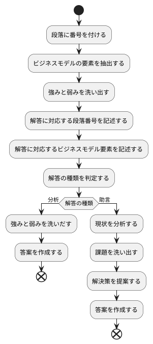

# 解答作成フロー

```plantuml
@startuml

start
:段落に番号を付ける;
:ビジネスモデルの要素を抽出する;
:強みと弱みを洗い出す;
:解答に対応する段落番号を記述する;
:解答に対応するビジネスモデル要素を記述する;
:解答の種類を判定する;
if (解答の種類) then (分析)
:強みと弱みを洗いだす;
:答案を作成する;
end
else (助言)
:現状を分析する;
:課題を洗い出す;
:解決策を提案する;
:答案を作成する;
end
@enduml
```