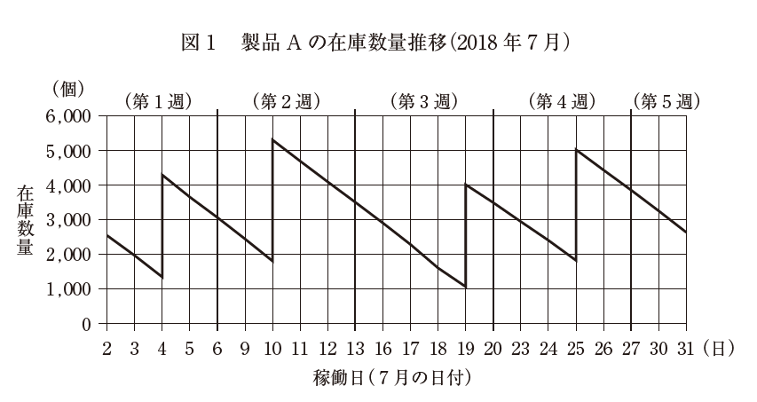
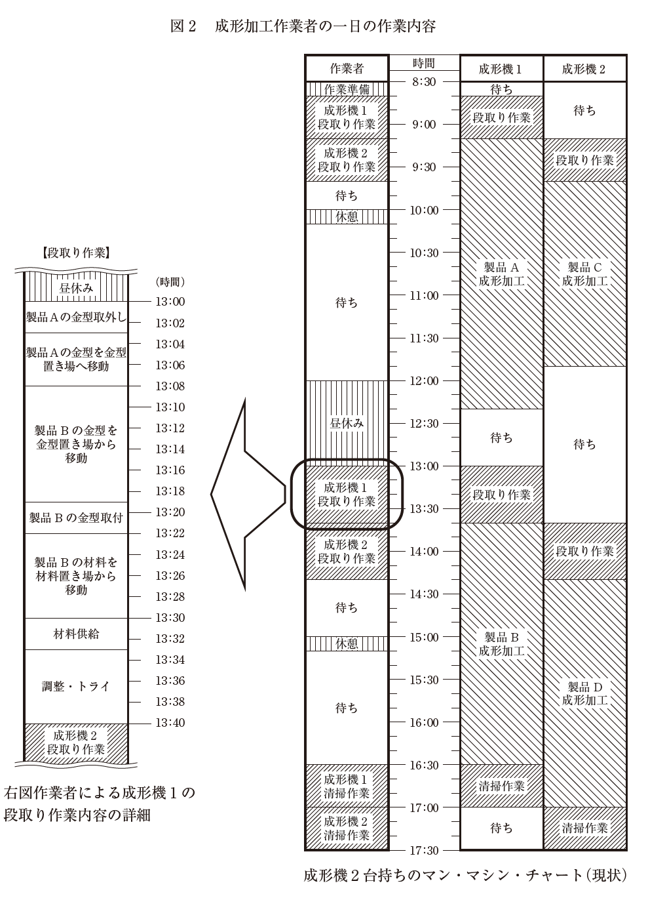
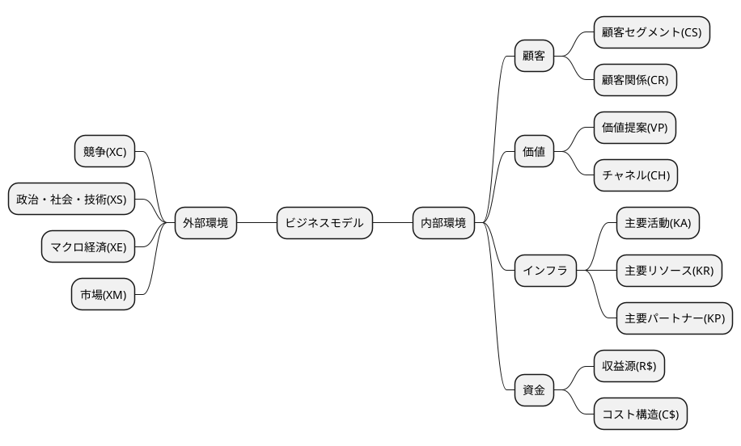
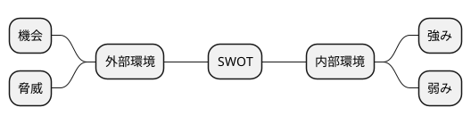

# 平成30年度　事例3　プラスチック射出成形加工を営むC社の事例

## 与件文


【C 社の概要】

　C 社は、1974 年の創業以来、大手電気・電子部品メーカー数社を顧客（以下「顧客企業」という）に、電気・電子部品のプラスチック射出成形加工を営む中小企業である。従業員数60 名、年商約9 億円、会社組織は総務部、製造部で構成されている。

　プラスチック射出成形加工（以下「成形加工」という）とは、プラスチックの材料を加熱溶融し、金型内に加圧注入して、固化させて成形を行う加工方法である。C 社では創業当初、顧客企業から金型の支給を受けて、成形加工を行っていた。

　C 社は、住工混在地域に立地していたが、1980 年、C 社同様の立地環境にあった他の中小企業とともに高度化資金を活用して工業団地に移転した。この工業団地には、現在、金属プレス加工、プラスチック加工、コネクター加工、プリント基板製作などの電気・電子部品に関連する中小企業が多く立地している。

　C 社のプラスチック射出成形加工製品（以下「成形加工品」という）は、顧客企業で電気・電子部品に組み立てられ、その後、家電メーカーに納品されて家電製品の一部になる。主に量産する成形加工品を受注していたが、1990 年代後半から顧客企業の生産工場の海外移転に伴い量産品の国内生産は減少し、主要顧客企業からの受注量の減少が続いた。

　こうした顧客企業の動向に対応した方策として、C 社では金型設計と金型製作部門を新設し、製品図面によって注文を受け、金型の設計・製作から成形加工まで対応できる体制を社内に構築した。また、プラスチック成形や金型製作にかかる技能士などの資格取得者を養成し、さらにOJT によってスキルアップを図るなど加工技術力の強化を推進してきた。このように金型設計・製作部門を持ち、技術力を強化したことによって、材料歩留り向上や成形速度の改善など、顧客企業の成形加工品のコスト低減のノウハウを蓄積することができた。

　C 社が立地する工業団地の中小企業も大手電気・電子部品メーカーを顧客としていたため、C 社同様工業団地に移転後、顧客企業の工場の海外移転に伴い経営難に遭遇した企業が多い。そこで工業団地組合が中心となり、技術交流会の定期開催、共同受注や共同開発の実施などお互いに助け合い、経営難を乗り越えてきた。C 社は、この工業団地組合活動のリーダー的存在であった。


　近年、国内需要分の家電製品の生産が国内に戻る傾向があり、以前の国内生産品が戻りはじめた。それによって、C 社ではどうにか安定した受注量を確保できる状態になったが、顧客企業からの1 回の発注量が以前よりも少なく、受注量全体としては以前と同じレベルまでには戻っていない。

　最近C 社は、成形加工の際に金属部品などを組み込んでしまう成形技術（インサート成形）を習得し、古くから取引のある顧客企業の1 社からの受注に成功している。それまで他社の金属加工品とC 社の成形加工品、そして顧客企業での両部品の組立という3 社で分担していた工程が、C 社の高度な成形技術によって金属加工品をC社の成形加工で組み込んで納品するため、顧客企業の工程数の短縮や納期の短縮、そしてコスト削減も図られることになる。


【生産概要】
　製造部は、生産管理課、金型製作課、成形加工課、品質管理課で構成されている。生産管理課は顧客企業との窓口になり生産計画の立案、資材購買管理、製品在庫管理を、金型製作課は金型設計・製作を、成形加工課は成形加工を、品質管理課は製品検査および品質保証をそれぞれ担当している。

　主要な顧客企業の成形加工品は、繰り返し発注され、毎日指定の数量を納品する。C 社の受注量の半数を占める顧客企業X 社からの発注については、毎週末の金曜日に翌週の月曜日から金曜日の確定納品計画が指示される。C 社の生産管理課ではX社の確定納品計画に基づき、それにその他の顧客企業の受注分を加え、毎週金曜日に翌週の生産計画を確定する。日々の各製品の成形加工は、各設備の能力、稼働状況を考慮して原則週１ 回計画される。また、生産ロットサイズは長時間を要するプラスチック射出成形機（以下「成形機」という）の段取り時間を考慮して決定される。生産効率を上げるために生産ロットサイズは受注量よりも大きく計画され、製品在庫が過大である。C 社の主要製品で、最も生産数量が多いX 社製品A の今年7 月2 日（月）から7 月31 日（火）までの在庫数量推移を図1 に示す。製品A は、毎日600 個前後の納品指定数であり、C 社の生産ロットサイズは約3,000 個で週1 回の生産を行っている。他の製品は、毎日の指定納品数量が少なく、変動することもあるため、製品A以上に在庫管理に苦慮している。



　成形加工課の作業は、作業者1 人が2 台の成形機を担当し、段取り作業、成形機のメンテナンスなどを担当している。また全ての成形機は、作業者が金型をセットし材料供給してスタートを指示すれば、製品の取り出しも含め自動運転し、指示した成形

　加工を終了すると自動停止状態となる。

　図2 で示す「成形機2 台持ちのマン・マシン・チャート（現状）」は、製品A の成形加工を担当している1 人の作業者の作業内容である。成形機の段取り時間が長時間となっている主な原因は、金型、使用材料などを各置き場で探し、移動し、準備する作業に長時間要していることにある。図2 で示す「成形機1 の段取り作業内容の詳細」は、製品A の成形加工作業者が、昼休み直後に行った製品B のための段取り作業の内容である。金型は顧客からの支給品もまだあり、C社内で統一した識別コードがなく、また置き場も混乱していることから、成形加工課の中でもベテラン作業者しか探すことができない金型まである。また使用材料は、仕入先から材料倉庫に納品されるが、その都度納品位置が変わり探すことになる。顧客企業からは、短納期化、小ロット化、多品種少量化がますます要望される状況にあり、ジャストインタイムな生産に移行するため、C 社では段取り作業時間の短縮などの改善によってそれに対応することを会社方針としている。

　その対策の一つとして、現在、生産管理のコンピュータ化を進めようとしているが、生産現場で効率的に運用するためには、成形加工課の作業者が効率よく金型、材料などを使用できるようにする必要があり、そのためにデータベース化などの社内準備を検討中である。




（平成30年度　中小企業診断士2次筆記試験　事例3　問題より引用）

## 分析

### 組織図

```plantuml
@startmindmap
@endmindmap
```

### ビジネスモデル



### SWOT分析





## 問題

### 第1問（配点20 点）

#### 問題文

顧客企業の生産工場の海外移転などの経営環境にあっても、C 社の業績は維持されてきた。その理由を80 字以内で述べよ。

#### ロジック

##### 現状分析

```plantuml
@startmindmap

@endmindmap
```

#### 解答


### 第2問（配点20 点）

#### 問題文

C 社の成形加工課の成形加工にかかわる作業内容（図2 ）を分析し、作業方法に関する問題点とその改善策を120 字以内で述べよ。

#### ロジック

##### 現状分析

```plantuml
@startmindmap

@endmindmap
```

##### 課題設定

##### 解決策

```plantuml
@startmindmap

@endmindmap
```

#### 解答


### 第3問（配点20 点）

#### 問題文

c 社の生産計画策定方法と製品在庫数量の推移（図1 ）を分析して、c 社の生産計画上の問題点とその改善策を120 字以内で述べよ。

#### ロジック

##### 現状分析

```plantuml
@startmindmap

@endmindmap
```

##### 課題設定


##### 解決策

```plantuml
@startmindmap

@endmindmap
```

#### 解答

### 第5問（配点20 点）

#### 問題文

わが国中小製造業の経営が厳しさを増す中で、c 社が立地環境や経営資源を生かして付加価値を高めるための今後の戦略について、中小企業診断士として120 字以内で助言せよ。

#### ロジック

##### 現状分析

```plantuml
@startmindmap

@endmindmap
```

##### 課題設定


##### 解決策

```plantuml
@startmindmap

@endmindmap
```

#### 解答

### 第5問（配点20 点）


#### 問題文

わが国中小製造業の経営が厳しさを増す中で、c 社が立地環境や経営資源を生かして付加価値を高めるための今後の戦略について、中小企業診断士として120 字以内で助言せよ。

#### ロジック

##### 現状分析

```plantuml
@startmindmap

@endmindmap
```

##### 課題設定


##### 解決策

```plantuml
@startmindmap

@endmindmap
```

#### 解答