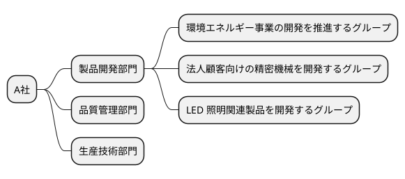
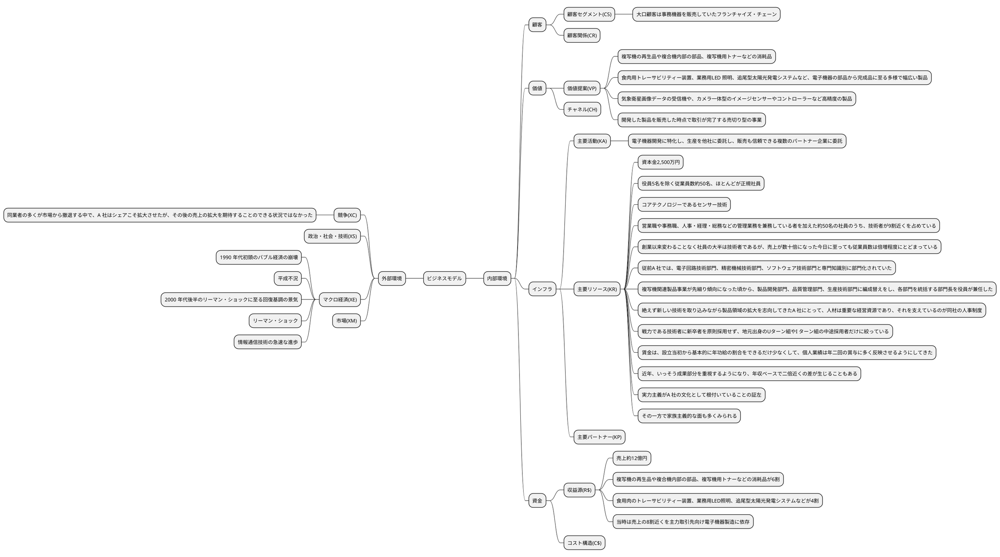
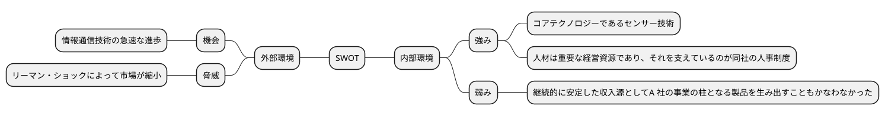

# 平成30年度　事例1　エレクトロニクス・メーカーＡ社の事例

## 与件文


　A 社は、(KR)資本金2,500 万円、売上約12 億円のエレクトロニクス・メーカーである。役員5 名を除く従業員数は約50 名で、そのほとんどが正規社員である。代表取締役は、1970 年代後半に同社を立ち上げたA 社長である。(VP)現在のA 社は電子機器開発に特化し、(KA)基本的に生産を他社に委託し、販売も信頼できる複数のパートナー企業に委託している、研究開発中心の企業である。(R$)この10 年間は売上のおよそ6 割を、(VP)複写機の再生品や複合機内部の部品、複写機用トナーなどの消耗品が占めている。そして、残りの4 割を、(VP)同社が受託し独自で開発している食用肉のトレーサビリティー装置、業務用LED 照明、追尾型太陽光発電システムなど、電子機器の部品から完成品に至る多様で幅広い製品が占めている。

　大手コンデンサーメーカーの技術者として経験を積んだ後、農業を主産業とする故郷に戻ったA 社長は、(CS)近隣に進出していた国内大手電子メーカー向けの特注電子機器メーカーA 社を創業した。その後、(KR)同社のコアテクノロジーであるセンサー技術が評価されるようになると、主力取引先以外の大手・中堅メーカーとの共同プロジェクトへの参画が増えたこともあって、(VP)気象衛星画像データの受信機や、カメラ一体型のイメージセンサーやコントローラーなど高精度の製品開発にも取り組むことになった。もっとも、(R$)当時は売上の8 割近くを主力取引先向け電子機器製造に依存していた。

　しかし、(XM)順調に拡大してきた国内大手電子メーカーの特注電子機器事業が、1990年代初頭のバブル経済の崩壊によって急激な事業縮小を迫られると、A 社の売上も大幅に落ち込んだ。経営を足元から揺るがされることになったA 社は、農産物や加工食品などの検品装置や、発電効率を高める太陽光発電システムなど、(VP)自社技術を応用した様々な新製品開発にチャレンジせざるを得ない状況に追い込まれた。

　(XS)平成不況が長引く中で、A 社は存続をかけて、ニッチ市場に向けた製品を試行錯誤を重ねながら開発し、事業を継続してきた。もちろん開発した製品すべてが市場で受け入れられるわけもなく、継続的に安定した収入源としてA 社の事業の柱となる製品を生み出すこともかなわなかった。そうした危機的状況が、A 社長の製品開発に対する考え方を一変させることになる。(VP)開発した製品を販売した時点で取引が完了する売切り型の事業の限界を打ち破ることを目標にして、新規事業開発に取り組んだのである。それが、複写機関連製品事業である。

　(CS)大口顧客は事務機器を販売していたフランチャイズ・チェーンであり、(XM)2000 年代後半のリーマン・ショックに至る回復基調の景気を追い風にしてA 社の業績も伸長した。ところが、(XM)リーマン・ショックによって急速に市場が縮小し始めると、A 社の売上も頭打ちになった。(XC)同業者の多くがこの市場から撤退する中で、A 社はシェアこそ拡大させたが、もはや、その後の売上の拡大を期待することのできる状況ではなかった。

　ところが、A 社がこの事業に参入した頃から、(XS)情報通信技術の急速な進歩に伴って、事務機器市場が大きく変化してきた。そのことを予測していたからこそ、A 社長は、後進に事業を委ねる条件が整うまで自らが先頭に立って、新規事業や製品の開発にチャレンジし続けているのである。

　これまで幾度かの浮き沈みを経験してきた同社であるが、(KR)営業職や事務職、人事・経理・総務などの管理業務を兼務している者を加えた約50 名の社員のうち、技術者が9 割近くを占めている。(KR)創業以来変わることなく社員の大半は技術者であるが、売上が数十倍になった今日に至っても従業員数は倍増程度にとどまっている。

　(KR)従前A 社では、電子回路技術部門、精密機械技術部門、ソフトウェア技術部門と専門知識別に部門化されていた。(KR)しかし、複写機関連製品事業が先細り傾向になった頃から、製品開発部門、品質管理部門、生産技術部門に編成替えをし、各部門を統括する部門長を役員が兼任した。製品開発部門は、環境エネルギー事業の開発を推進するグループ、法人顧客向けの精密機械を開発するグループ、LED 照明関連製品を開発するグループに分けられ、電子回路技術、精密機械技術、ソフトウェア技術などの専門知識を有する技術者をほぼ同数配置した混成チームとした。品質管理部門と生産技術部門には、数名の技術者が配属され、製品開発部門の業務をサポートすると同時に、複数の生産委託先との調整業務を担っている。

　(KR)絶えず新しい技術を取り込みながら製品領域の拡大を志向してきたA 社にとって、人材は重要な経営資源であり、それを支えているのが同社の人事制度である。

　(KR)その特徴の一つは、戦力である技術者に新卒者を原則採用せず、地元出身のUターン組やI ターン組の中途採用者だけに絞っていることである。(KR)また、賃金は、設立当初から基本的に年功給の割合をできるだけ少なくして、個人業績は年二回の賞与に多く反映させるようにしてきた。近年、(KR)いっそう成果部分を重視するようになり、年収ベースで二倍近くの差が生じることもある。それにもかかわらず、A 社の離職率が地元の同業他社に比べて低いことは、実力主義がA 社の文化として根付いていることの証左である。とはいえ、(KR)その一方で家族主義的な面も多くみられる。社員持株制度や社員全員による海外旅行などの福利厚生施策を充実させているし、1990 年代半ばには、技術者による申請特許に基づく装置が売れると、それを表彰して売上の1 ％を報奨金として技術者が受け取ることができる制度を整備し運用している。

このように、A 社は、研究開発型企業として、取引先や顧客などの声を反映させていた受け身の製品開発の時代から、時流を先読みし先進的な事業展開を進める一方で、伝統的な家族主義的要素をも取り入れて成長を実現している企業だといえる。


（平成30年度　中小企業診断士2次筆記試験　事例1　問題より引用）

## 分析

### 組織図



### ビジネスモデル



### SWOT分析





## 問題

### 第1問（配点20 点）

#### 問題文

研究開発型企業であるA 社が、相対的に規模の小さな市場をターゲットとしているのはなぜか。その理由を、競争戦略の視点から100 字以内で答えよ。

#### ロジック

##### 現状分析

```plantuml
@startmindmap

@endmindmap
```

#### 解答


### 第2問（配点40 点）

A 社の事業展開について、以下の設問に答えよ。

#### （設問１）

##### 問題文

A 社は創業以来、最終消費者に向けた製品開発にあまり力点を置いてこなかった。A 社の人員構成から考えて、その理由を100 字以内で答えよ。

##### ロジック

###### 現状分析

```plantuml
@startmindmap

@endmindmap
```

###### 課題設定

###### 解決策

```plantuml
@startmindmap

@endmindmap
```

##### 解答


#### （設問２）

##### 問題文

A 社長は経営危機に直面した時に、それまでとは異なる考え方に立って、複写機関連製品事業に着手した。それ以前に同社が開発してきた製品の事業特性と、複写機関連製品の事業特性には、どのような違いがあるか。100 字以内で答えよ。

##### ロジック

###### 現状分析

```plantuml
@startmindmap

@endmindmap
```

###### 課題設定

###### 解決策

```plantuml
@startmindmap

@endmindmap
```

##### 解答

### 第3問（配点20 点）　

#### 問題文

A 社の組織改編にはどのような目的があったか。100 字以内で答えよ。

#### ロジック

##### 現状分析

```plantuml
@startmindmap

@endmindmap
```

##### 課題設定

##### 解決策

```plantuml
@startmindmap

@endmindmap
```

#### 解答

### 第4問（配点20 点）

#### 問題文

A 社が、社員のチャレンジ精神や独創性を維持していくために、金銭的・物理的インセンティブの提供以外に、どのようなことに取り組むべきか。中小企業診断士として、100 字以内で助言せよ。

#### ロジック

##### 現状分析

```plantuml
@startmindmap

@endmindmap
```

##### 課題設定


##### 解決策

```plantuml
@startmindmap

@endmindmap
```

#### 解答

