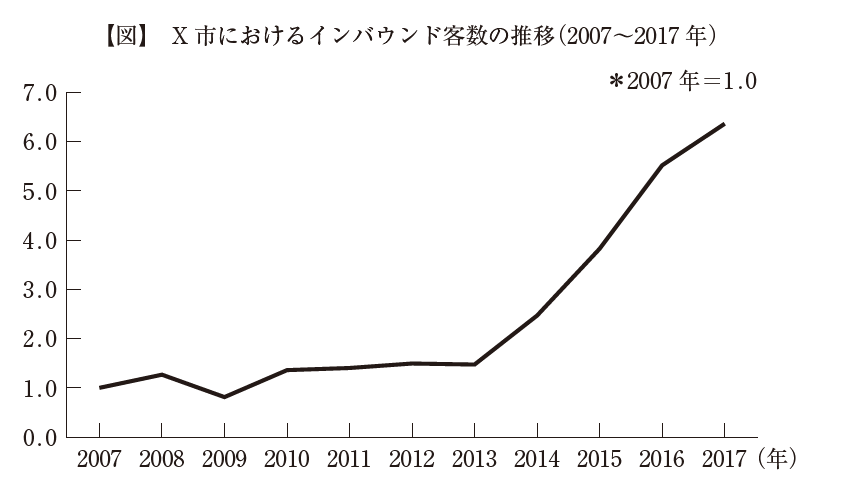
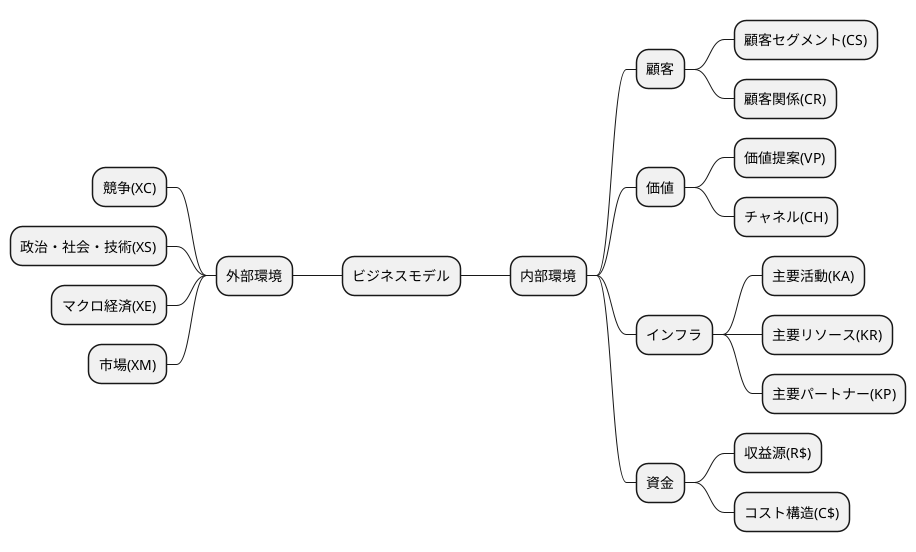
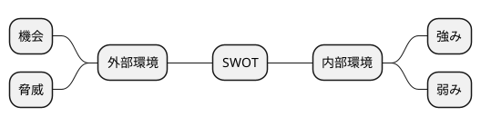

# 平成30年度　事例2　老舗日本旅館B社の事例

## 与件文

　B 社は、X 市市街地中心部にある老舗日本旅館である。明治初期に創業し、約150年の歴史をもつ。２ 年前、父親である社長が急死し、民間企業に勤めていた30 歳代後半の長男が急きょ事業を承継することになり、8 代目社長に就任した。資本金は500 万円、従業員は家族従業員3 名、パート従業員４ 名である。このうち1 名は、つい最近雇用した英語に堪能な従業員である。客室は全15 室で、最大収容人員は50名、1 人1 泊朝食付き7,500 円を基本プランとする。裏手には大型バス1 台、乗用車6 台分の駐車場がある。

　簡素な朝食は提供しているものの、客室稼働率に上下があり食材のロスが発生するという理由と調理人の人件費を削減するという理由から、創業以来、夕食は提供していない。宿泊客から夕食を館内でとりたいという要望がある場合は、すぐそばにある地元の割烹料理店からの仕出しで対応している。これまで何度か小さな増改築を行ってきたが、現在の宿泊棟は築45 年である。客室には基本的にずっと手を加えていない。畳と座卓、障子、天井吊り下げ式照明のある、布団を敷くタイプの古風な和室である。館内には大広間があり、その窓からは小ぶりだが和の風情がある苔こけむした庭園を眺めることができる。大浴場はないため、各部屋に洋式トイレとバスを設置している。歴代の社長たちは皆、芸術や文化への造詣が深く、執筆や創作のために長期滞在する作家や芸術家を支援してきた。このため、館内の廊下や共用スペースには、歴代の社長たちが支援してきた芸術家による美術品が随所に配置され、全体として小規模な施設ながらも文化の香りに満ちた雰囲気である。この中には、海外でも名の知られた作家や芸術家もいる。

　X 市は江戸時代から栄えた城下町である。明治時代までは県内随一の商都であり、教育や文化支援にも熱心な土地柄であった。X 市市街地は、北側は城跡付近に造られた官公庁街、東から南側にかけては名刹・古刹が点在する地域となっており、西側には商都の名残である広大な商業地域が広がっている。B 社は創業時からちょうどこの中央に立地し、これらのエリアはいずれも徒歩圏内にある。B 社から最寄り駅までは公共バスを利用して20 分強かかるが、現在、この間を結ぶバスは平均すると1 時間に５ ～ ６ 本程度運行している。この最寄り駅からは国内線と国際線の離発着がある空港に向けて、毎日7 往復の直通バスが走っており、駅から空港までの所要時間は1時間40 分ほどである。

　X 市市街地の中でも、商業地域の目抜き通りには江戸時代の豪商や明治時代の実業家が造り上げた厳かな大型建造物が立ち並ぶ。この通りは現在でも商業地域の顔である。400 年以上続くとされる地域の祭りでは、市内各地を練り歩いてきた豪勢な何台もの山車がこの通りに集結するタイミングで最高の盛り上がりを見せる。夜通し続くこの祭りの見物客は近年、年々増加している。街の一角にはこの祭りの展示施設があり、ここを訪れた観光客は有料で山車を引く体験ができる。X 市商業地域には、歴史を感じさせる大型建造物が残る一方、住民を対象にした店舗もたくさんある。普段遣いのお店から料亭、割烹料理店までのさまざまなタイプの飲食店をはじめ、各種食料品店、和装店、銭湯、劇場、地元の篤志家が建設した美術館などの施設が集積している。

　10 年ほど前、X 市の名刹と商業地域が高視聴率の連続ドラマの舞台となり、このエリアが一躍脚光を浴びた。これを機に、商業地域に拠点をもつ経営者層を中心として、このエリア一体の街並み整備を進めることになった。名刹は通年で夜間ライトアップを行い、地域の動きに協力した。地域ボランティアは観光案内や街の清掃活動を行い、美しい街並みと活気の維持に熱心である。こうした影響を受け、最近では、ほとんどいなかった夜間の滞在人口は増加傾向にある。

　X 市は大都市圏とも近く、電車で２ 時間程度の日帰りできる距離にある。古き良き時代の日本を感じさせるX 市の街のたたずまいは観光地として人気を集めている。2017 年時点で、X 市を訪れる観光客は全体で約500 万人、このうち約20 万人がインバウンド客である。商業地域には空き店舗があったが、観光客が回遊しそうな通り沿いの空き店舗には地元の老舗商店が出店して、シャッター通りにならないための協力体制を敷いた。食べ歩きできるスイーツや地域の伝統を思わせる和菓子などを販売し、街のにぎわい創出に努めた。歴史ある街並みに加え、こうした食べ物などは写真映えし、SNS 投稿に向く。そのため、ここ数年は和の風情を求めるインバウンド客が急増している（図参照）。

　一方、B 社のビジネス手法は創業時からほとんど変わっていなかった。明治時代から仕事や執筆・創作活動のために訪れる宿泊客が常に一定数いたため、たいしたプロモーション活動を行う必要性がなかったのが理由である。それに気付いた8 代目は就任して１ 年後、館内に無料Wi-Fi を導入し、B 社ホームページも開設した。これにより、それまで電話のみで受け付けていた宿泊予約も、ホームページから外国語でも受け付けられるようになった。また、最低限のコミュニケーションが主要な外国語で図れるよう、従業員教育も始めた。近々モバイル決済の導入も考えている。現在、宿泊客は昔なじみのビジネス客８ 割、インバウンド客２ 割であるが、なじみ客らは高齢化が進み、減少傾向にある。最寄り駅から距離のあるB 社には、事前に予約のない客が宿泊することはほとんどない。

　B 社から距離の離れた駅前にはチェーン系ビジネスホテルが2 軒ほどあるが、X 市市街地中心部にはB 社以外に宿泊施設がない。かつてはB 社と似たようなタイプの旅館もあったが、10 年以上前に閉鎖している。B 社周辺にある他の業種の店々は、拡大する観光需要をバネに、このところ高収益を上げていると聞く。B 社だけがこの需要を享受できていない状態だ。

　8 代目は事業承継したばかりで経営の先行きが不透明であるため、宿泊棟の改築などの大規模な投資は当面避けたいと考えている。既存客との関係を考えると、宿泊料金の値上げにも着手したくない。打てる手が限られる中、8 代目が試しに従来の簡素な朝食を日本の朝を感じられる献立に切り替え、器にもこだわってみたところ、多くの宿泊客から喜びの声が聞かれた。こうした様子を目にした8 代目は、経営刷新して営業を継続したいと考えるようになり、中小企業診断士にその方向性を相談した。



## 分析

### 組織図

```plantuml
@startmindmap
@endmindmap
```

### ビジネスモデル



### SWOT分析





## 問題

### 第1 問（配点25 点）

#### 問題文

B 社の現状について、3C（Customer：顧客、Competitor：競合、Company：自社）分析の観点から150 字以内で述べよ。

#### ロジック

##### 現状分析

```plantuml
@startmindmap

@endmindmap
```

#### 解答


### 第2問（配点25 点）

#### 問題文

B 社は今後、新規宿泊客を増加させたいと考えている。そこで、B 社のホームページや旅行サイトにB 社の建物の外観や館内設備に関する情報を掲載したが、反応がいまひとつであった。B 社はどのような自社情報を新たに掲載することによって、閲覧者の好意的な反応を獲得できるか。今後のメインターゲット層を明確にして、100字以内で述べよ。

#### ロジック

##### 現状分析

```plantuml
@startmindmap

@endmindmap
```

##### 課題設定

##### 解決策

```plantuml
@startmindmap

@endmindmap
```

#### 解答


### 第３問（配点25 点）

#### 問題文

B 社は、宿泊客のインターネット上での好意的なクチコミをより多く誘発するために、おもてなしの一環として、従業員と宿泊客との交流を促進したいと考えている。B 社は、従業員を通じてどのような交流を行うべきか、100 字以内で述べよ。

#### ロジック

##### 現状分析

```plantuml
@startmindmap

@endmindmap
```

##### 課題設定


##### 解決策

```plantuml
@startmindmap

@endmindmap
```

#### 解答

### 第４問（配点25 点）

#### 問題文

B 社は、X 市の夜の活気を取り込んで、B 社への宿泊需要を生み出したいと考えている。B 社はどのような施策を行うべきか、100 字以内で述べよ。

#### ロジック

##### 現状分析

```plantuml
@startmindmap

@endmindmap
```

##### 課題設定


##### 解決策

```plantuml
@startmindmap

@endmindmap
```

#### 解答
