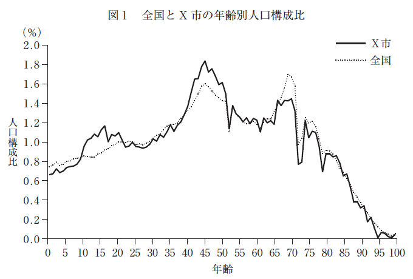
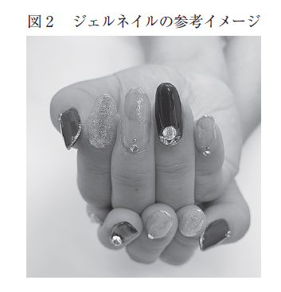
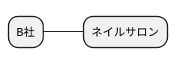
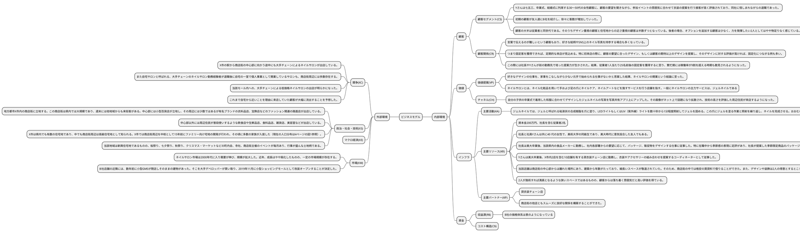

# 令和元年度　事例2　ネイルサロンB社の事例

## 与件文

　(KR)B社は資本金200万円、社長を含む従業者2名の完全予約制ネイルサロンであり、地方都市X市内の商店街に立地する。(XS)この商店街は県内では大規模であり、週末には他地域からも来街客がある。中心部には小型百貨店が立地し、その周辺には少数ではあるが有名ブランドの衣料品店、宝飾店などのファッション関連の路面店が出店している。中心部以外には周辺住民が普段使いするような飲食店や生鮮品店、食料品店、雑貨店、美容室などが出店している。(XS)X市は県内でも有数の住宅地であり、中でも商店街周辺は高級住宅地として知られる。X市では商店街周辺を中核として15年前にファミリー向け宅地の開発が行われ、その頃に多数の家族が入居した（現在の人口分布は4ページの図1参照）。(XS)当該地域は新興住宅地であるものの、桜祭り、七夕祭り、秋祭り、クリスマス・マーケットなどの町内会、寺社、商店街主催のイベントが毎月あり、行事が盛んな土地柄である。

　B社は2017年に現在の社長が創業した。(KR)社長と社員Yさんは共に40 代の女性で、美術大学の同級生であり、美大時代に意気投合した友人でもある。(KR)社長は美大卒業後、当該県内の食品メーカーに勤務し、社内各部署からの要望に応じて、パッケージ、販促物をデザインする仕事に従事した。特に在職中から季節感の表現に定評があり、社長が提案した季節限定商品のパッケージや季節催事用のPOPは、同社退職後も継続して利用されていた。(KR)Yさんは美大卒業後、X市内2店を含む10店舗を有する貸衣装チェーン店に勤務し、衣装やアクセサリーの組み合わせを提案するコーディネーターとして従事した。2人は同時期の出産を契機に退職し、しばらくは専業主婦として過ごしていた。やがて、子供が手から離れた頃に社長が、(VP)好きなデザインの仕事を、家事をこなしながら少ない元手で始められる仕事がないかと思案した結果、ネイルサロンの開業という結論に至った。Yさんも社長の誘いを受け、起業に参加した。なお、Yさんはその時期、(KP)前職の貸衣装チェーン店が予約会（注）を開催し、人手が不足する時期に、パートタイマーの同社店舗スタッフとして働いていた。(CS)Yさんは七五三、卒業式、結婚式に列席する30～50代の女性顧客に、顧客の要望を聞きながら、参加イベントの雰囲気に合わせて衣装の提案を行う接客が高く評価されており、同社に惜しまれながらの退職であった。2人は開業前にネイリスト専門学校に通い始めた。当初は絵画との筆遣いの違いに戸惑いを覚えたが、要領を得てからは持ち前の絵心で技術は飛躍的に向上した。

　技術を身に付けた2人は、出店候補地の検討を開始した。その過程で空き店舗が見つかり、スペースを改装して、営業を開始した。なお、(KR)当該店舗は商店街の中心部からは離れた場所にあり、建築から年数がたっており、細長いスペースが敬遠されていた。そのため、(C$)商店街の中では格安の賃貸料で借りることができた。また、デザインや装飾は2人の得意とするところであり、大規模な工事を除く内装のほとんどは手作業で行った。2人が施術すれば満員となるような狭いスペースではあるものの、(CH)顧客からは落ち着く雰囲気だと高い評価を得ている。また、Yさんが商店街の貸衣装チェーン店で勤務していた経緯もあり、(KP)商店街の他店ともスムーズに良好な関係を構築することができた。

　(VP)ネイルサロンとは、ネイル化粧品を用いて手および足の爪にネイルケア、ネイルアートなどを施すサービスを行う店舗を指す。一般にネイルサロンの主力サービスは、ジェルネイルである（ 4ページの図2参照）。(KA)ジェルネイルでは、ジェルと呼ばれる粘液状の合成樹脂を爪に塗り、LEDライトもしくはUV（紫外線）ライトを数十秒から1分程度照射してジェルを固める。この爪にジェルを塗る作業と照射を繰り返し、ネイルを完成させる。おおむね両手で平均1時間半の時間を要する（リムーブもしくはオフと呼ばれるジェルネイルの取り外しを含める場合は平均2時間程度である）。サービスを提供する際に顧客の要望を聞き、予算に基づき、要望を具体化する。ただし、(CR)言葉で伝えるのが難しいという顧客もおり、好きな絵柄やSNS上のネイル写真を持参する場合も多くなっている。(R$)またB社の価格体系は表のようになっている（ 4ページ参照）。

　(XM)ネイルサロン市場は2000年代に入り需要が伸び、規模が拡大した。近年、成長はやや鈍化したものの、一定の市場規模が存在する。(XC)X市の駅から商店街の中心部に向かう途中にも大手チェーンによるネイルサロンが出店している。(XC)また自宅サロンと呼ばれる、大手チェーンのネイルサロン勤務経験者が退職後に自宅の一室で個人事業として開業しているサロンも、商店街周辺には多数存在する。

　開業当初、B社にはほとんど顧客がいなかった。(CH)あるとき、B社社長が、自分の子供の卒業式で着用した和服に合わせてデザインしたジェルネイルの写真を写真共有アプリ上にアップした。その画像がネット上で話題になり拡散され、技術の高さを評価した周辺住民が来店するようになった。そして、(CS)初期の顧客が友人達にB社を紹介し、徐々に客数が増加していった。ジェルネイルは爪の成長に伴い施術から3週間～1カ月の間隔での来店が必要になる。(CR)つまり固定客を獲得できれば、定期的な来店が見込める。特に初来店の際に、顧客の要望に合ったデザイン、もしくは顧客の期待以上のデザインを提案し、そのデザインに対する評価が高ければ、固定化につながる例も多い。(CR)この際には社長やYさんが前の勤務先で培った提案力が生かされた。結果、従業者1人当たり25名前後の固定客を獲得するに至り、繁忙期には稼働率が9割を超える時期も散見されるようになった。なお、(CS)顧客の大半は従業者と同世代である。そのうちデザイン重視の顧客と住宅地からの近さ重視の顧客は半数ずつとなっている。後者の場合、オプションを追加する顧客は少なく、力を発揮したい2人としてはやや物足りなく感じている。

　(XM)B社店舗の近隣には、数年前に小型GMSが閉店しそのままの建物があった。そこを大手デベロッパーが買い取り、2019年11月に小型ショッピングモールとして改装オープンすることが決定した。当初、一層の集客を期待したB社社長であったが、(XC)当該モール内への、大手チェーンによる低価格ネイルサロンの出店が明らかになった。B社社長は、(CS)これまで自宅から近いことを理由に来店していた顧客が大幅に流出することを予想した。B社社長とYさんは大幅に減少する顧客数を補うための施策について思案したが、良い案も出ず、今後の方針について中小企業診断士に相談することとした。

（注）貸衣装業界で行われるイベント。百貨店、ホール、ホテル、大学、結婚式場などの大規模な会場で、顧客が会場でサンプルを確認、試着し、気に入ったものがあれば商品を予約することができる。支払いは後日行う。






（令和元年度　中小企業診断士2次筆記試験　事例2　問題より引用）

## 分析

### 組織図



### ビジネスモデル



### SWOT分析

```plantuml
@startmindmap
* SWOT
-- 外部環境
--- 機会
---- ネイルサロン市場は2000年代に入り需要が伸び、規模が拡大した。近年、成長はやや鈍化したものの、一定の市場規模が存在する。
---- B社店舗の近隣には、数年前に小型GMSが閉店しそのままの建物があった。そこを大手デベロッパーが買い取り、2019年11月に小型ショッピングモールとして改装オープンすることが決定した。
---- 地方都市X市内の商店街に立地する。この商店街は県内では大規模であり、週末には他地域からも来街客がある。中心部には小型百貨店が立地し、その周辺には少数ではあるが有名ブランドの衣料品店、宝飾店などのファッション関連の路面店が出店している。
---- 当該地域は新興住宅地であるものの、桜祭り、七夕祭り、秋祭り、クリスマス・マーケットなどの町内会、寺社、商店街主催のイベントが毎月あり、行事が盛んな土地柄である。
--- 脅威
---- X市の駅から商店街の中心部に向かう途中にも大手チェーンによるネイルサロンが出店している。
---- また自宅サロンと呼ばれる、大手チェーンのネイルサロン勤務経験者が退職後に自宅の一室で個人事業として開業しているサロンも、商店街周辺には多数存在する。
---- 当該モール内への、大手チェーンによる低価格ネイルサロンの出店が明らかになった。
** 内部環境
*** 強み
**** この際には社長やYさんが前の勤務先で培った提案力が生かされた。結果、従業者1人当たり25名前後の固定客を獲得するに至り、繁忙期には稼働率が9割を超える時期も散見されるようになった。
**** 自分の子供の卒業式で着用した和服に合わせてデザインしたジェルネイルの写真を写真共有アプリ上にアップした。その画像がネット上で話題になり拡散され、技術の高さを評価した周辺住民が来店するようになった。
**** 2人が施術すれば満員となるような狭いスペースではあるものの、顧客からは落ち着く雰囲気だと高い評価を得ている。
**** 商店街の他店ともスムーズに良好な関係を構築することができた。
*** 弱み
**** 当該店舗は商店街の中心部からは離れた場所にあり、建築から年数がたっており、細長いスペースが敬遠されていた。そのため、商店街の中では格安の賃貸料で借りることができた。また、デザインや装飾は2人の得意とするところであり、大規模な工事を除く内装のほとんどは手作業で行った。
@endmindmap
```





## 問題

### 第1 問（配点20点）

小型ショッピングモール開業を控えた2019年10月末時点のB社の状況について、SWOT分析をせよ。各要素について、①～④の解答欄にそれぞれ40字以内で説明すること。

#### 問題文

#### ロジック

##### 現状分析

```plantuml
@startmindmap

@endmindmap
```

##### 課題設定

##### 解決策

```plantuml
@startmindmap

@endmindmap
```

#### 解答


### 第2問（配点30点）

B社社長は初回来店時に、予約受け付けや確認のために、インスタント・メッセンジャー（インターネットによるメッセージ交換サービス）のアカウント（ユーザーID）を顧客に尋ねている。インスタント・メッセンジャーでは個別にメッセージを配信できる。
このアカウントを用いて、デザインを重視する既存顧客の客単価を高めるためには、個別にどのような情報発信を行うべきか。100字以内で助言せよ。


#### 問題文


#### ロジック

##### 現状分析

```plantuml
@startmindmap

@endmindmap
```

##### 課題設定

##### 解決策

```plantuml
@startmindmap

@endmindmap
```

#### 解答


### 第３問（配点50点）

B社社長は2019年11月以降に顧客数が大幅に減少することを予想し、その分を補うために商店街の他業種との協業を模索している。

#### （設問１）

B社社長は減少するであろう顧客分を補うため、協業を通じた新規顧客のトライアルが必要であると考えている。どのような協業相手と組んで、どのような顧客層を獲得すべきか。理由と併せて100字以内で助言せよ。


##### 問題文

##### ロジック

###### 現状分析

```plantuml
@startmindmap

@endmindmap
```

###### 課題設定

###### 解決策

```plantuml
@startmindmap

@endmindmap
```

##### 解答

#### （設問２）

協業を通じて獲得した顧客層をリピートにつなげるために、初回来店時に店内での接客を通じてどのような提案をすべきか。価格プロモーション以外の提案について、理由と併せて100字以内で助言せよ


##### 問題文

##### ロジック

###### 現状分析

```plantuml
@startmindmap

@endmindmap
```

###### 課題設定

###### 解決策

```plantuml
@startmindmap

@endmindmap
```

##### 解答
