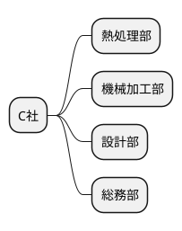
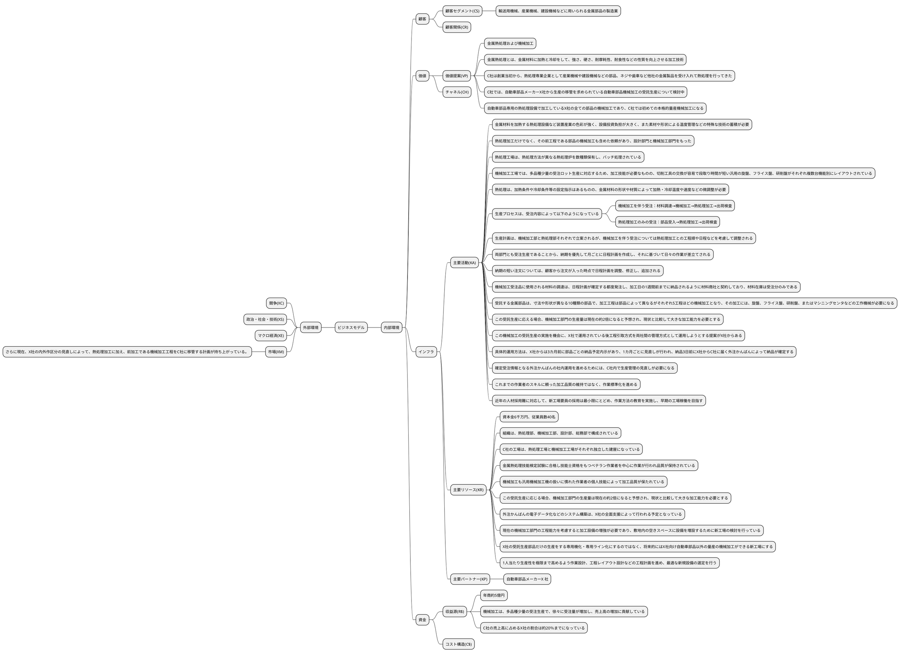
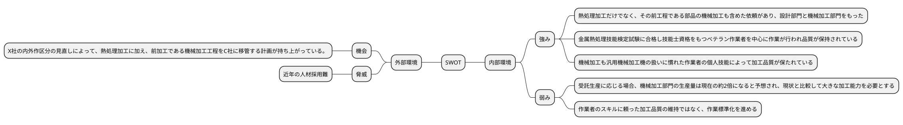

# 令和元年度_事例3_金属部品の熱処理や機械加工を営むC社​の事例

## 与件文

【企業概要】

　C社は、(CS)輸送用機械、産業機械、建設機械などに用いられる金属部品の製造業を顧客に、(VP)金属熱処理および機械加工を営む。(KR)資本金6千万円、従業員数40名、(R$)年商約5億円の中小企業である。(KR)組織は、熱処理部、機械加工部、設計部、総務部で構成されている。

　(VP)金属熱処理とは、金属材料に加熱と冷却をして、強さ、硬さ、耐摩耗性、耐食性などの性質を向上させる加工技術である。多くの金属製品や部品加工の最終工程として、製品品質を保証する重要な基盤技術である。(KA)金属材料を加熱する熱処理設備など装置産業の色彩が強く、設備投資負担が大きく、また素材や形状による温度管理などの特殊な技術の蓄積が必要である。このため、一般に金属加工業では、熱処理は内製せず熱処理業に外注する傾向が強い。(VP)C社は創業当初から、熱処理専業企業として産業機械や建設機械などの部品、ネジや歯車など他社の金属製品を受け入れて熱処理を行ってきた。

　その後、熱処理加工だけでなく、(KA)その前工程である部品の機械加工も含めた依頼があり、設計部門と機械加工部門をもった。設計部門は、発注先から指示される製品仕様をC社社内の機械加工用に図面化するもので、現在2名で担当している。機械加工は、多品種少量の受注生産で、徐々に受注量が増加し、売上高の増加に貢献している。

　約10年前、所属する工業会が開催した商談会で、(KP)金属熱処理業を探していた自動車部品メーカーX 社との出会いがあり、自動車部品の熱処理を始めた。(R$)その後X社の増産計画により、自動車部品専用の熱処理工程を増設し、それによってC社売上高に占めるX社の割合は約20％までになっている。(XM)さらに現在、X社の内外作区分の見直しによって、熱処理加工に加え、前加工である機械加工工程をC社に移管する計画が持ち上がっている。


【生産概要】

　C社の工場は、熱処理工場と機械加工工場がそれぞれ独立した建屋になっている。(KA)熱処理工場は、熱処理方法が異なる熱処理炉を数種類保有し、バッチ処理されている。機械加工工場では、多品種少量の受注ロット生産に対応するため、加工技能が必要なものの、切削工具の交換が容易で段取り時間が短い汎用の旋盤、フライス盤、研削盤がそれぞれ複数台機能別にレイアウトされている。

　(KA)熱処理は、加熱条件や冷却条件等の設定指示はあるものの、金属材料の形状や材質によって加熱・冷却温度や速度などの微調整が必要となる。(KR)そのため金属熱処理技能検定試験に合格し技能士資格をもつベテラン作業者を中心に作業が行われ品質が保持されている。また、機械加工も汎用機械加工機の扱いに慣れた作業者の個人技能によって加工品質が保たれている。

(KA)生産プロセスは、受注内容によって以下のようになっている。

　・機械加工を伴う受注：材料調達→機械加工→熱処理加工→出荷検査

　・熱処理加工のみの受注：部品受入→熱処理加工→出荷検査


　(KA)生産計画は、機械加工部と熱処理部それぞれで立案されるが、機械加工を伴う受注については熱処理加工との工程順や日程などを考慮して調整される。両部門とも受注生産であることから、納期を優先して月ごとに日程計画を作成し、それに基づいて日々の作業が差立てされる。納期の短い注文については、顧客から注文が入った時点で日程計画を調整、修正し、追加される。機械加工受注品に使用される材料の調達は、日程計画が確定する都度発注し、加工日の1週間前までに納品されるように材料商社と契約しており、材料在庫は受注分のみである。


【自動車部品機械加工の受託生産計画】

　(VP)C社では、自動車部品メーカーX社から生産の移管を求められている自動車部品機械加工の受託生産について検討中である。

　(VP)その内容は、自動車部品専用の熱処理設備で加工しているX社の全ての部品の機械加工であり、C社では初めての本格的量産機械加工になる。(KA)受託する金属部品は、寸法や形状が異なる10種類の部品で、加工工程は部品によって異なるがそれぞれ5工程ほどの機械加工となり、その加工には、旋盤、フライス盤、研削盤、またはマシニングセンタなどの工作機械が必要になる。(KR)この受託生産に応える場合、機械加工部門の生産量は現在の約2倍になると予想され、現状と比較して大きな加工能力を必要とする。

　(KA)また、この機械加工の受託生産の実施を機会に、X社で運用されている後工程引取方式を両社間の管理方式として運用しようとする提案がX社からある。(KA)具体的運用方法は、X社からは3カ月前に部品ごとの納品予定内示があり、1カ月ごとに見直しが行われ、納品3日前にX社からC社に届く外注かんばんによって納品が確定する。これら納品予定内示および外注かんばんは、通信回線を使用して両社間でデータを交換する計画である。

　(KR)外注かんばんの電子データ化などのシステム構築は、X社の全面支援によって行われる予定となっているが、(KA)確定受注情報となる外注かんばんの社内運用を進めるためには、C社内で生産管理の見直しが必要になる。この後工程引取方式は、X社自動車部品の機械加工工程および自動車部品専用の熱処理工程に限定した運用範囲とし、その他の加工品については従来同様の生産計画立案と差立方法で運用する計画である。

　(KR)生産設備面では、現在の機械加工部門の工程能力を考慮すると加工設備の増強が必要であり、敷地内の空きスペースに設備を増設するために新工場の検討を行っている。C社社長は、この新工場計画について前向きに検討を進める考えであり、次のような方針を社内に表明している。

(KR)1．X社の受託生産部品だけの生産をする専用機化・専用ライン化にするのではなく、将来的にはX社向け自動車部品以外の量産の機械加工ができる新工場にする。

(KA)2．これまでの作業者のスキルに頼った加工品質の維持ではなく、作業標準化を進める。

(KR)3．一人当たり生産性を極限まで高めるよう作業設計、工程レイアウト設計などの工程計画を進め、最適な新規設備の選定を行う。

(KA)4．近年の人材採用難に対応して、新工場要員の採用は最小限にとどめ、作業方法の教育を実施し、早期の工場稼働を目指す。


　現在C社社内では、各部の関係者が参加する検討チームを組織し、上記のC社社長方針に従って検討を進めている。
（令和元年度　中小企業診断士2次筆記試験　事例3　問題より引用）


## 分析

### 組織図



### ビジネスモデル



### SWOT分析





## 問題

### 第1問（配点20点）

#### 問題文

C社の事業変遷を理解した上で、C社の強みを80字以内で述べよ。

#### ロジック

##### 現状分析

```plantuml
@startmindmap

@endmindmap
```

#### 解答


### 第2問（配点20点）

#### 問題文

自動車部品メーカーX社からの機械加工の受託生産に応じる場合、C社における生産面での効果とリスクを100字以内で述べよ。

#### ロジック

##### 現状分析

```plantuml
@startmindmap

@endmindmap
```

##### 課題設定

##### 解決策

```plantuml
@startmindmap

@endmindmap
```

#### 解答


### 第3問（配点20点）

X社から求められている新規受託生産の実現に向けたC社の対応について、以下の設問に答えよ。

#### （設問1）

##### 問題文

C社社長の新工場計画についての方針に基づいて、生産性を高める量産加工のための新工場の在り方について120 字以内で述べよ。

##### ロジック

###### 現状分析

```plantuml
@startmindmap

@endmindmap
```

###### 課題設定

###### 解決策

```plantuml
@startmindmap

@endmindmap
```

##### 解答


#### （設問2）

##### 問題文

X社とC社間で外注かんばんを使った後工程引取方式の構築と運用を進めるために、これまで受注ロット生産体制であったC社では生産管理上どのような検討が必要なのか、140 字以内で述べよ。

##### ロジック

###### 現状分析

```plantuml
@startmindmap

@endmindmap
```

###### 課題設定

###### 解決策

```plantuml
@startmindmap

@endmindmap
```

##### 解答

### 第4問（配点20点）

新工場が稼働した後のC社の戦略について、120 字以内で述べよ。

#### 問題文


#### ロジック

##### 現状分析

```plantuml
@startmindmap

@endmindmap
```

##### 課題設定


##### 解決策

```plantuml
@startmindmap

@endmindmap
```

#### 解答

