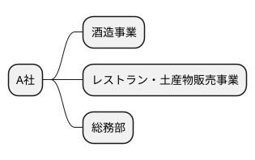
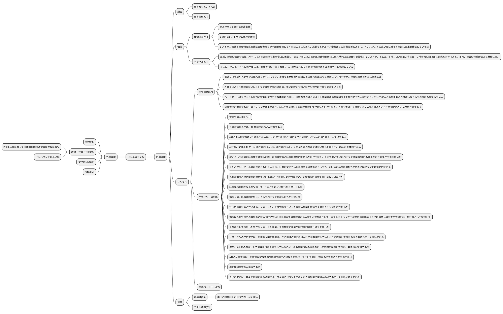
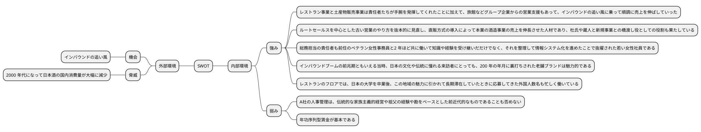
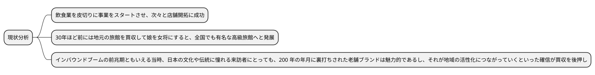
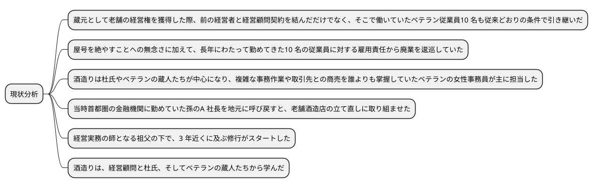
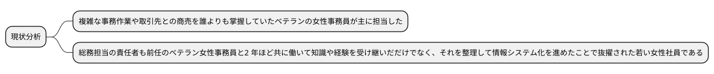
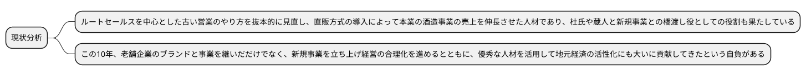
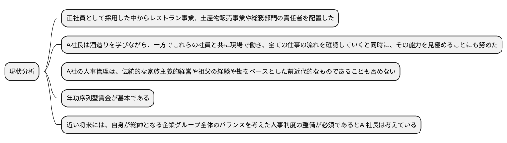
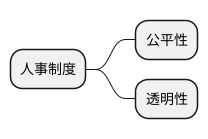

# 令和2年度　事例1　老舗の蔵元A社の事例

## 与件文

　A 社は、わが国を代表する観光地として知られる温泉地にある老舗の蔵元である。(KR)資本金は2,000 万円、売上は約5 億円で、(R$)中小の同業他社と比べて売上が大きい。A 社の軒下には杉玉がぶら下がり壁際に酒樽などが並んではいるものの、店の中に入るとさまざまな土産物が所狭しと並んでいる。中庭のやや燻した感じの石造りの酒蔵だけが、今でも蔵元であることを示している。

　(VP)A 社の売上のうち約2 億円は昔ながらの酒造事業によるものであるが、(VP)残りの3 億円はレストランと土産物店の売上である。(KR)現在、この老舗の当主は、40 代前半の若いA 社長である。A 社の4 名の役員は全て親族であるが、その中で直接A 社のビジネスに関わっているのはA 社長一人だけである。(KR)A 社長、従業員40 名（正規社員20 名、非正規社員20 名）、それにA 社の社員ではない杜氏を加えて、実質42 名体制である。

　実は、江戸時代から続く造り酒屋のA 社は、現在のA 社長と全く血縁関係のない旧家によって営まれていた。戦後の最盛期には酒造事業で年間2 億円以上を売り上げていた。しかし、(XS)2000 年代になって日本酒の国内消費量が大幅に減少し、A 社の売上高も半分近くに落ち込んでしまった。そこで、旧家の当主には後継者がいなかったこともあって廃業を考えるようになっていた。とはいえ、屋号を絶やすことへの無念さに加えて、長年にわたって勤めてきた10 名の従業員に対する雇用責任から廃業を逡巡していた。近隣の金融機関や取引先、組合関係者にも相談した結果、地元の有力者の協力を仰ぐことを決めた。

　最終的に友好的買収を決断したこの有力者は、飲食業を皮切りに事業をスタートさせ次々と店舗開拓に成功しただけでなく、30 年ほど前には地元の旅館を買収して娘を女将にすると、全国でも有名な高級旅館へと発展させた実業家である。蔵元として老舗の経営権を獲得した際、(KR)前の経営者と経営顧問契約を結んだだけでなく、そこで働いていたベテラン従業員10 名も従来どおりの条件で引き継いだ。

　(KR)インバウンドブームの前兆期ともいえる当時、日本の文化や伝統に憧れる来訪者にとっても、200 年の年月に裏打ちされた老舗ブランドは魅力的であるし、それが地域の活性化につながっていくといった確信が買収を後押ししたのである。そして、(KR)当時首都圏の金融機関に勤めていた孫のA 社長を地元に呼び戻すと、老舗酒造店の立て直しに取り組ませた。

　幼少時から祖父の跡を継ぐことを運命づけられ、自らも違和感なく育ってきたA社長は金融機関を退職し帰郷した。(KP)経営実務の師となる祖父の下で、3 年近くに及ぶ修行がスタートした。(KR)酒造りは、経営顧問と杜氏、そしてベテランの蔵人たちから学んだ。

　修行の合間を見ながら、(CH)敷地全体のリニューアルにも取り組んだ。以前、製品の保管や居住スペースであった建物を土産物店に改装し、また中庭には古民家風の建物を新たに建て地元の高級食材を提供するレストランとした。1 階フロアは個人客向け、2 階の大広間は団体観光客向けである。また、社員の休憩所なども整備した。(CH)さらに、リニューアルの数年後には、酒蔵の横の一部を改装して、造りたての日本酒を堪能できる日本酒バーも開店している。

　こうした新規事業開発の一方で、(KR)各部門の責任者と共に酒造、レストラン、土産物販売といった異なる事業を統括する体制づくりにも取り組んだ。(KA)酒造りは杜氏やベテランの蔵人たちが中心になり、複雑な事務作業や取引先との商売を誰よりも掌握していたベテランの女性事務員が主に担当した。また、A 社長にとって経験のないレストラン経営や売店経営は、祖父に教えを請いながら徐々に仕事を覚えていった。　

　(KR)他方、酒造以外の各部門の責任者となる30 代から40 代半ばまでの経験のある人材を正規社員として、またレストランと土産物店の現場スタッフには地元の学生や主婦を非正規社員として採用した。(KR)正規社員として採用した中からレストラン事業、土産物販売事業や総務部門の責任者を配置した。その間も、A 社長は酒造りを学びながら、一方でこれらの社員と共に現場で働き、全ての仕事の流れを確認していくと同時に、その能力を見極めることにも努めた。

　(VP)レストラン事業と土産物販売事業は責任者たちが手腕を発揮してくれたことに加えて、旅館などグループ企業からの営業支援もあって、(XS)インバウンドの追い風に乗って順調に売上を伸ばしていった。(KR)レストランのフロアでは、日本の大学を卒業後、この地域の魅力に引かれて長期滞在していたときに応募してきた外国人数名も忙しく働いている。

　そして、(KR)現在、A 社長の右腕として重要な役割を果たしているのは、酒の営業担当の責任者として敏腕を発揮してきた、若き執行役員である。(KA)ルートセールスを中心とした古い営業のやり方を抜本的に見直し、直販方式の導入によって本業の酒造事業の売上を伸長させた人材であり、杜氏や蔵人と新規事業との橋渡し役としての役割も果たしている。典型的なファミリービジネスの中にあって、血縁関係がないにもかかわらず、A 社長の頼りがいのある参謀として執行役員に抜擢されている。また、(KA)総務担当責任者も前任のベテラン女性事務員と2 年ほど共に働いて知識や経験を受け継いだだけでなく、それを整理して情報システム化を進めたことで抜擢された若い女性社員である。

　A 社長は、この10 年、老舗企業のブランドと事業を継いだだけでなく、新規事業を立ち上げ経営の合理化を進めるとともに、優秀な人材を活用して地元経済の活性化にも大いに貢献してきたという自負がある。しかしながら、(KR)A 社の人事管理は、伝統的な家族主義的経営や祖父の経験や勘をベースとした前近代的なものであることも否めない。(KR)社員の賃金を同業他社よりやや高めに設定しているとはいえ、年功序列型賃金が基本である。(KR)近い将来には、自身が総帥となる企業グループ全体のバランスを考えた人事制度の整備が必須であるとA 社長は考えている。

（令和2年度　中小企業診断士2次筆記試験　事例1　問題より引用）

## 分析

### 組織図

### ビジネスモデル

### SWOT分析

## 問題

### 第1問（配点40 点）

#### 問題文

以下は、老舗蔵元A 社を買収する段階で、企業グループを経営する地元の有力実業家であるA 社長の祖父に関する設問である。各設問に答えよ。

#### （設問１）

A 社の経営権を獲得する際に、A 社長の祖父は、どのような経営ビジョンを描いていたと考えられるか。100 字以内で答えよ。

#### ロジック

##### 現状分析

##### 解答

経営ビジョンは、老舗ブランドを活かし、既存の飲食業・高級旅館と連携し、シナジーを生み出すことで地域の活性化に貢献することであったと考えられる。

#### （設問２）

A 社長の祖父がA 社の買収に当たって、前の経営者と経営顧問契約を結んだり、ベテラン従業員を引き受けたりした理由は何か。100 字以内で答えよ。

##### ロジック

###### 現状分析

##### 解答

理由は、酒造りのノウハウ、複雑な事務作業や取引先との関係を引き継ぎ後継者を育成するため。また、地元の雇用を守るためであったと考えられる。

### 第2問（配点20 点）

#### 問題文

A 社では、情報システム化を進めた若い女性社員を評価し責任者とした。ベテラン事務員の仕事を引き継いだ女性社員は、どのような手順を踏んで情報システム化を進めたと考えられるか。100 字以内で答えよ。

#### ロジック

##### 現状分析

#### 解答

情報システム化を進めるためには、まず、ベテラン事務員の業務フローを理解し、情報システム化の必要性を検討し、情報システム化の目的を明確にし、情報システム化の手法を検討し、情報システム化の計画を立て、情報システム化を実施し、情報システム化の効果を検証することが考えられる。

### 第3問（配点20 点）　

#### 問題文

現在、A 社長の右腕である執行役員は、従来のルートセールスに加えて直販方式を取り入れ売上伸長に貢献してきた。その時、部下の営業担当者に対して、どのような能力を伸ばすことを求めたか。100 字以内で答えよ。

#### ロジック

##### 現状分析

#### 解答

### 第4問（配点20 点）

#### 問題文

将来、祖父の立ち上げた企業グループの総帥となるA 社長が、グループ全体の人事制度を確立していくためには、どのような点に留意すべきか。中小企業診断士として100 字以内で助言せよ。

#### ロジック

##### 現状分析

##### 課題設定

グループ全体の人事制度を確立するためには、どのような点に留意すべきか。

##### 解決策

#### 解答

公平性と透明性を確保し、家族主義的経営から脱却し、能力主義の人事制度を確立することが重要である。
