# 令和2年度　事例2　農業生産法人A社の事例

## 与件文

　B社は、(KR)資本金450万円、社長をはじめ従業者10名（パート・アルバイト含む）の農業生産法人（現・農地所有適格法人）である。(VP)ハーブの無農薬栽培、ハーブ乾燥粉末の一次加工・出荷を行っている。

　B社は、本州から海を隔てたX島にある。島は車で2時間もあれば一周できる広さで、島内各所には海と空、緑が鮮やかな絶景スポットがある。(XS)比較的温暖な気候で、マリンスポーツや釣りが1年の長い期間楽しめ、夜は満天の星空が広がる。島の主力産業は、農業と観光業である。(XS)ただし島では、若年層の人口流出や雇用機会不足、人口の高齢化による耕作放棄地の問題、農家所得の減少などが深刻化し、地域の活力が低下して久しい。

　B社の設立は10年ほど前にさかのぼる。この島で生まれ育ち、代々農業を営む一家に生まれたB社社長が、こうした島の窮状を打開したいと考えたことがきっかけである。B社設立までの経緯は以下のとおりである。

　社長は、セリ科のハーブY（以下「ハーブ」と称する）に目を付けた。(VP)このハーブはもともと島に自生していた植物で、全国的な知名度はないが、島内では古くから健康・長寿の効能があると言い伝えられてきた。現在でも祝いの膳や島のイベント時に必ず食べる風習が残り、とくに高齢者は普段からおひたしや酢みそあえにして食べる。社長はこのハーブの本格的な栽培に取り組み、島の新たな産業として発展させようと考えた。

　まず社長が取り組んだのは、ハーブの栽培手法の確立であった。(KA)このハーブは自生植物であるため、栽培ノウハウは存在しなかった。しかし、社長は農業試験場の支援を得て実験を繰り返し、無農薬で高品質のハーブが同じ耕作地で年に4～5回収穫できる効率的な栽培方法を開発した。一面に広がるハーブ畑は、生命力あふれる緑の葉が海から吹く風に揺れ、青い空と美しいコントラストを生み出している。

　(XM)一般的にハーブの用途は広く、お茶や調味料、健康食品などのほか、アロマオイルや香水などの原材料にもなる。社長は次に、このハーブを乾麺や焼き菓子に練りこんだ試作品をOEM企業に生産委託し、大都市で開催される離島フェアなどに出展して販売を行った。しかし、その売上げは芳しくなかった。(CH)社長は、このハーブと島の知名度が大消費地では著しく低いことを痛感し、ハーブを使った自社による製品開発をいったん諦めた。社長はハーブの販売先を求めて、試行錯誤を続けた。

　(KP)B社設立の直接的な契機となったのは、社長が大手製薬メーカーZ社と出合ったことである。(XM)消費者の健康志向を背景にますます拡大基調にあるヘルスケア市場では、メーカー間の競争も激しい。Z社は当時、希少性と効能を兼ね備えた差別的要素の強いヘルスケア製品の開発可能性を探っており、(VP)美しい島で栽培された伝統あるハーブが有するアンチエイジングの効能と社長の高品質かつ安全性を追求する姿勢、島への思い入れを高く評価した。社長もZ社もすぐに取引を開始したかったが、軽い割にかさばるハーブを島から島外の工場へ輸送するとなるとコストがかかることがネックとなった。

　(KR)そこで社長自ら島内に工場を建設し、栽培したハーブを新鮮なうちに乾燥粉末にするところまで行い、輸送コスト削減を図ろうと考えた。Z社もそれに同意した。その結果、B社はハーブの栽培・粉末加工・出荷を行うための事業会社として、10年ほど前に設立された。

　(CH)Z社は予定どおり、B社製造のハーブの乾燥粉末を原材料として仕入れ、これをさらに本州の工場で加工し、ドリンクやサプリメントとして全国販売した。(CR)これらの製品は、島の大自然とハーブからもたらされる美を意識させるパッケージで店頭に並び、(CS)主として30～40歳代の女性層の支持を獲得した。この島の空港や港の待合室にも広告看板が設置され、島とハーブの名前が大きく明示されている。そのため、(CS)とくにヘルスケアに関心の高い人たちから、このハーブが島の顔として認知されるようになってきた。こうした経緯もあって、島民は昨今B社の存在を誇りに感じ始めている。

　ただし、Z社のこの製品も発売から約10年の歳月を経て、売れ行きが鈍ってきた。このところ、B社とZ社とのハーブの取引量は徐々に減少している。(XM)Z社担当者からは先日、ブランド刷新のため、あと2～3年でこの製品を製造中止する可能性が高いことを告げられた。

　現在のB社は、(VP)このハーブ以外に、6～7種類の別のハーブの栽培・乾燥粉末加工を行うようになっている。(VP)最近ではこのうち、安眠効果があるとされるハーブ（Yとは異なるハーブ）が注目を集めている。(XM)Z社との取引実績が安心材料となり、複数のヘルスケアメーカーなどから安眠系サプリメントなどの原材料として使いたいと引き合いが来るようになった。(R$)しかし、取引が成立しても、Z社との取引に比べるとまだ少量であり、B社の事業がZ社との取引に依存している現状は変わらない。(CH)最近になって、社長は自社ブランド製品の販売に再びチャレンジしたいという思いや、島の活性化への思いがさらに強くなってきた。試しに、(VP)安眠効果のあるハーブを原材料とした「眠る前に飲むハーブティー」というコンセプトの製品をOEM企業に生産委託し、自社オンラインサイトで販売してみたところ、(CS)20歳代後半～50歳代の大都市圏在住の女性層から注文が来るようになった。

　島の数少ない事業家としての責任もあるため、社長は早期に事業の見直しを行うべきだと考え、中小企業診断士に相談することにした。


（令和2年度　中小企業診断士2次筆記試験　事例2　問題より引用）


## 分析

### 組織図

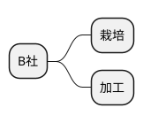

### ビジネスモデル

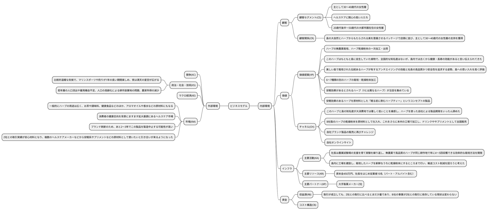

### SWOT分析


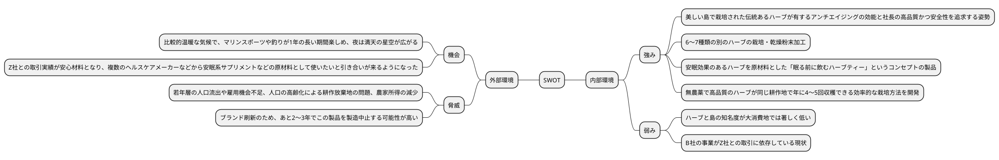

## 問題

### 第1問（配点20点）

#### 問題文

現在のB社の状況について、SWOT分析をせよ。各要素について、①～④の解答欄にそれぞれ40字以内で説明すること。

#### ロジック

##### 現状分析

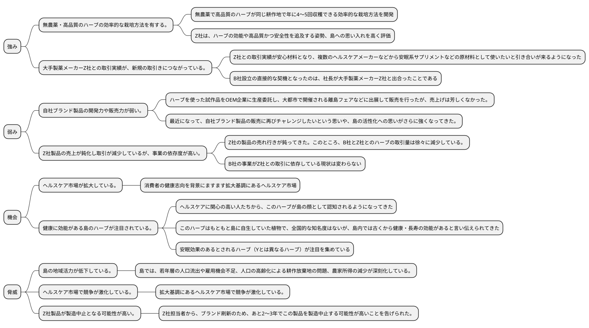

#### 解答

1. 無農薬・高品質のハーブの効率的な栽培技術、新規取引に繋がる大手Z社との取引実績。
2. 自社ブランド製品の開発力や販売力が弱い、取引が減少するZ社への依存度が高いこと。
3. 健康に効能のあるハーブが注目されていること、ヘルスケア市場が拡大していること。
4. ヘルスケア市場での競争激化、Z社製品の製造中止の可能性、島の地域活力の低下。


### 第2問（配点30点）

#### 問題文

Z社との取引縮小を受け、B社はハーブYの乾燥粉末の新たな取引先企業を探している。今後はZ社の製品とは異なるターゲット層を獲得したいと考えているが、B社の今後の望ましい取引先構成についての方向性を、100字以内で助言せよ。

#### ロジック

##### 現状分析

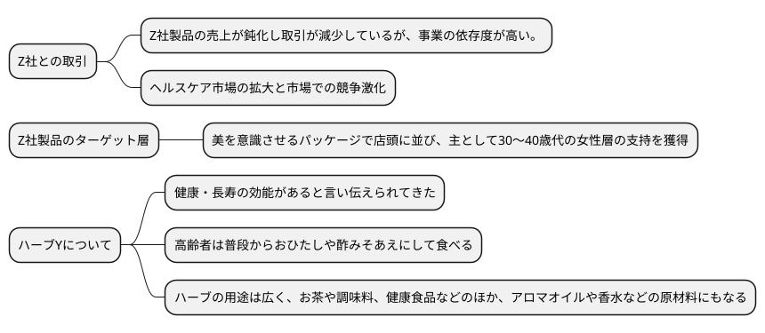

##### 課題設定

Z社製品と異なるターゲット層の獲得にあたっての、望ましい取引先構成

##### 解決策

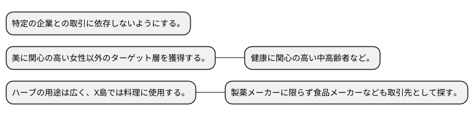

#### 解答

特定の企業との取引に依存しないように、複数の取引先を開拓する。健康に関心の高い中高年齢者などを顧客として獲得するために、製薬メーカーに限らず、食品メーカーやヘルスケアメーカーなども取引先企業として探す。


### 第３問（配点30点）

#### （設問１）

##### 問題文

B社社長は最近、「眠る前に飲むハーブティー」の自社オンラインサイトでの販売を手がけたところ、ある程度満足のいく売上げがあった。


上記の事象について、アンゾフの「製品・市場マトリックス」の考え方を使って50字以内で説明せよ。

##### ロジック

###### 現状分析

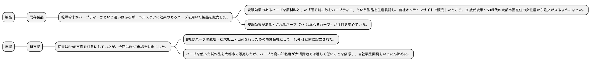

###### 課題設定


###### 解決策

```plantuml
@startmindmap

@endmindmap
```

##### 解答

ヘルスケアに効果のハーブを用いた製品で、一般消費者向けの市場を開拓する、新市場開拓戦略である。

#### （設問２）

##### 問題文

B社社長は自社オンラインサイトでの販売を今後も継続していくつもりであるが、顧客を製品づくりに巻き込みたいと考えている。顧客の関与を高めるため、B社は今後、自社オンラインサイト上でどのようなコミュニケーション施策を行っていくべきか。100字以内で助言せよ。

##### ロジック

###### 現状分析

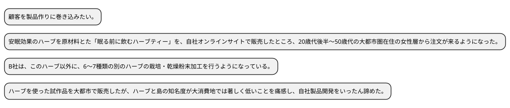

###### 課題設定

自社オンラインサイト上で行うコミュニケーション施策

###### 解決策

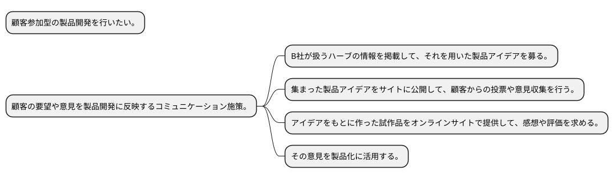

##### 解答

顧客の声を製品開発に反映するコミュニケーション施策を行う。具体的には、サイト上でB社が取り扱うハーブを用いた製品アイデアを募り、アイデアを公開して投票を行い、試作品を提供して評価を求めて製品化に活用する。

### 第4問（配点20点）

#### 問題文

B社社長は、自社オンラインサイトのユーザーに対して、X島宿泊訪問ツアーを企画することにした。社長は、ツアー参加者には訪問を機にB社とX島のファンになってほしいと願っている。

絶景スポットや星空観賞などの観光以外で、どのようなプログラムを立案すべきか。100字以内で助言せよ。


#### ロジック

##### 現状分析

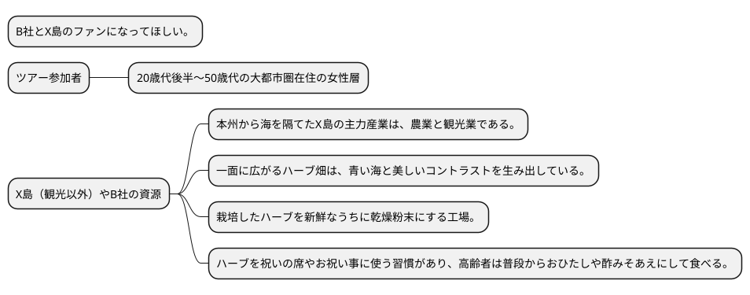

##### 課題設定

X島宿泊ツアーのプログラム立案

##### 解決策

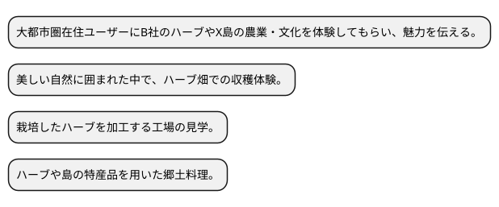

#### 解答

大都市圏在住のユーザーに対して、美しい自然に囲まれた中でのハーブ収穫や工場でのハーブ加工の見学、島の特産品を用いた郷土料理作りといった農業や文化を体験するプログラムを通して、B社とX島の魅力を伝える。