# 令和2年度 事例3　ステンレス製品の受注・製作・据付を行うC社の事例

## 与件文

【C社の概要】

　C社は、1955年創業で、資本金4,000万円、(VP)デザインを伴うビル建築用金属製品やモニュメント製品などのステンレス製品を受注・製作・据付する企業で、(KR)従業員は、営業部5名、製造部23名、総務部2名の合計30名で構成される。

　(VP)C社が受注しているビル建築用金属製品の主なものは、出入口の窓枠やサッシ、各種手摺、室内照明ボックスなどで、特別仕様の装飾性を要求されるステンレス製品である。(VP)またモニュメント製品は、作家（デザイナー）のデザインに従って製作するステンレス製の立体的造形物である。(KA)どちらも個別受注製品であり、C社の工場建屋の制約から設置高さ7m以内の製品である。(CS)主な顧客は、ビル建築用金属製品については建築用金属製品メーカー、モニュメント製品についてはデザイナーである。

　創業時は、サッシ、手摺など建築用金属製品の特注品製作から始め、(KA)特に鏡面仕上げなどステンレス製品の表面品質にこだわり、溶接技術や研磨技術を高めることに努力した。その後、ビル建築内装材の大型ステンレス加工、サイン（案内板）など装飾性の高い製品製作に拡大し、それに対応して設計技術者を確保し、設計から製作、据付工事までを受注する企業になった。

　その後、3代目である現社長は、(XM)就任前から溶接技術や研磨技術を生かした製品市場を探していたが、ある建築プロジェクトで外装デザインを行うデザイナーから、モニュメントの製作依頼を受けたことを契機として、特殊加工と仕上げ品質が要求されるステンレス製モニュメント製品の受注活動を始めた。

　モニュメント製品は受注量が減少したこともあったが、(XM)近年の都市型建築の増加に伴い製作依頼が増加している。(R$)受注量の変動が大きいものの、全売上高の40％を占め、ビル建築用金属製品と比較して付加価値が高いため、今後も受注の増加を狙っている。

【業務プロセス】

　ビル建築用金属製品、モニュメント製品の受注から引き渡しまでの業務フローは、以下のとおりである

　(KA)受注、設計、据付工事施工管理は営業部が担当する。顧客から引き合いがあると、受注製品ごとに受注から引き渡しに至る営業部担当者を決め、顧客から提供される設計図や仕様書などを基に、製作仕様と納期を確認して見積書を作成・提出し、契約締結後、製作図および施工図を作成して顧客承認を得る。(KA)通常、製作図および施工図の顧客承認段階では、仕様変更や図面変更などによって顧客とのやりとりが多く発生する。(KA)特にモニュメント製品では、造形物のイメージの摺合わせに時間を要する場合が多く、図面承認後の製作段階でも打ち合わせが必要な場合がある。設計には2次元CADを早くから使用している。

　(KA)その後、製作図を製造部に渡すことにより製作指示をする。製作終了後、据付工事があるものについては、営業部担当者が施工管理して据付工事を行い、検査後顧客に引き渡す。据付工事は社外の協力会社に依頼し、施工管理のみ社内営業部担当者が行っている。

　(KA)契約から製品引き渡しまでのリードタイムは、平均約2か月である。最終引き渡し日が設定されているが、契約、図面作成、顧客承認までの製作前プロセスに時間を要して製作期間を十分に確保できないことや、複雑な形状など高度な加工技術が必要な製品などの受注内容によって、製作期間が生産計画をオーバーするなど、納期の遅延が生じC社の大きな悩みとなっている。

　(KA)C社では、全社的な改善活動として「納期遅延の根絶」を掲げ、製作プロセスを含む業務プロセス全体の見直しを進めている。また、その対策の支援システムとしてIT化も検討している。

【生産の現状】

　(KA)製作工程は切断加工、曲げ加工、溶接・組立、研磨、最終検査の5工程である。切断加工工程と曲げ加工工程はNC加工機による加工であり、作業員2名が担当している。溶接・組立工程と研磨工程は溶接機や研磨機を用いた手作業であり、4班の作業チームが受注製品別に担当している。(KA)この作業チームは1班5名で編成され、熟練技術者が各班のリーダーとなって作業管理を行うが、各作業チームの技術力には差があり、高度な技術が必要な製作物の場合には任せられない作業チームもある。

　(KA)ビル建築用金属製品は切断加工、曲げ加工、溶接・組立までは比較的単純であるが、その後の研磨工程に技術を要する。(KA)また、モニュメント製品は立体的で複雑な曲線形状の製作が多く、全ての工程で製作図の理解力と高い加工技術が要求される。(KA)ビル建築用金属製品は製作完了後、製造部長と営業部の担当者が最終検査を行って、出荷する。モニュメント製品は、デザイナーの立ち会いの下、最終検査が行われ、この際デザイナーの指示によって製品に修整や手直しが生じる場合がある。

　(KA)生産計画は、製造部長が月次で作成している。月次生産計画は、営業部の受注情報、設計担当者の製品仕様情報によって、納期順にスケジューリングされるが、溶接・組立工程と研磨工程は加工の難易度などを考慮して各作業チームの振り分けを行いスケジューリングされる。(KA)C社の製品については基準となる工程順序や工数見積もりなどの標準化が確立しているとはいえない。

　(KR)工場は10年前に改築し、個別受注生産に適した設備や作業スペースのレイアウトに改善したが、最近の加工物の大型化によって狭隘な状態が進み、溶接・組立工程と研磨工程の作業スペースの確保が難しく、新たな製品の着手によって作業途中の加工物の移動などを強いられている。

　製造部長は、全社的改善活動のテーマである納期遅延の問題点を把握するため、作業時間中の作業者の稼働状態を調査した。それによると、(KA)不稼働の作業内容としては、「材料・工具運搬」と「歩行」のモノの移動に関連する作業が多く、その他作業者間の「打ち合わせ」、営業部担当者などとの打ち合わせのための「不在」が多く発生していた。

（令和2年度　中小企業診断士2次筆記試験　事例3　問題より引用）

## 分析

### 組織図

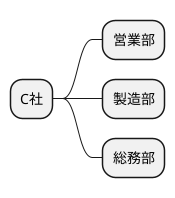

### ビジネスモデル

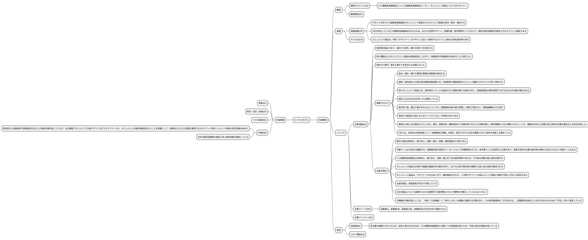

### SWOT分析

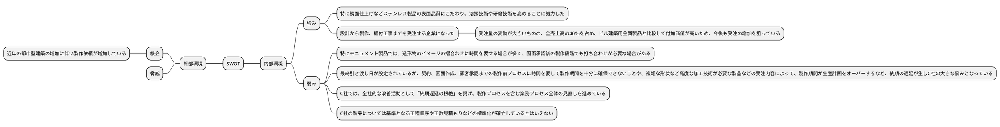

## 問題

### 第1問（配点20点）

#### 問題文

C社の(a)強みと(b)弱みを、それぞれ40字以内で述べよ。

#### ロジック

##### 現状分析

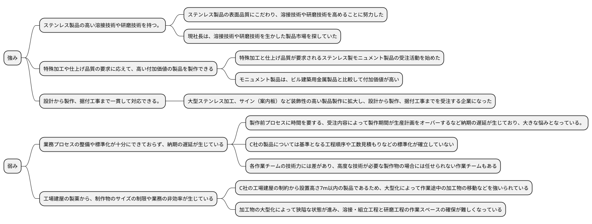

#### 解答

- 特殊加工等が必要な高付加価値を製作する溶接・研磨技術、設計から据付の一貫対応。
- 業務プロセスの整備や標準化が不十分で、納期の遅延が生じている。工場建屋の制約がある。

### 第2問（配点40点）

C社の大きな悩みとなっている納期遅延について、以下の設問に答えよ。

#### （設問1）

C社の営業部門で生じている(a)問題点と(b)その対応策について、それぞれ60字以内で述べよ。

##### 問題文

##### ロジック

###### 現状分析

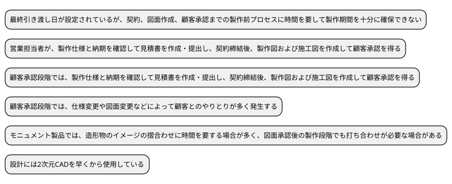

###### 課題設定

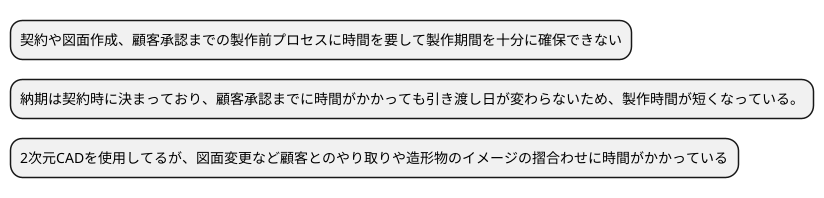

###### 解決策

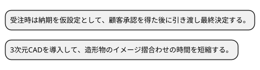

##### 解答

- 顧客承認までに顧客とのやりとりや造形物のイメージの摺合わせ等の製作前プロセスに時間がかかって、製作期間が短くなっている。
- 受注時は納期を仮設定し顧客承認を得た後に引き渡し日を決定する。設計に３次元CADを導入し顧客との摺合わせ時間を短縮する。

#### （設問2）

##### 問題文

C社の製造部門で生じている(a)問題点と(b)その対応策について、それぞれ60字以内で述べよ。

##### ロジック

###### 現状分析

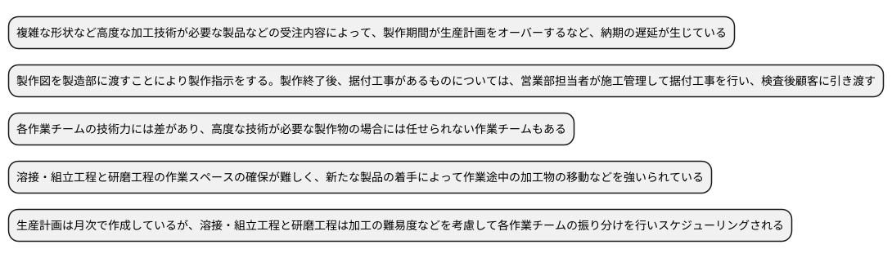

###### 課題設定

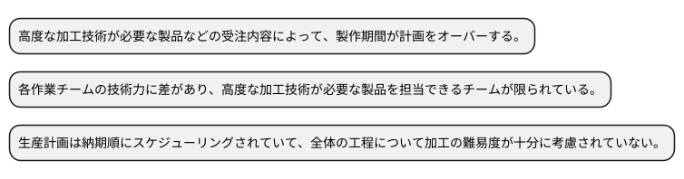

###### 解決策

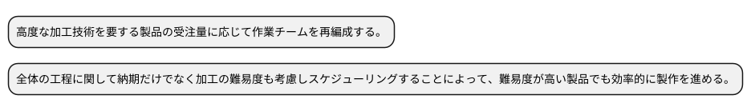

##### 解答

- 納期順に生産計画を作成しているため、加工難易度の高い製品を製作できるチームが限られるため、製作期間が計画をオーバーする。
- 納期だけでなく加工難易度も考慮し製作工程全体の生産計画を作成する。高度な技術を要する製品の受注量に応じて作業チームを再編成する。

### 第3問（配点20点）

#### 問題文

C社社長は、納期遅延対策として社内のIT化を考えている。C社のIT活用について、中小企業診断士としてどのように助言するか、120字以内で述べよ。

#### ロジック

##### 現状分析

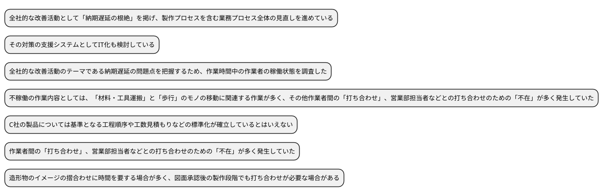

##### 課題設定

納期遅延対策として社内のIT活用を行う。

##### 解決策

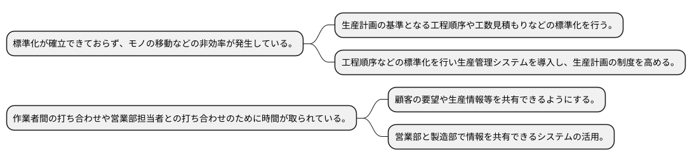

#### 解答

①営業部と製造部で顧客の要望や生産情報等を共有できるシステムを活用して、打ち合わせにかかる時間を削減し作業期間を確保する。
②工程順序などを標準化した上で、生産管理システムを導入する。生産計画の精度を向上し、不稼働を減らし作業効率を高める。

### 第4問（配点20点）

#### 問題文

C社社長は、付加価値の高いモニュメント製品事業の拡大を戦略に位置付けている。モニュメント製品事業の充実、拡大をどのように行うべきか、中小企業診断士として120字以内で助言せよ。

#### ロジック

##### 現状分析

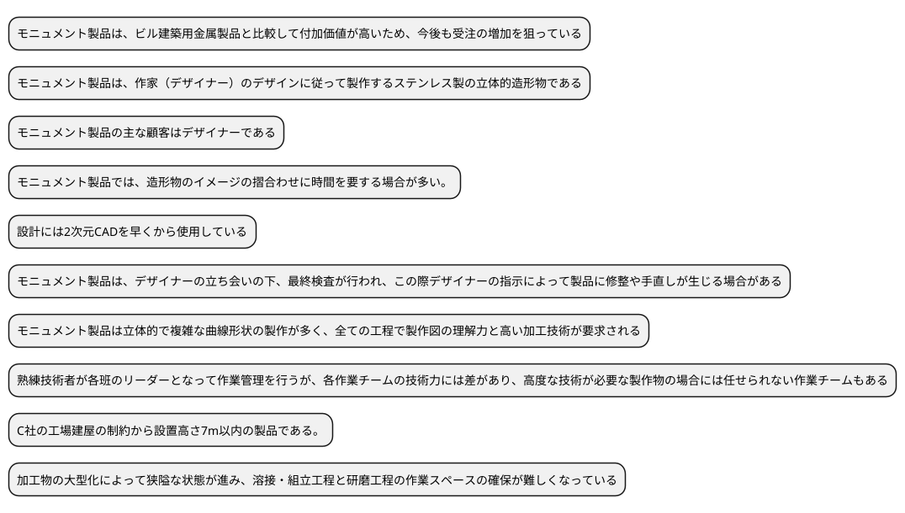

##### 課題設定

モニュメント製品事業の充実、拡大

##### 解決策

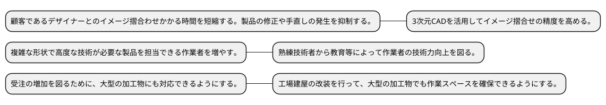

#### 解答

①３次元CADを活用し、デザイナーとのイメージ摺合わせ精度を上げ修正の発生を抑える、②担当できる作業者を増やすため熟練技術者による教育等により全社的に技術力向上を図る、③大型加工物にも対応できるように工場建屋を改修して作業場所を確保する。

