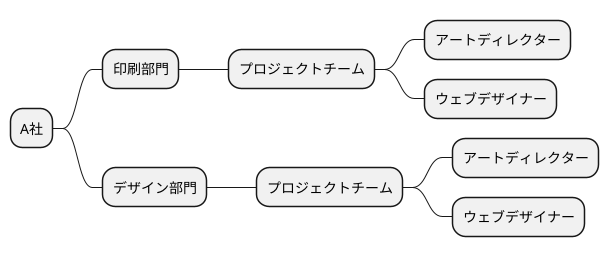
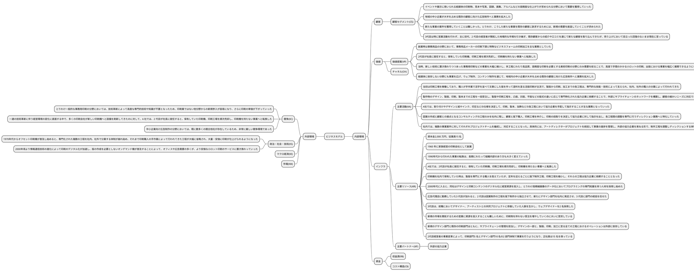
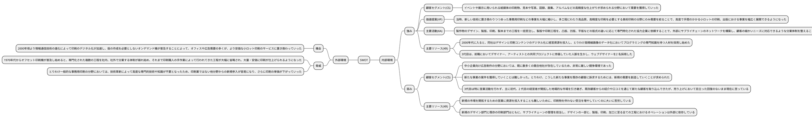
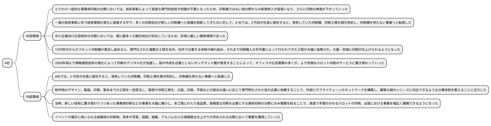
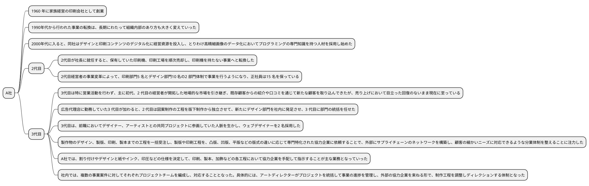
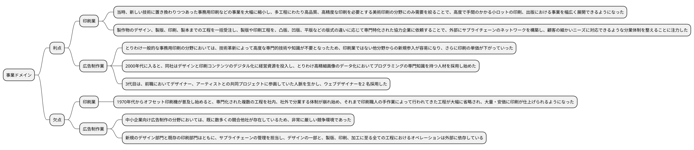
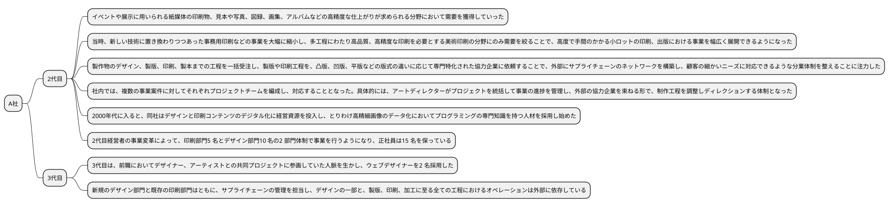
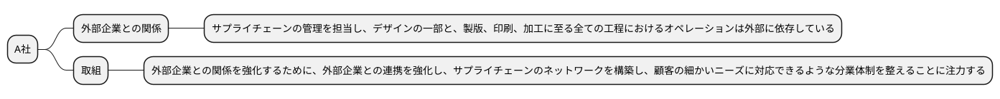
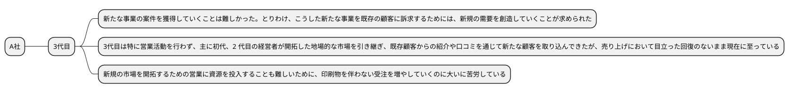
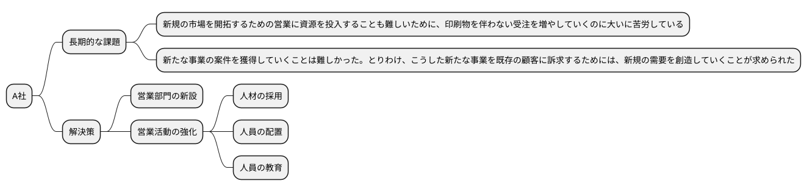

# 令和3年度 事例1　印刷・広告制作会社A社の事例

　A社は首都圏を拠点とする、(KR)資本金2,000 万円、従業員15 名の印刷・広告制作会社である。(KR)1960 年に家族経営の印刷会社として創業し、1990 年より長男が2 代目として引き継ぎ、30 年にわたって経営を担ってきたが、2020 年より3 代目が事業を承継している。

　(CS)創業時は事務用品の分野において、(VP)事務用品メーカーの印刷下請と特殊なビジネスフォームの印刷加工を主な業務としていた。(KA)当初は印刷工場を稼働しており、職人が手作業で活字を並べて文章にした版を作って塗料を塗る活版印刷が主流で、製版から印刷、加工までの各工程は、専門的な技能・技術によって支えられ、社内、社外の職人の分業によって行われてきた。

　(XS)しかしながら1970 年代からオフセット印刷機が普及し始めると、専門化された複数の工程を社内、社外で分業する体制が崩れ始め、それまで印刷職人の手作業によって行われてきた工程が大幅に省略され、大量・安価に印刷が仕上げられるようになった。

　(XS)さらに2000 年頃より情報通信技術の進化によって印刷のデジタル化が加速し、版の作成を必要としないオンデマンド機が普及することによって、オフィスや広告需要の多くが、より安価な小ロット印刷のサービスに置き換わっていった。(XC)とりわけ一般的な事務用印刷の分野においては、技術革新によって高度な専門的技術や知識が不要となったため、印刷業ではない他分野からの新規参入が容易になり、さらに印刷の単価が下がっていった。

　(XC)こうした一連の技術革新に伴う経営環境の変化に直面する中で、多くの印刷会社が新しい印刷機へと設備を刷新してきたのに対して、(KR)A 社では、2 代目が社長に就任すると、保有していた印刷機、印刷工場を順次売却し、印刷機を持たない事業へと転換した。(KA)制作物のデザイン、製版、印刷、製本までの工程を一括受注し、(KP)製版や印刷工程を、凸版、凹版、平版などの版式の違いに応じて専門特化された協力企業に依頼することで、(KA)外部にサプライチェーンのネットワークを構築し、顧客の細かいニーズに対応できるような分業体制を整えることに注力した。

　(KA)A 社では、割り付けやデザインと紙やインク、印圧などの仕様を決定して、印刷、製本、加飾などの各工程において協力企業を手配して指示することが主な業務となっていった。(VP)当時、新しい技術に置き換わりつつあった事務用印刷などの事業を大幅に縮小し、多工程にわたり高品質、高精度な印刷を必要とする美術印刷の分野にのみ需要を絞ることで、高度で手間のかかる小ロットの印刷、出版における事業を幅広く展開できるようになった。(CS)その結果、イベントや展示に用いられる紙媒体の印刷物、見本や写真、図録、画集、アルバムなどの高精度な仕上がりが求められる分野において需要を獲得していった。

　1990年代から行われた事業の転換は、長期にわたって組織内部のあり方も大きく変えていった。(KR)印刷機を社内で保有していた時は、製版を専門とする職人を抱えていたが、定年を迎えるごとに版下制作工程、印刷工程を縮小し、それらの工程は協力企業に依頼することとなった。(KA)そして、図案の作成と顧客との接点となるコンサルティングの工程のみを社内に残し、顧客と版下職人、印刷工場を仲介し、印刷の段取りを決定して協力企業に対して指示を出し、各工程間の調整を専門に行うディレクション業務へと特化していった。

　他方で2000年代に入ると、(KR)同社はデザインと印刷コンテンツのデジタル化に経営資源を投入し、とりわけ高精細画像のデータ化においてプログラミングの専門知識を持つ人材を採用し始めた。(KA)社内では、複数の事業案件に対してそれぞれプロジェクトチームを編成し、対応することとなった。具体的には、アートディレクターがプロジェクトを統括して事業の進捗を管理し、外部の協力企業を束ねる形で、制作工程を調整しディレクションする体制となった。

　また、(KR)広告代理店に勤務していた3 代目が加わると、2 代目は図案制作の工程を版下制作から独立させて、新たにデザイン部門を社内に発足させ、3 代目に部門の統括を任せた。(KR)3 代目は、前職においてデザイナー、アーティストとの共同プロジェクトに参画していた人脈を生かし、ウェブデザイナーを2 名採用した。こうした社内の人材の変化を受けて、(VP)紙媒体に依存しない分野にも事業を広げ、ウェブ制作、コンテンツ制作を通じて、(CS)地域内の中小企業が大半を占める既存の顧客に向けた広告制作へと業務を拡大した。(CS)しかしながら、新たな事業の案件を獲得していくことは難しかった。とりわけ、こうした新たな事業を既存の顧客に訴求するためには、新規の需要を創造していくことが求められた。また、(XC)中小企業向け広告制作の分野においては、既に数多くの競合他社が存在しているため、非常に厳しい競争環境であった。(KR)さらに新規の市場を開拓するための営業に資源を投入することも難しいために、印刷物を伴わない受注を増やしていくのに大いに苦労している。

　(KR)新規のデザイン部門と既存の印刷部門はともに、サプライチェーンの管理を担当し、デザインの一部と、製版、印刷、加工に至る全ての工程におけるオペレーションは外部に依存している。必要に応じて外部のフォトグラファーやイラストレーター、コピーライター、製版業者、印刷職人との協力関係を構築することで、事業案件に合わせてプロジェクトチームが社内に形成されるようになった。

　(KR)2代目経営者の事業変革によって、印刷部門5 名とデザイン部門10 名の2 部門体制で事業を行うようになり、正社員は15 名を保っている。(CS)3 代目は特に営業活動を行わず、主に初代、2 代目の経営者が開拓した地場的な市場を引き継ぎ、既存顧客からの紹介や口コミを通じて新たな顧客を取り込んできたが、売り上げにおいて目立った回復のないまま現在に至っている。
（令和3年度　中小企業診断士2次筆記試験　事例1　問題より引用）

## 与件文

## 分析

### 組織図

### ビジネスモデル

### SWOT分析

## 問題

### 第1問（配点20 点）

2代目経営者は、なぜ印刷工場を持たないファブレス化を行ったと考えられるか、100 字以内で述べよ。

#### 問題文

#### ロジック

##### 現状分析

#### 解答

技術革新により高度な専門技術や知識が不要となり内製するよりも外部に委託することで、設備投資を進める競合他社との差別化を図り、優位性を獲得するための戦略として、ファブレス化を行ったと考えられる。

### 第2問（配点20 点）

#### 問題文

2代目経営者は、なぜA 社での経験のなかった3 代目にデザイン部門の統括を任せたと考えられるか、100 字以内で述べよ。

#### ロジック

##### 現状分析

#### 解答

理由として、デザインと印刷コンテンツのデジタル化に経営資源を集中し既存の印刷ビジネス経験を必要とせず広告業界と関連性のあるデザイン部門の統括を後継者として経験を積ませるため任せたと考えられる。

### 第3問（配点20 点）　

#### 問題文

A社は、現経営者である3 代目が、印刷業から広告制作業へと事業ドメインを拡大させていった。これは、同社にどのような利点と欠点をもたらしたと考えられるか、100 字以内で述べよ。

#### ロジック

##### 現状分析

#### 解答

利点は、印刷業から広告制作業への事業ドメインの拡大により、新たな市場を開拓することができた。欠点は、競合他社が多い中での参入と、サプライチェーンの管理を外部に依存していることによるリスクがある。

### 第4問（配点20 点）

#### 問題文

2代目経営者は、プロジェクトごとに社内と外部の協力企業とが連携する形で事業を展開してきたが、3 代目は、2代目が構築してきた外部企業との関係をいかに発展させていくことが求められるか、中小企業診断士として100 字以内で助言せよ。

#### ロジック

##### 現状分析

##### 課題設定

2代目経営者が構築してきた外部企業との関係を発展させるためには、3 代目がどのような取り組みを行うべきか

##### 解決策

課題は外部依存のリスクを軽減し安定したサプライチェーンを構築すること。取組としては、重要業務の内製化、外部連携企業の新規開拓、既存連携企業との人的交流を通じた信頼関係の構築が挙げられる。

#### 解答

### 第5問（配点20 点）

#### 問題文

新規事業であるデザイン部門を担う3 代目が、印刷業を含めた全社の経営を引き継ぎ、これから事業を存続させていく上での長期的な課題とその解決策について100 字以内で述べよ。

#### ロジック

##### 現状分析

##### 課題設定

事業を存続させていく上での長期的な課題とその解決策

##### 解決策

課題は広告制作業ドメインの受注獲得と既存顧客からの新規需要の獲得。解決策としては、営業部門を新設し適性のある人材を配置と中途採用で即戦力の獲得により営業活動を強化することが挙げられる。

#### 解答
