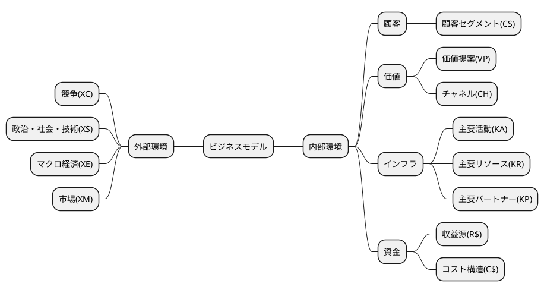
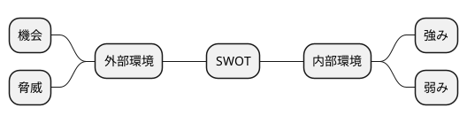

# 令和3年度 事例3　革製のバッグを製造、販売するC社の事例

## 与件文

【C社の概要】

　C社は、革製のメンズおよびレディースバッグを製造、販売する中小企業である。資本金は2,500万円、従業員は総務・経理部門5名、製品デザイン部門5名、製造部門40名の合計50名である。

　バッグを製造する他の中小企業同様、C社はバッグメーカーX社の縫製加工の一部を請け負う下請企業として創業した。そして徐々に加工工程の拡大と加工技術の向上を進め、X社が企画・デザインした製品の完成品までの一貫受託生産ができるようになり、X社の商品アイテム数の拡大も加わって生産量も増大した。しかしその後、X 社がコストの削減策として東南アジアの企業に生産を委託したことから生産量が減少し、その対策として他のバッグメーカーとの取引を拡大することで生産量を確保してきた。現在バッグメーカー4社から計10アイテムの生産委託を受けており、受注量は多いものの低価格品が主となっている。

　C社では、バッグメーカーとの取引を拡大するとともに、製品デザイン部門を新設し、自社ブランド製品の企画・開発、販売を進めてきた。その自社ブランド製品が旅行雑誌で特集されて、手作り感のある高級仕様が注目された。高価格品であったが生産能力を上回る注文を受けた経験があり、自社ブランド化を推進する契機となった。さらに、その旅行雑誌を見たバッグ小売店数社からC社ブランド製品の引き合いがあり、販売数量は少ないものの小売店との取引も始められた。一方でC社独自のウェブサイトを立ち上げ、インターネットによるオンライン販売も開始し、今では自社ブランド製品販売の中心となっている。現在自社ブランド製品は25アイテム、C社売上高の20％程度ではあるが、収益に貢献している。

【自社ブランド製品と今後の事業戦略】

　C社の自社ブランド製品は、天然素材のなめし革を材料にして、熟練職人が縫製、仕上げ加工する高級品である。その企画・開発コンセプトは、「永く愛着を持って使えるバッグ」であり、そのため自社ブランド製品の修理も行っている。新製品は、インターネットのオンライン販売情報などを活用して企画している。

　C社社長は今後、大都市の百貨店や商業ビルに直営店を開設して、自社ブランド製品の販売を拡大しようと検討している。ただ、製品デザイン部門には新製品の企画・開発経験が少ないことに不安がある。また、製造部門の対応にも懸念を抱いている。


【生産の現状】

　生産管理担当者は、バッグメーカーの他、小売店およびインターネットからの注文受付や自社ブランド製品の修理受付の窓口でもあり、それらの製造および修理の生産計画の立案、包装・出荷担当への出荷指示なども行っている。生産計画は月1回作成し、月末の生産会議で各工程のリーダーに伝達されるが、計画立案後の受注内容の変動や特急品の割込みによって月内でもその都度変更される。

　生産は、バッグメーカーから受託する受注生産が主であり、1回の受注量は年々小ロット化している。生産管理担当者は、繰り返し受注を見越して、受注量よりも多いロットサイズで生産を計画し、納品量以外は在庫保有している。

　バッグ小売店やインターネットで販売する自社ブランド製品は、生産管理担当者が受注予測を立てて生産計画を作成し、見込生産している。注文ごとに在庫から引き当てるものの、欠品や過剰在庫が生じることがある。

受注後の製造工程は、裁断、縫製、仕上げ、検品、包装・出荷の5工程である。

　裁断工程では、材料の革をパーツごとに型で抜き取る作業を行っており、C社内の製造工程では一番機械化されている。その他に、材料や付属部品などの資材発注と在庫管理も裁断工程のリーダーが担当する。生産計画に基づき発注業務を行うが、発注から納品までの期間が1カ月を超える資材もあり、資材欠品が生じた場合、生産計画の変更が必要となる。

　C社製造工程では一番多くの熟練職人6名が配置されている縫製工程は、裁断された革を組み立てて成形する作業を行う。通常はバッグメーカーからの受託生産品の縫製作業が中心で、裁断済みパーツの部分縫製とそれを組み合わせて製品形状にする全体縫製との作業に大きく分かれ、全体縫製では部分縫製よりも熟練を要する。自社ブランド製品の生産が計画されると、熟練職人は受託生産品の作業から自社ブランド製品の作業へ移る。自社ブランド製品は、部分縫製から立体的形状を要求される全体縫製のすべてを一人で製品ごとに熟練職人が担当し、そのほとんどの作業は丁寧な手縫い作業（手作業）で行われる。自社ブランド製品の縫製工程を担当した熟練職人は、引き続き仕上げ工程についても作業を行い、製品完成まで担当している。各作業者の作業割り当ては、縫製工程のリーダーが各作業者の熟練度を考慮して決めている。縫製工程は、自社ブランド製品の修理作業も担当しており、C社製造工程中最も負荷が大きく時間を要する工程となっている。

　仕上げ工程は、縫製されたバッグメーカーからの受託生産品の裁断断面の処理、付属金物の取り付けなどを行う製造の最終工程を担当し、縫製工程同様手作業が多く、熟練を要する。

　縫製、仕上げ両工程では、熟練職人の高齢化が進み、今後退職が予定されているため、若手職人の養成を行っている。その方法として、細分化した作業分担制で担当作業の習熟を図ろうとしているが、バッグを一人で製品化するために必要な製造全体の技術習熟が進んでいない。

　検品工程では製品の最終検査を行っているが、製品の出来栄えのばらつきが発生した場合、手直し作業も担当する。

　包装・出荷工程は、完成した製品の包装、在庫管理、出荷業務を担当する。

（令和3年度　中小企業診断士2次筆記試験　事例3　問題より引用）

## 分析

### 組織図

```plantuml
@startmindmap
@endmindmap
```

### ビジネスモデル



### SWOT分析





## 問題

### 第1問（配点20点）

#### 問題文

革製バッグ業界におけるC社の(a)強みと(b)弱みを、それぞれ40字以内で述べよ。

#### ロジック

##### 現状分析

```plantuml
@startmindmap

@endmindmap
```

#### 解答


### 第2問（配点30点）

#### 問題文

バッグメーカーからの受託生産品の製造工程について、効率化を進める上で必要な(a)課題2つを20字以内で挙げ、それぞれの(b)対応策を80字以内で助言せよ。

#### ロジック

##### 現状分析

```plantuml
@startmindmap

@endmindmap
```

##### 課題設定

##### 解決策

```plantuml
@startmindmap

@endmindmap
```

#### 解答


### 第3問（配点20点）

#### 問題文

C社社長は、自社ブランド製品の開発強化を検討している。この計画を実現するための製品企画面と生産面の課題を120字以内で述べよ。

#### ロジック

##### 現状分析

```plantuml
@startmindmap

@endmindmap
```

##### 課題設定


##### 解決策

```plantuml
@startmindmap

@endmindmap
```

#### 解答

### 第4問（配点30点）

#### 問題文

C社社長は、直営店事業を展開する上で、自社ブランド製品を熟練職人の手作りで高級感を出すか、それとも若手職人も含めた分業化と標準化を進めて自社ブランド製品のアイテム数を増やすか、悩んでいる。

C社の経営資源を有効に活用し、最大の効果を得るためには、どちらを選び、どのように対応するべきか、中小企業診断士として140字以内で助言せよ。

#### ロジック

##### 現状分析

```plantuml
@startmindmap

@endmindmap
```

##### 課題設定

##### 解決策

```plantuml
@startmindmap

@endmindmap
```

#### 解答
