# 令和3年度 事例2　豆腐の製造販売業者B社の事例

　(KR)B社は資本金300 万円、社長を含む従業者数15 名の豆腐の製造販売業者である。(XS)B 社は清流が流れる地方都市X 市に所在する。この清流を水源とする地下水は良質な軟水で、滑らかな豆腐づくりに向く。

　1953 年（昭和28年）、現社長の祖父がX 市の商店街にB 社を創業した。(VP)地元産大豆、水にこだわった豆腐は評判となり、品評会でも度々表彰された。なお、X 市は室町時代に戦火を避けて京都から移り住んだ人々の影響で、小京都の面影を残している。そのため、京文化への親近感が強く、(XS)同地の職人には京都の老舗で修行した者が多い。同地の繁盛店は、B 社歴代社長、(KP)新しい素材を使った菓子で人気を博す和菓子店の店主、予約が取りにくいと評判の割烹の板前など京都で修行した職人が支えている。

　1981 年（昭和56 年）、創業者の病をきっかけに、経営は息子の2 代目に引き継がれた。その頃、(XC) 市でもスーパーマーケットなど量販店の出店が増加し、(CH)卸販売も行うようになった。(KR)従来の商店街の工場兼店舗が手狭になったため、良質な地下水を採取できる農村部の土地に工場を新設した。パートの雇用も増やし、生産量を拡大した。

　2000 年（平成12 年）、創業者の孫にあたる現社長が、京都での修行を終えてB 社を継承した。その頃、(VP)地場資本のスーパーマーケットからプライベート・ブランド（PB）の製造呼びかけがあった。国産大豆を使いながらも、価格を抑え、集客の目玉とするPB であった。地元産大豆にこだわった祖父と父のポリシーに反するが、事業拡大の好機と捉え、コンペ（企画競争型の業者選定会）に参加し、受注に成功した。(KR)そしてPB 製造のための材料用倉庫と建屋も新築し、パートも増やした。その後、数度のコンペで受注契約を繰り返し、(R$)最盛期はB 社売上比率の約半分がPB で占められた。しかし、(XC)2015 年（平成27 年）のコンペで大手メーカーに敗れ、契約終了となった。

　PB の失注のタイミングで、(KP)X 市の大手米穀店Y 社からアプローチがあり、協議の結果、(KR)農村部の工場の余剰設備をY 社へ売却し、整理人員もY 社が雇用した。X 市は豊富な水を活かした米の生産も盛んで、Y 社は同地の米の全国向けEC サイトに注力している。Y 社社長は以前より在庫用倉庫と炊飯に向く良質な軟水を大量に採取できる井戸を探していた。Y 社は建屋を改修し、B 社の地下水を購入する形で、(CH)Y 社サイトのお得意さまに限定販売するペットボトル入り水の製造を開始した。またY 社は(VP)「X 市の魅力を全国に」との思いからX 市企業の佃煮、干物などもY 社サイトでコラボ企画と称して販売している。(CH)近年、グルメ雑誌でY 社サイトの新米、佃煮が紹介されたのをきっかけに、(CS)全国の食通を顧客として獲得し、サイトでの売上が拡大している。

　B社社長はPB 関連施設の整理のめどが立った頃、B 社の将来について、残った従業員と会議を重ねた。その結果、(VP)各地で成功例のある冷蔵販売車を使った豆腐の移動販売の開始を決意した。(CH)売上の早期回復のために移動販売はフランチャイズ方式を採用した。先行事例を参考に、(KR)フランチャイジーは加盟時に登録料と冷蔵販売車を用意し、以降はB 社から商品を仕入れるのみで、その他のフィーは不要とする方式とした。また、(KA)フランチャイジーは担当地域での販売に専念し、B 社はその他のマーケティング活動、支援活動を担当する。結果、元商店経営者やB社の元社員などがフランチャイジーとして加盟した。

　移動販売の開始と同時に原材料を全て地元産大豆に戻し、品揃えも大幅に見直した。(VP)手頃な価格の絹ごし豆腐、木綿豆腐の他、柚子 豆腐、銀杏豆腐などの季節の変わり豆腐も月替わりの商品として加えた。(VP)新商品のグラム当たり単価はいずれもスーパーマーケットの高価格帯商品よりも高く設定した。

(CH)移動販売は戸別訪問の他に、豆腐の製造販売店がない商店街、遊戯施設、病院などの駐車場でも許可を得て販売している。(CS)駐車場での販売は高齢者が知り合いを電話で呼び、井戸端会議のきっかけとなることも多い。(R$)移動販売の開始後、顧客数は拡大したものの客単価は伸び悩んでいたが、フランチャイジーの1 人がデモンストレーション販売をヒントに始めた販売方法が客単価を引き上げた。(CR)自身が抱える在庫をどうせ廃棄するならば、と小分けにし、使い捨て容器に盛り付け、豆腐に合った調味料をかけて試食を勧めながら、商品説明を積極的に行った結果、次第に高単価商品が売れ始めた。

　(CR)フランチャイジーと高齢者顧客とのやり取りは来店前の電話での通話が主体である。インスタント・メッセンジャー（IM）の利用を勧めた時もあったが敬遠されたため、電話がメインになっている。ただし若年層にはIM によるテキストでのやり取りの方が好まれ、自社の受注用サイトを作る計画もあったが、ノウハウもなく、投資に見合った利益が見込めないとの判断により、IM で十分という結論に達した。

　移動販売の開始以降、(CR)毎年秋には農村部の工場に顧客リストの中から買い上げ額上位のお得意さまの家族を招いて、日頃のご愛顧への感謝を伝える収穫祭と称するイベントを実施してきた。これは昔ながらの方法で大豆の収穫を体験するイベントである。収穫の喜びを顧客と共有すると共に、(CS)B 社の顧客は高齢者が多いため、一緒に昔を懐かしむ目的で始めた。しかし、食べ物が多くの人の努力を経て食卓に届くことを孫に教えたいという声が増え、年を追うごとに子連れの参加者が多くなった。収穫体験の後には食事会を開き、B 社商品を使った肉豆腐や湯豆腐を振る舞う。ここで参加者が毎年楽しみにしているのは炊きたての新米に、出来たての温かい豆腐を乗せ、鰹節としょうゆ、薬味の葱ねぎ少々をかけた豆腐丼であった。豆腐丼は祖父の時代からB 社でまかないとして食べてきたものである。(VP)「豆腐に旅をさせるな」といわれるように出来たての豆腐の風味が最も良く、豆腐と同じ水で炊き上げた新米との相性も合って毎年好評を得ていた。(CS)同市の年齢分布を踏まえると主婦層の顧客が少ないという課題を抱えつつ、移動販売は高齢層への販売を伸ばし続けていた。

　(XS)しかしながら、新型コロナウイルス感染症のまん延に伴い、以降、試食を自粛した。また、人的接触を避けるために、駐車場での販売から戸別販売への変更を希望したり、戸別訪問を断ったりする顧客が増えてきた。収穫祭では収穫体験のみを実施し、室内での食事会を中止した。その際に、豆腐丼を惜しむ声が複数顧客より寄せられた。(CH)B 社社長が全国に多数展開される豆腐EC サイトを調べたところ、多くのサイトで豆乳とにがりをセットにした商品が販売されていることを知り(VP)「手作り豆腐セット」を開発し、移動販売を開始した。顧客が豆乳とにがりを混ぜ、蒸し器で仕上げる手間のかかる商品であるが、出来たての豆腐を味わえる。(CS)リモートワークの浸透を受け、自宅での食事にこだわりを持つ家庭が増え、お得意さま以外の主婦層にも人気を博している。この商品のヒットもあり、何とかもちこたえてきたものの、(R$)移動販売の売上は3 割落ち込んだままである。

　そこで、(CH)人的接触を控えたい、自宅を不在にする日にも届けてほしいという高齢層や主婦層の声を踏まえ、生協を参考に冷蔵ボックスを使った置き配の開始も検討している。そして、危機こそ好機と捉え、(CS)豆腐やおからを材料とする菓子類による主婦層の獲得や、(CH)地元産大豆の魅力を伝える全国向けネット販売といった夢をこの機にかなえたいと考えている。しかし、具体的な打ち手に悩んだB 社社長は2021 年（令和3 年）8 月末に中小企業診断士に相談することとした。

（令和3年度　中小企業診断士2次筆記試験　事例2　問題より引用）

## 与件文

## 分析

### 組織図

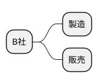

### ビジネスモデル

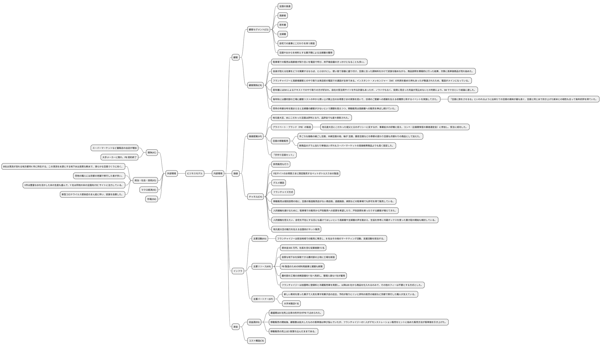

### SWOT分析


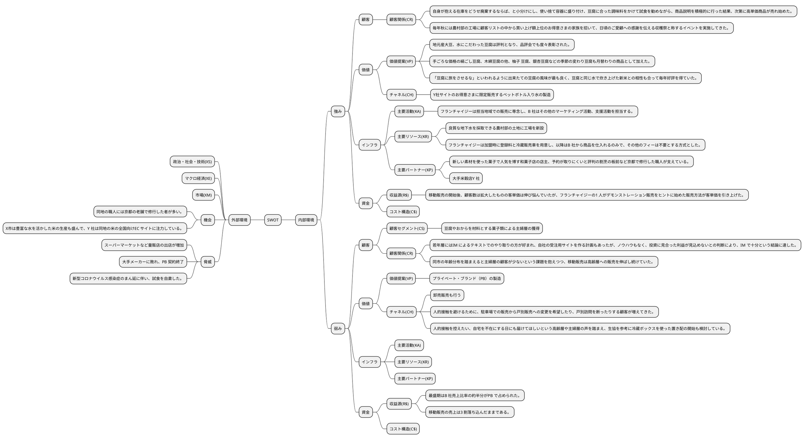


## 問題

### 第1問（配点20 点）

#### 問題文

2021 年（令和3 年）8 月末時点のB 社の状況を、移動販売の拡大およびネット販売の立ち上げを目的としてSWOT 分析によって整理せよ。①～④の解答欄に、それぞれ30 字以内で述べること。

#### ロジック

##### 現状分析

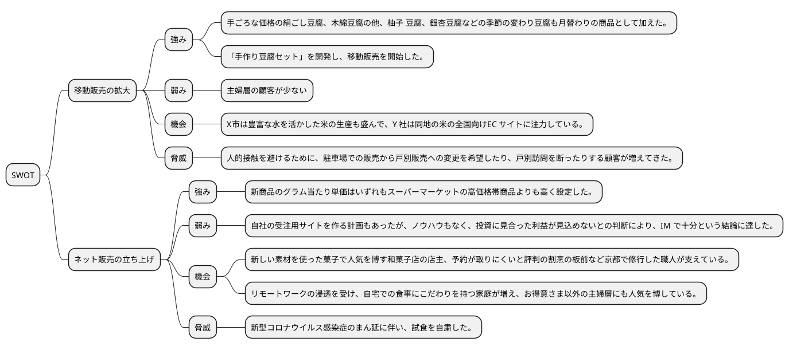

#### 解答

強みは、幅広し商品ラインナップと競合より高価格帯の商品設定。
弱みは、主婦層の顧客が少ないことと、ネット販売のノウハウ不足。
機会は、地元の水源を活かした商品開発と、リモートワークの浸透。
脅威は、新型コロナウイルス感染症の影響と、人的接触を避ける顧客の増加。

### 第2問（配点25 点）

#### 問題文

B 社社長は社会全体のオンライン化の流れを踏まえ、ネット販売を通じ、地元産大豆の魅力を全国に伝えたいと考えている。そのためには、どの商品を、どのように販売すべきか。ターゲットを明確にした上で、中小企業診断士の立場から100 字以内で助言せよ。


#### ロジック

##### 現状分析

```plantuml
@startmindmap

* ネット販売
** 商品
*** 手ごろな価格の絹ごし豆腐、木綿豆腐の他、柚子 豆腐、銀杏豆腐などの季節の変わり豆腐も月替わりの商品として加えた。
*** 「手作り豆腐セット」を開発し、移動販売を開始した。
***　「豆腐に旅をさせるな」といわれるように出来たての豆腐の風味が最も良く、豆腐と同じ水で炊き上げた新米との相性も合って毎年好評を得ていた。
** 販売
*** 自身が抱える在庫をどうせ廃棄するならば、と小分けにし、使い捨て容器に盛り付け、豆腐に合った調味料をかけて試食を勧めながら、商品説明を積極的に行った結果、次第に高単価商品が売れ始めた。
*** フランチャイジーと高齢者顧客とのやり取りは来店前の電話での通話が主体である。インスタント・メッセンジャー（IM）の利用を勧めた時もあったが敬遠されたため、電話がメインになっている。
*** Y社サイトのお得意さまに限定販売するペットボトル入り水の製造
** ターゲット
*** 同市の年齢分布を踏まえると主婦層の顧客が少ないという課題を抱えつつ、移動販売は高齢層への販売を伸ばし続けていた。
*** 若年層にはIM によるテキストでのやり取りの方が好まれ、自社の受注用サイトを作る計画もあったが、ノウハウもなく、投資に見合った利益が見込めないとの判断により、IM で十分という結論に達した。
*** 自宅での食事にこだわりを持つ家庭が増え、お得意さま以外の主婦層にも人気を博している。
*** 全国の食通

@endmindmap
```

##### 課題設定

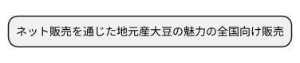

##### 解決策

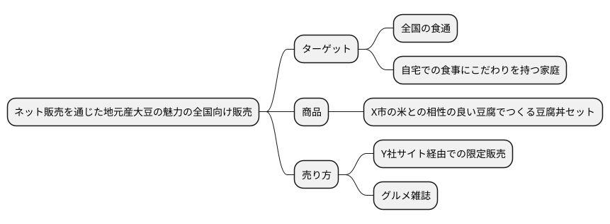

#### 解答

全国の食通や自宅での食事にこだわりを持つ家庭をターゲットに、X市の米との相性の良い豆腐でつくる豆腐丼セットをY社サイト経由で限定販売することで、地元産大豆の魅力を全国に伝えることができる。

### 第3問（配点30 点）　


#### 問題文

B 社のフランチャイズ方式の移動販売において、置き配を導入する場合に、それを利用する高齢者顧客に対して、どのような取り組みを実施すべきか。中小企業診断士の立場から(a)フランチャイザー、(b)フランチャイジーに対して、それぞれ50 字以内で助言せよ。

#### ロジック

##### 現状分析

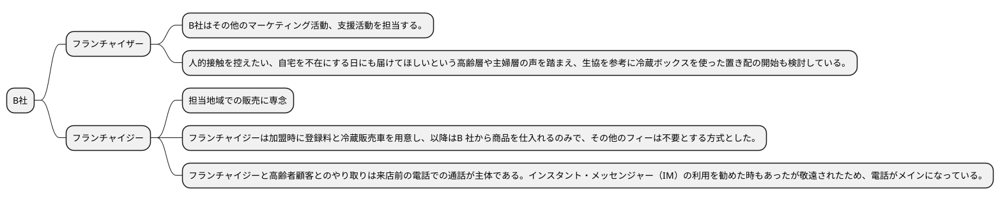

##### 課題設定

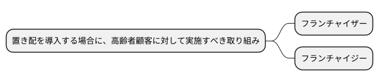

##### 解決策

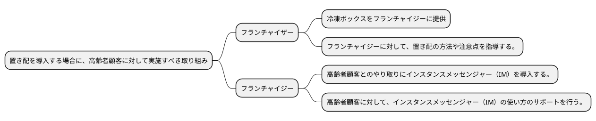

#### 解答

(a)フランチャイザーは、冷凍ボックスをフランチャイジーに提供し、置き配の方法や注意点を指導する。 (b)フランチャイジーは、高齢者顧客とのやり取りにインスタンスメッセンジャー（IM）を導入し、使い方のサポートを行う。


### 第4問（配点25 点）

#### 問題文

B社ではX市周辺の主婦層の顧客獲得をめざし、豆腐やおからを材料とする菓子類の新規開発、移動販売を検討している。製品戦略とコミュニケーション戦略について、中小企業診断士の立場から100 字以内で助言せよ。

#### ロジック

##### 現状分析

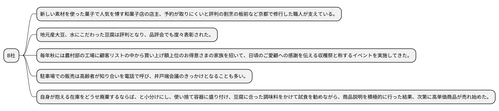

##### 課題設定

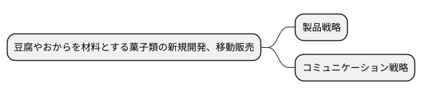

##### 解決策

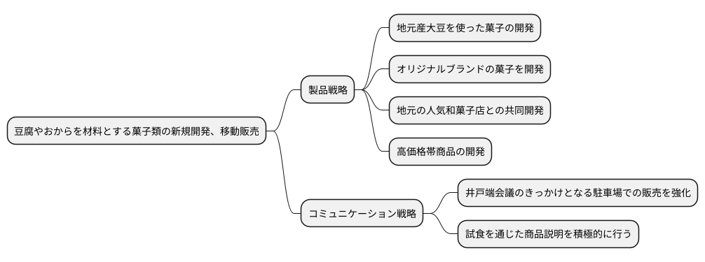

#### 解答

製品戦略として、地元産大豆を使った菓子の開発、オリジナルブランドの菓子の開発、地元の人気和菓子店との共同開発、高価格帯商品の開発を行う。コミュニケーション戦略として、井戸端会議のきっかけとなる駐車場での販売を強化し、試食を通じた商品説明を積極的に行う。
