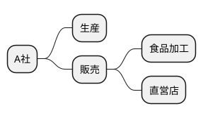
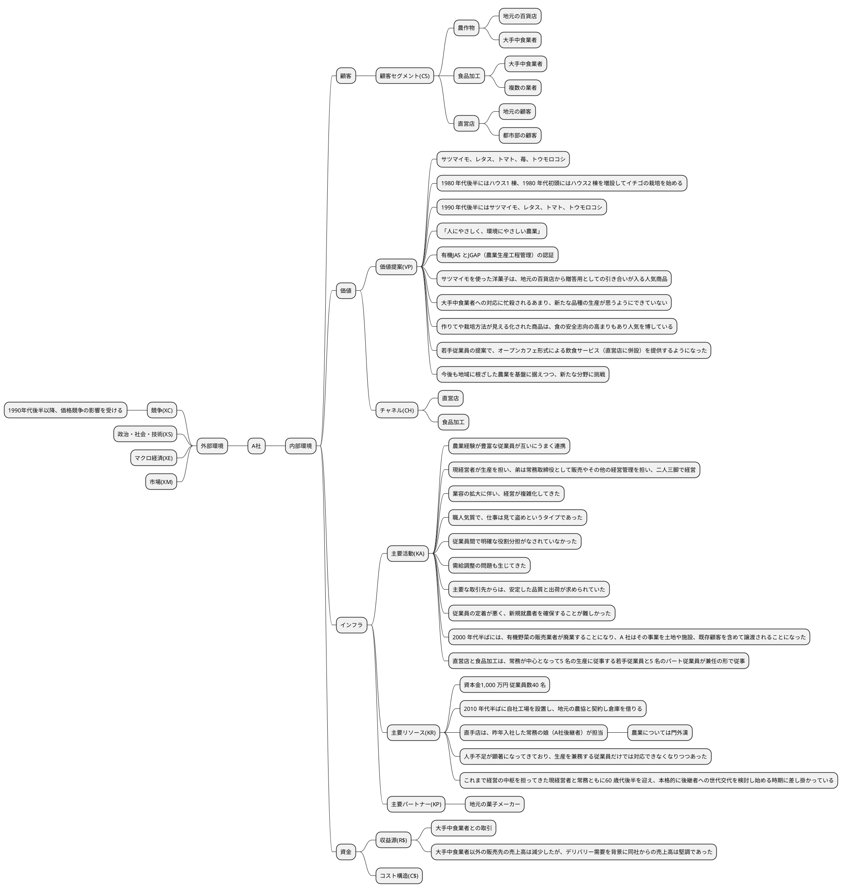
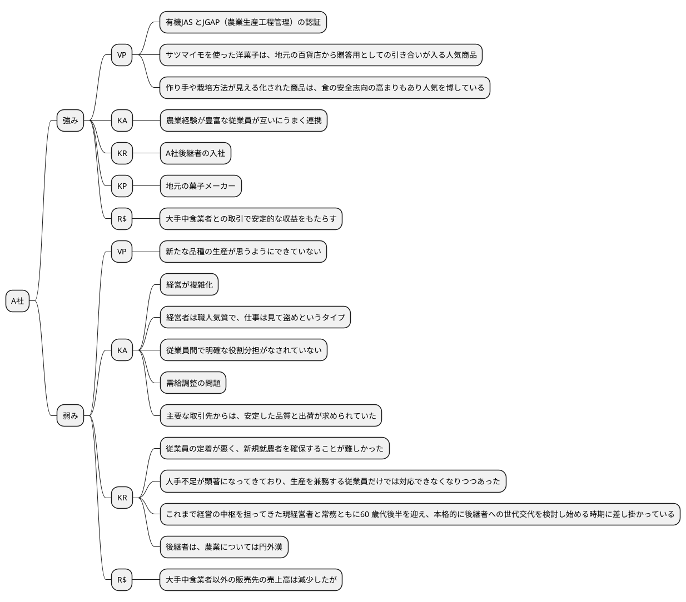
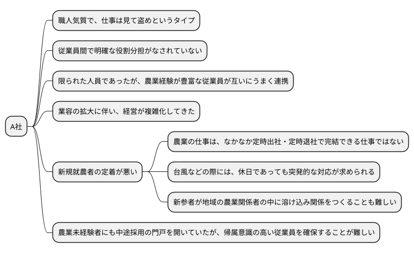
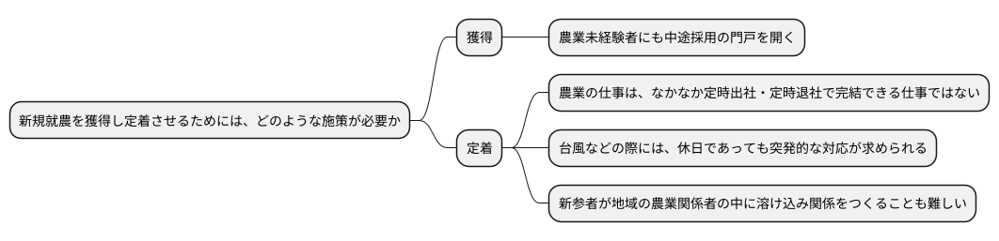
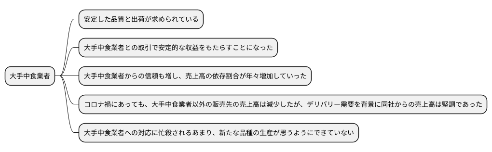
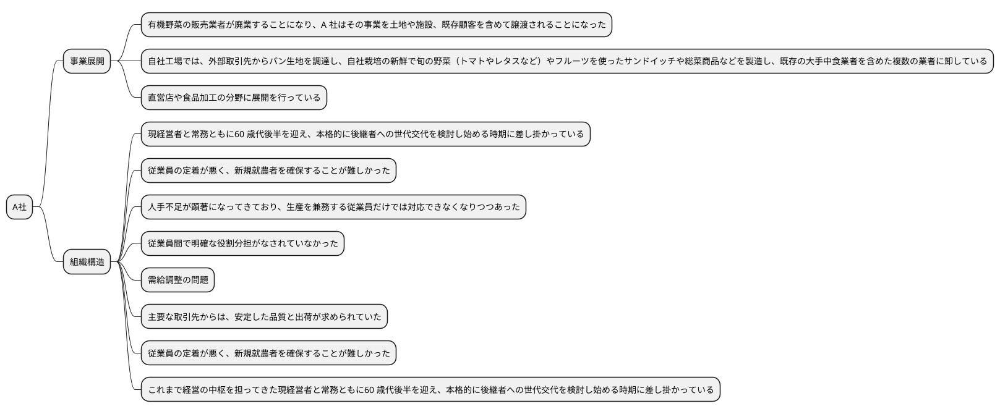
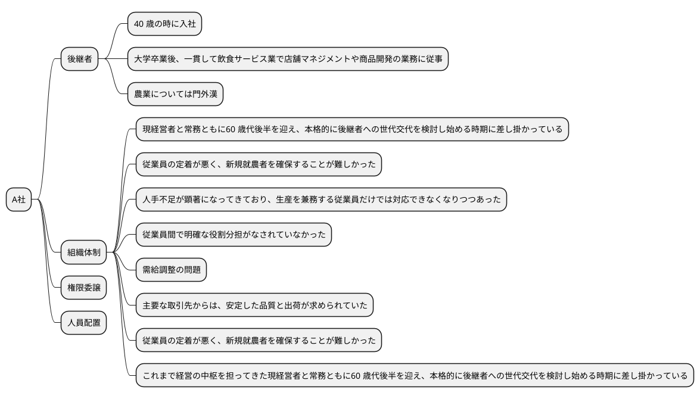
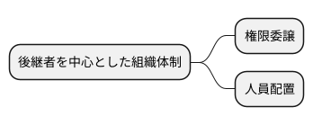

# 令和4年度　事例Ⅰ　農業法人Ａ社の事例

## 与件文

①A社は、(VP)サツマイモ、レタス、トマト、苺、トウモロコシなどを栽培・販売する農業法人（株式会社）である。(KR)資本金は1,000 万円（現経営者とその弟が折半出資）、従業員数は40 名（パート従業員10 名を含む）である。A 社の所在地は、水稲農家や転作農家が多い地域である。

②A社は、戦前より代々、家族経営で水稲農家を営んできた。69 歳になる現経営者は、幼い頃から農作業に触れてきた体験を通じて農業の面白さを自覚し、父親からは農業のイロハを叩き込まれた。当初、現経営者は水稲農業を引き継いだが、普通の農家と違うことがしたいと決心し、先代経営者から資金面のサポートを受け、1970 年代初頭に施設園芸用ハウスを建設して苺の栽培と販売を始める。(VP)同社の苺は、糖度が高いことに加え、大粒で形状や色合いが良く人気を博した。県外からの需要に対応するため、1970 年代後半にはハウス1 棟、1980 年代初頭にはハウス2 棟を増設した。(VP)(CS)その頃から贈答用果物として地元の百貨店を中心に販売され始めた。1980 年代後半にかけて、順調に売上高を拡大することができた。

③(XM T)他方、バブル経済崩壊後、(R$ W)贈答用の高級苺の売上高は陰りを見せ始める。現経営者は、(VP)次の一手として1990 年代後半に作り方にこだわった野菜の栽培を始めた。当時限られた人員であったが、(KA S)現経営者を含め農業経験が豊富な従業員が互いにうまく連携し、(VP)サツマイモを皮切りに、レタス、トマト、トウモロコシなど栽培する品種を徐々に広げていった。この頃から業務量の増加に伴い、パート従業員を雇用するようになった。

④A社は、バブル経済崩壊後の収益の減少を乗り越え、順調に事業を展開していたが、(XC T)1990 年代後半以降、価格競争の影響を受けるようになった。その頃、首都圏の大手流通業に勤めていた現経営者の弟が入社した。(KA)現経営者が生産を担い、弟は常務取締役として販売やその他の経営管理を担い、二人三脚で経営を行うようになる。現経営者と常務は、新しい収益の柱を模索する。そこで、打ち出したのが、(VP)「人にやさしく、環境にやさしい農業」というコンセプトであった。常務は、販売先の開拓に苦労したが、(KP)有機野菜の販売業者を見つけることができた。A 社は、この販売業者のアドバイスを受けながら、(VP S)最終消費者が求める野菜作りを行い、2000 年代前半に有機JAS とJGAP（農業生産工程管理）の認証を受けた。

⑤また、A 社では、(KP)地元の菓子メーカーと連携し、(VP)同社の栽培するサツマイモを使った洋菓子を共同開発した。もともと、A 社のサツマイモは、上品な甘さとホクホクとした食感があり人気商品であった。地元菓子メーカーと開発した洋菓子は、販売開始早々、地元の百貨店から贈答用としての引き合いが入る人気商品となった。(VP S)この洋菓子は、地域の新たな特産品としての認知度を高めた。

⑥(KA W)他方、業容の拡大に伴い、経営が複雑化してきた。(KA W)現経営者は職人気質で、仕事は見て盗めというタイプであった。また、A 社ではパート従業員だけではなく、家族や親族以外の正社員採用も行い従業員数も増加していた。しかし、(KA W)従業員間で明確な役割分担がなされていなかった。そこに、(KA W)需給調整の問題も生じてきた。作物は天候の影響を受ける。また収穫時期の違いなどによる季節的な繁閑がある。そのため、A社では、(KA W)繁忙期は従業員総出でも人手が足りず、パート従業員をスポットで雇用して対応する一方、閑散期は逆に人手が余るような状況であった。それに加え、(KA W)主要な取引先からは、安定した品質と出荷が求められていた。

⑦さらに、(KR W)従業員の定着が悪く、新規就農者を確保することが難しかった。農業の仕事は、なかなか定時出社・定時退社で完結できる仕事ではない。台風などの際には、休日であっても突発的な対応が求められる。また、新参者が地域の農業関係者の中に溶け込み関係をつくることも難しかった。A 社では、農業経験者だけではなく、農業未経験者にも中途採用の門戸を開いていたが、帰属意識の高い従業員を確保することが難しかった。県の農業大学校の卒業生など新卒採用も始めたが、長く働き続けてくれる人材の確保は容易ではなかった。

⑧2000年代半ばには、有機野菜の販売業者が廃業することになり、(KR)A 社はその事業を土地や施設、既存顧客を含めて譲渡されることになった。A 社は、そのタイミングで株式会社化（法人化）をした。A 社は、有機野菜の販売業者から事業を引き継いだ際、(CS)運よく大手中食業者と直接取引する機会を得た。(R$ S)この取引は、A 社に安定的な収益をもたらすことになった。大手中食業者からの要求水準は厳しかったものの、(KA S)A 社は同社との取引を通じて対応能力を蓄積することができた。大手中食業者からの信頼も増し、売上高の依存割合が年々増加していった。このコロナ禍にあっても、(R$ W)大手中食業者以外の販売先の売上高は減少したが、(R$ S)デリバリー需要を背景に同社からの売上高は堅調であった。他方、ここ数年、A 社では、(VP W)大手中食業者への対応に忙殺されるあまり、新たな品種の生産が思うようにできていない状況であった。

⑨ここ数年、A 社では、(CH)直営店や食品加工の分野に展開を行っている。これらの業務は、(KA)常務が中心となって5 名の生産に従事する若手従業員と5 名のパート従業員が兼任の形で従事している。A 社は、(KR)2010 年代半ばに自社工場を設置するとともに、地元の農協と契約し倉庫を借りることになった。(VP)自社工場では、外部取引先からパン生地を調達し、自社栽培の新鮮で旬の野菜（トマトやレタスなど）やフルーツを使ったサンドイッチや総菜商品などを製造し、(CS)既存の大手中食業者を含めた複数の業者に卸している。(VP S)作り手や栽培方法が見える化された商品は、食の安全志向の高まりもあり人気を博している。

⑩現在、(KR)直営店は、昨年入社した常務の娘（A社後継者）が担当している。後継者は、大学卒業後、一貫して飲食サービス業で店舗マネジメントや商品開発の業務に従事してきた。(KR W)農業については門外漢であったものの、現経営者や常務からの説得もあり、40 歳の時に入社した。(VP)直営店では、サンドイッチや総菜商品、地元菓子メーカーと共同開発した洋菓子に加え、後継者が若手従業員からの提案を上手に取り入れ、搾りたてのトマトジュース、苺ジャムなどの商品を開発し、販売にこぎ着けている。(CS)現在、直営店はA 社敷地の一部に設置されている。大きな駐車場を併設しており、地元の顧客に加え、噂を聞きつけて買い付けにくる都市部の顧客も取り込んでいる。また最近、(CR)若手従業員の提案で、オープンカフェ形式による飲食サービス（直営店に併設）を提供するようになった。消費者との接点ができることで、少しずつではあるがA 社は自社商品に関する消費者の声を取得できるようになった。この分野は、着実に売上高を伸ばしてきたが、一方で、(KR W)人手不足が顕著になってきており、生産を兼務する従業員だけでは対応できなくなりつつあった。A 社は、(VP)今後も地域に根ざした農業を基盤に据えつつ、新たな分野に挑戦したいと考えている。

⑪コロナ禍をなんとか乗り切ったA 社であるが、(KR W)これまで経営の中枢を担ってきた現経営者と常務ともに60 歳代後半を迎え、本格的に後継者への世代交代を検討し始める時期に差し掛かっている。現経営者は、今後のA 社の事業展開について中小企業診断士に助言を求めた。

（令和4年度　中小企業診断士2次筆記試験　事例Ⅰ　問題より引用）

## 分析

### 組織図

### ビジネスモデル

## 問題

### 第1問（配点20 点）

A社が株式会社化（法人化）する以前において、同社の強みと弱みを100 字以内で分析せよ。

#### 現状分析

## 第2問（配点20 点）

A社が新規就農者を獲得し定着させるために必要な施策について、中小企業診断士として100 字以内で助言せよ。

#### 現状分析

#### 課題設定

新規就農を獲得し定着させるためには、どのような施策が必要か

#### 解決策

### 第3問（配点20 点）

A社は大手中食業者とどのような取引関係を築いていくべきか、中小企業診断士として100 字以内で助言せよ。

#### 現状分析

#### 課題設定

大手中食業者との取引関係

#### 解決策

### 第4問（配点40 点）

A社の今後の戦略展開にあたって、以下の設問に答えよ。

#### （設問１）

A社は今後の事業展開にあたり、どのような組織構造を構築すべきか、中小企業診断士として50 字以内で助言せよ。

##### 現状分析

##### 課題設定

どのような組織構造を構築すべきか

##### 解決策

#### （設問２）

現経営者は、今後5 年程度の期間で、後継者を中心とした組織体制にすることを検討している。その際、どのように権限委譲や人員配置を行っていくべきか、中小企業診断士として100 字以内で助言せよ。

##### 現状分析

##### 課題設定

後継者を中心とした組織体制にするにあたって、どのように権限委譲や人員配置を行っていくべきか

##### 解決策

（令和4年度　中小企業診断士2次筆記試験　事例Ⅰ　問題より引用）