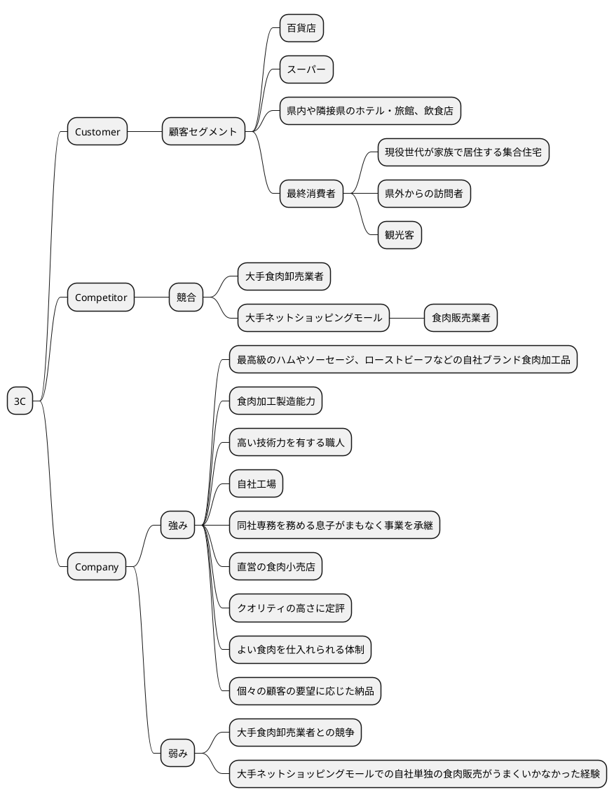
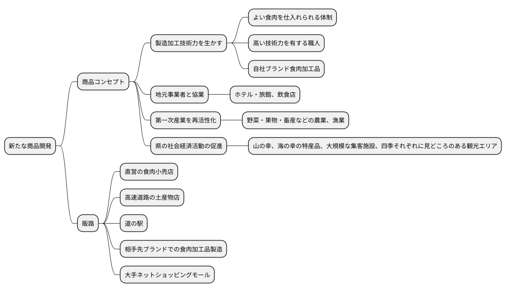
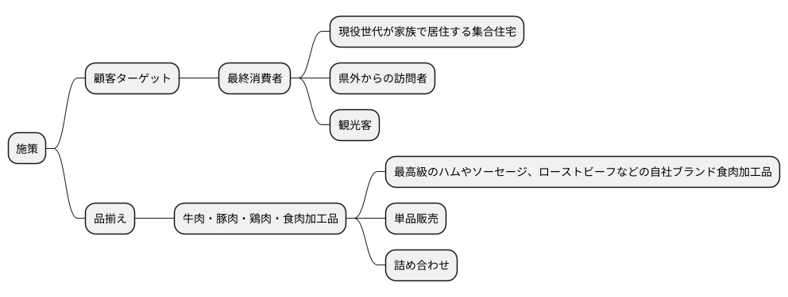
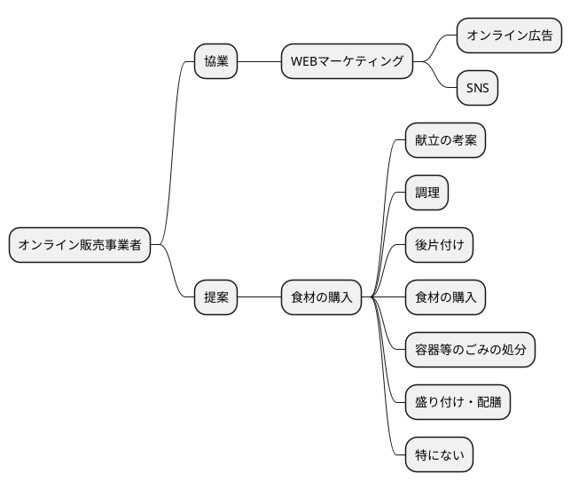
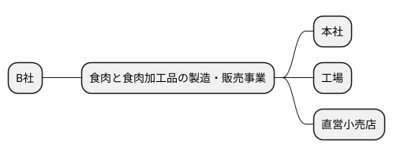
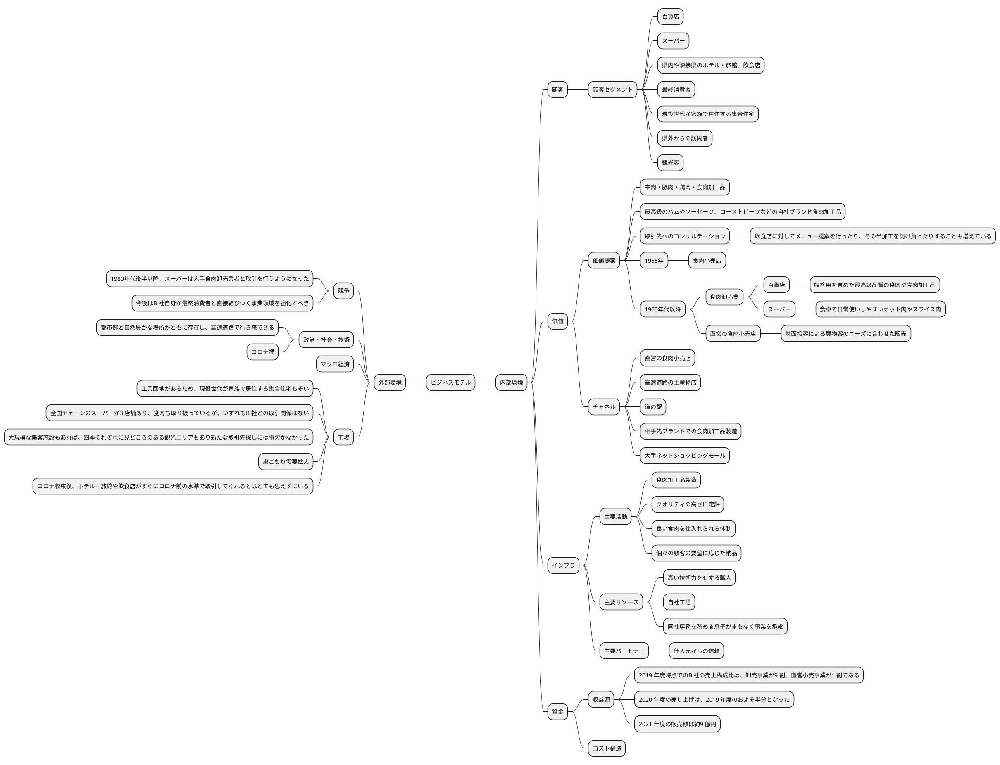
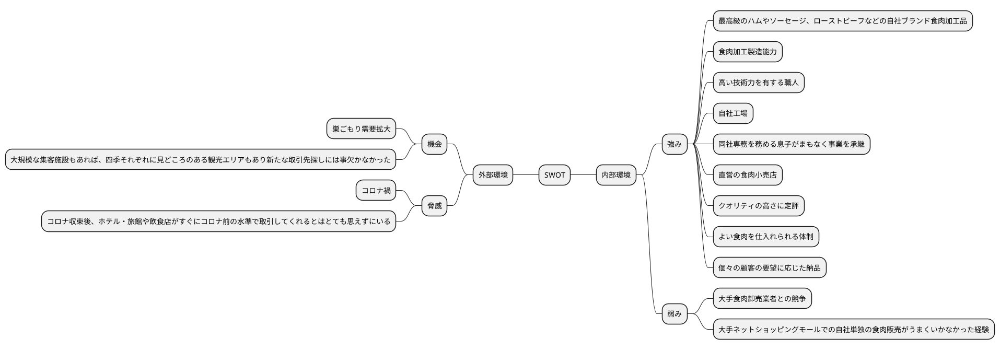

# 令和4年度 事例2　食肉と食肉加工品の製造・販売を行うB社の事例

## 与件文

　(KR)B社は資本金3,000 万円、従業者数は45 名（うちパート従業員21 名）で、(VP)食肉と食肉加工品の製造・販売を行う事業者である。現在の事業所は本社、工場、直営小売店1 店舗である。(R$)2021 年度の販売額は約9 億円で、(VP)取扱商品は牛肉・豚肉・鶏肉・食肉加工品である。

　B社はX県の大都市近郊に立地する。高速道路のインターチェンジからも近く、車の利便性は良いエリアだ。B 社の周辺には、大規模な田畑を所有する古くからの住民もいるが、(XM)工業団地があるため、現役世代が家族で居住する集合住宅も多い。

　(VP)1955年、B 社はこの地で牛肉、豚肉、鶏肉、肉の端材を使った揚げたてコロッケなどの総菜を販売する食肉小売店を開業した。当時の食肉消費拡大の波に乗って順調に売り上げを伸ばしたB 社は、1960 年代に入ると、(CH)食肉小売事業に加え、地域の百貨店や近隣のスーパーなどの大型小売業へ食肉を納入する事業を手がけるようになった。

　(CS)百貨店やスーパーを取引先としてきたこともあって、(KA)B 社の商品はクオリティの高さに定評がある。(KP)仕入れ元からのB 社に対する信頼も厚く、(KA)良い食肉を仕入れられる体制が整っている。(CS)(CH)B 社は、百貨店向けには贈答用を含めた最高級品質の食肉や食肉加工品の販売を行い、直営の食肉小売店では対面接客による買物客のニーズに合わせた販売を行い、スーパー向けには食卓で日常使いしやすいカット肉やスライス肉などの販売を行っており、さまざまな食肉の消費機会に対応できる事業者である。

　大型小売業の成長とともにB 社も成長していたが、1980 年代後半以降、(XC)スーパーは大手食肉卸売業者と取引を行うようになったため、B 社からスーパーへの納入量は徐々に減少していった。(XM)現在、B 社の周囲5 km 圏内には広大な駐車場を構える全国チェーンのスーパーが3 店舗あり、食肉も取り扱っているが、いずれもB 社との取引関係はない。

　こうした経営環境の変化を前に、B 社社長は、(CS)直営の食肉小売店での販売と百貨店やスーパーを主要取引先とする商売を続けていくことに危機を感じた。そこで1990年代に入ってすぐ、次に挙げる3 点で事業内容の見直しを行った。

　第1に、(CS)新たな取引先の開拓である。従来の百貨店やスーパーとの取引に加え、県内や隣接県のホテル・旅館、飲食店などに活路を見出した。(XS)B 社のあるX 県は、都市部と自然豊かな場所がともに存在し、高速道路で行き来できる。また、野菜・果物・畜産などの農業、漁業、機械や食品などの工業、大型ショッピングセンターなどの商業、観光サービス業がバランスよく発展している。(XM)山の幸、海の幸の特産品にも恵まれ、大規模な集客施設もあれば、四季それぞれに見どころのある観光エリアもあり、新たな取引先探しには事欠かなかった。

　第2に、(KA)自社工場を新設し、食肉加工品製造も行えるようにした。(KR)高い技術力を有する職人をB 社に招き入れ、良質でおいしい食肉加工品を製造できる体制を整えた。これによって、(VP)B 社は最高級のハムやソーセージ、ローストビーフなどの食肉加工品を自社ブランドで開発できるようになった。(VP)単品販売もできるうえ、詰め合わせれば贈答品にもなり、(CH)これら食肉加工品は直営小売店や高速道路の土産物店、道の駅などで販売している。(CH)また、取引先のニーズに応じて、相手先ブランドでの食肉加工品製造を請け負うことも可能になった。

　これと関連して第3 に、(VP)取引先へのコンサルテーションも手がけるようになった。自社工場設立以前、B 社は食肉販売を主な事業としていたため、取り扱う商品は標準的なカットやスライスを施した食肉であり、高度な加工を必要としなかった。(KA)しかし、ホテル・旅館や飲食店との取引の場合、販売先の調理の都合に合わせた形状のカットや、指定された個数でのパッキング、途中工程までの調理済み商品が求められるなど、顧客ニーズにきめ細かく合わせることが必要となってきた。(KR)B 社は自社工場という加工の場をもつことによって、個々の顧客の要望に応じた納品が可能になった。最近では、(VP)飲食店に対してメニュー提案を行ったり、その半加工を請け負ったりすることも増えている。

　事業見直しを進めた現在、(CS)B 社取引先の多くは1990 年代以降に開拓した事業者となった。(R$)2019 年度時点でのB 社の売上構成比は、卸売事業が9 割、直営小売事業が1 割である。(XS)折からのインバウンド需要の拡大を受け、ホテル・旅館との取引は絶好調であった。加えて2020 年夏には東京オリンピック・パラリンピックを控え、B 社はさらなる飛躍を期待し、冷凍在庫も積み増していた。

　ところが、(XS)国内での新型コロナウイルス感染症の発生を受け、ホテル・旅館や飲食店などを主要取引先とするB 社の経営は大打撃を受けた。(R$)B 社の2020 年度の売り上げは、2019 年度のおよそ半分となった。2021 年度の売り上げも2020 年度から多少回復がみられる程度だ。東京オリンピック・パラリンピックのために積み増した冷凍在庫をさばくため、(CH)B 社は大手ネットショッピングモールに出店し、焼肉用やステーキ用として冷凍肉の販売も試してみた。しかし、コロナ禍で同じことを考えた食肉販売業者は多く、B 社紹介ページはネット上で埋もれ、消費者の目にはほとんど留まらないようだった。(CH)B 社にとってせめてもの救いは、直営の食肉小売店であった。(XM)コロナ禍の巣ごもり需要拡大の影響で、開業以来、とくに何の手も打って来なかった食肉小売店での販売だけが急上昇した。料理の楽しさに目覚めた客や、作りたての揚げ物を買い求める客が、食肉専門店の魅力に気づいて足を運ぶようになった結果だった。

　(XM)B社社長はこの2年以上、コロナ禍で長期にわたって取引が激減しているホテル・旅館や、続々と閉店する飲食店を目の当たりにしてきた。もちろんB 社の販売先の多くはまだ残っているが、コロナ収束後、これらの事業者がすぐにコロナ前の水準で取引してくれるようになるとはとても思えずにいる。

　(KR)B社社長は高齢のため、同社専務を務める息子がまもなく事業を承継する予定だ。アフターコロナと事業承継を見据え、B 社社長は自社事業の再構築を行うべく、中小企業診断士に相談した。B 社はこのところ卸売事業を主軸としてきた。しかし、中小企業診断士との対話を重ねていくうち、(XC)B 社社長は自社の売り上げが他社の動向に左右されていることに気づき、(CS)今後はB 社自身が最終消費者と直接結びつく事業領域を強化すべきであると納得するに至った。B 社社長は、自社の強みを生かした新たな事業展開ができるよう、中小企業診断士にさらなる助言を求めた。

（令和4年度　中小企業診断士2次筆記試験　事例2　問題より引用）

## 問題


第1問（配点30点）

B社の現状について、3C（Customer：顧客、Competitor：競合、Company：自社）分析の観点から150 字以内で述べよ。



顧客に関しては、百貨店やスーパー、県内や隣接県のホテル・旅館、飲食店、最終消費者が顧客セグメントとして挙げられる。競合に関しては、大手食肉卸売業者、大手ネットショッピングモールに出店している食肉販売業者が挙げられる。自社に関しては、最高級のハムやソーセージ、ローストビーフなどの自社ブランド食肉加工品、食肉加工製造能力、高い技術力を有する職人、自社工場、同社専務を務める息子がまもなく事業を承継、直営の食肉小売店、クオリティの高さに定評、よい食肉を仕入れられる体制、個々の顧客の要望に応じた納品が強みとして挙げられる。弱みに関しては、大手食肉卸売業者との競争、大手ネットショッピングモールでの自社単独の食肉販売がうまくいかなかった経験が挙げられる。


第2問（配点20点）

B社は、X県から「地元事業者と協業し、第一次産業を再活性化させ、県の社会経済活動の促進に力を貸してほしい」という依頼を受け、B社の製造加工技術力を生かして新たな商品開発を行うことにした。商品コンセプトと販路を明確にして、100 字以内で助言せよ。



商品コンセプトは、地元の畜産を活かした食肉加工品ブランドを展開する。販路は土産物店、道の駅、大手ネットショッピングモールなどに展開し県内・県外の消費者に認知されるようにする。

第3問（配点20点）

アフターコロナを見据えて、B社は直営の食肉小売店の販売力強化を図りたいと考えている。どのような施策をとればよいか、顧客ターゲットと品揃えの観点から100字以内で助言せよ。



顧客ターゲットとして、現役世代家族・観光客、品揃えとして、現役世代家族向けにはボリューム感のある単品、観光客向けには贈答品としての詰め合わせを強化する。

第4問（配点30点）

B 社社長は、新規事業として、最終消費者へのオンライン販売チャネル開拓に乗り出すつもりである。ただし、コロナ禍で試した大手ネットショッピングモールでの自社単独の食肉販売がうまくいかなかった経験から、オンライン販売事業者との協業によって行うことを考えている。

中小企業診断士に相談したところ、B 社社長は日本政策金融公庫『消費者動向調査』（令和4 年1 月）を示された。これによると、家庭での食に関する家事で最も簡便化したい工程は「献立の考案」（29.4 ％）、「調理」（19.8 ％）、「後片付け」（18.2 ％）、「食材の購入」（10.7 ％）、「容器等のごみの処分」（8.5 ％）、「盛り付け・配膳」（3.3 ％）、「特にない」（10.3 ％）とのことであった。

B社はどのようなオンライン販売事業者と協業すべきか、また、この際、協業が長期的に成功するためにB社はどのような提案を行うべきか、150 字以内で助言せよ。



協業対象として、オンライン広告やSNSを活用したWEBマーケティングに強みを持つ事業者を選定する。自社加工品を活用した献立を季節ごとに提案することで、リピート購入を促進する。またSNSを活用した情報発信を行うことで、消費者の食材購入に対する意識を高める。

(令和4年度　中小企業診断士2次筆記試験　事例2　問題より引用)


## 環境分析

### 組織図




### ビジネスモデル



### SWOT分析




### 業務分析

```plantuml
@startmindmap

* B社
-- ドメイン
--- 企業ドメイン
---- 理念
---- ビジョン
----- 今後はB 社自身が最終消費者と直接結びつく事業領域を強化すべき
---- ミッション
--- 事業ドメイン
---- 誰に
----- 最終消費者
---- 何を
----- 食肉と食肉加工品の製造・販売
---- どのように
----- 直営の食肉小売店での販売
--- サブドメイン
---- コアサブドメイン
----- 食肉加工品製造
---- 汎用サブドメイン
---- サポートサブドメイン
----- 直営の食肉小売店での販売
** 事業
*** 食肉と食肉加工品の製造・販売事業
**** 本社
**** 工場
**** 直営小売店
@endmindmap
```・販売事業
本社
工場
直営小売店