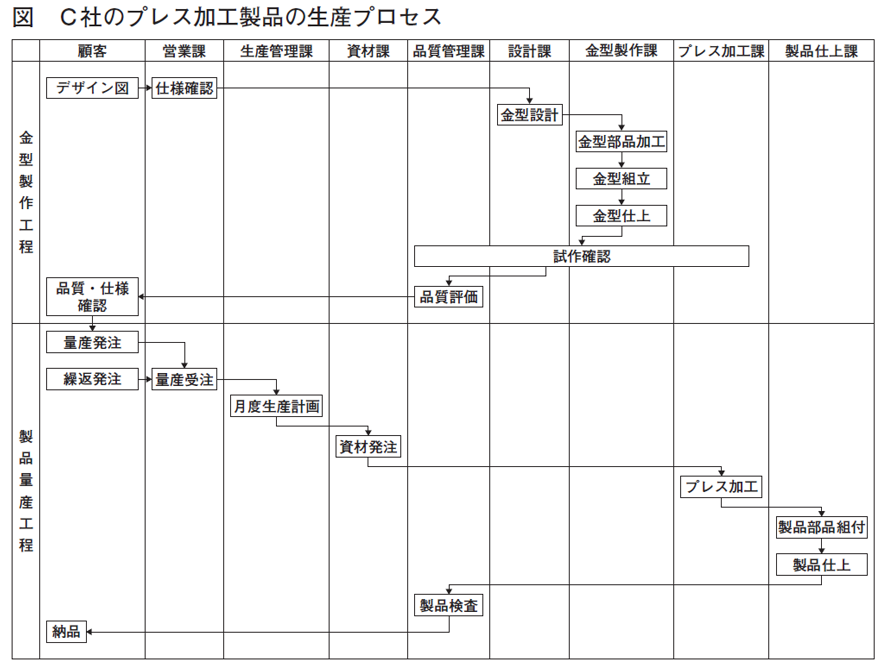
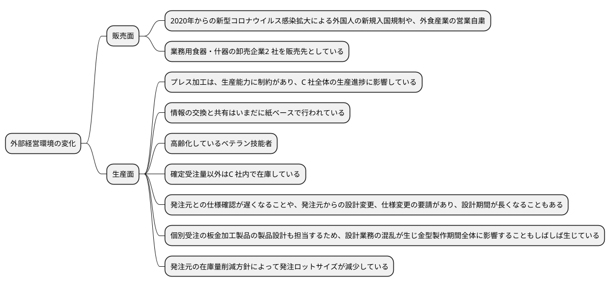
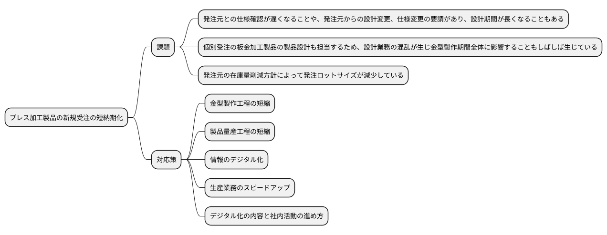
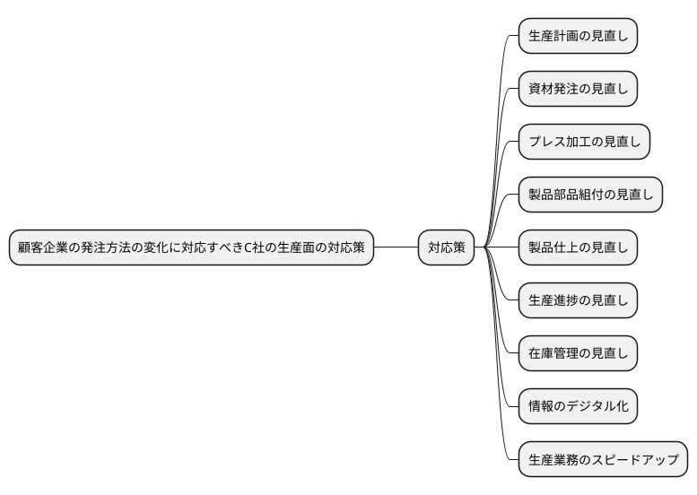
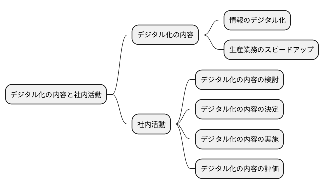
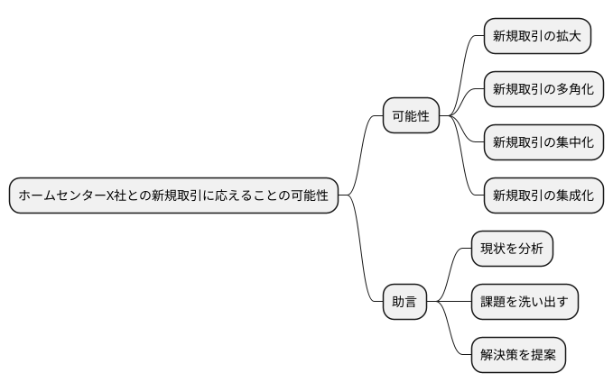
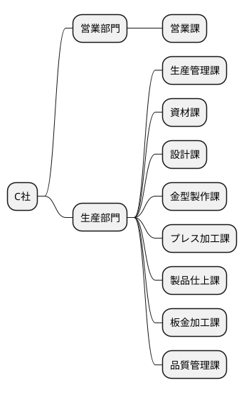
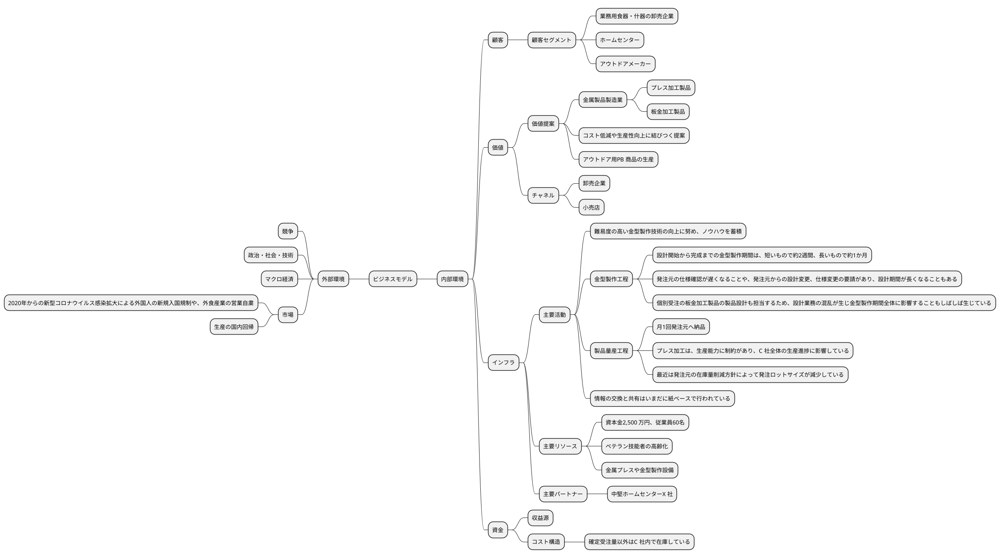
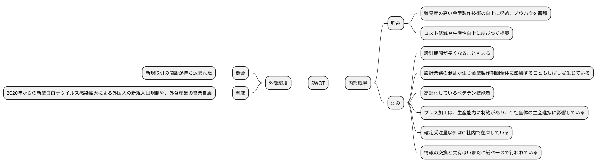
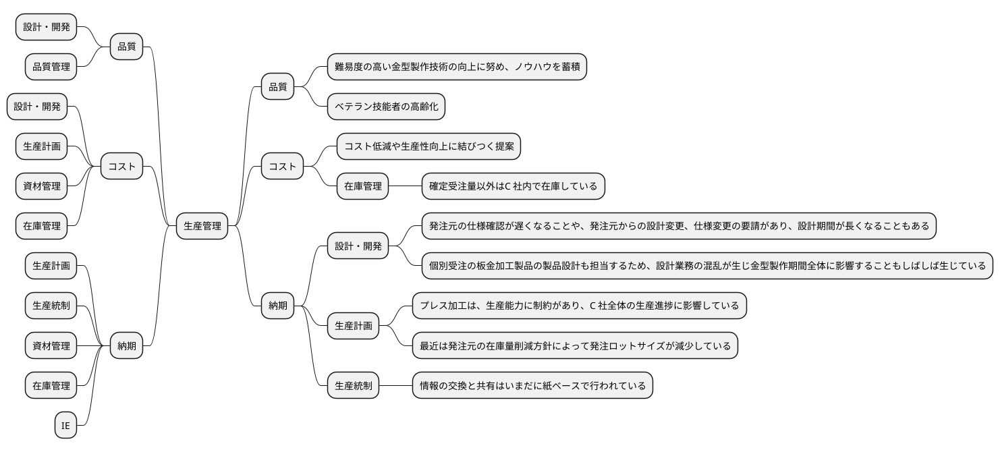

# 令和4年度 事例3　金属製品製造業であるC社の事例

## 与件文

【企業概要】

　(KR)C社は1964 年創業、資本金2,500 万円、従業員60 名の金属製品製造業である。(R$)製品は、売上の7 割を占めるアルミニウムおよびステンレス製プレス加工製品（以下「プレス加工製品」という）と、残り3 割のステンレス製板金加工製品（以下「板金加工製品」という）である。(VP)プレス加工製品は金型を使用して成形する鍋、トレー、ポットなどの繰返受注製品で、板金加工製品は鋼材を切断や曲げ、溶接加工して製作する調理台、収納ラック、ワゴンなどの個別受注製品である。(CS)どちらもホテル、旅館、外食産業などの調理場で使用される製品で、業務用食器・什器の卸売企業2 社を販売先としている。

　C社は、卸売企業が企画する業務用什器の板金加工製品を受託生産する企業として創業した。その後金属プレスや金型製作設備を導入してプレス加工製品の生産を始めている。(KA S)難易度の高い金型製作技術の向上に努めて、ノウハウを蓄積してきたため、コスト低減や生産性向上に結びつく提案などが可能である。

　(XM)近年は観光需要で受注量は毎年増加していたが、2020 年からの新型コロナウイルス感染拡大による外国人の新規入国規制や、外食産業の営業自粛による影響を受けて減少している。

【生産の現状】

　(KR)生産部門は、生産管理課、資材課、設計課、金型製作課、プレス加工課、製品仕上課、板金加工課、品質管理課で構成されている。

　(KA)プレス加工製品の生産プロセスには、金型を製作する金型製作工程と、その金型を利用して同じ製品の繰返受注生産を行う製品量産工程がある（次ページの図参照）。

　(KA)C社の金型製作工程は、発注元から提示される形状やサイズの概要を表したデザイン図を基に仕様を確認した後に「金型設計」を行い、金型を構成する部品を製作する「金型部品加工」、加工した部品を組み立てる「金型組立」、その後の調整や研磨などを行う「金型仕上」を経て、「試作確認」を行い、さらに試作品の品質を発注元との間で確認して完成する。設計開始から完成までの金型製作期間は、難易度によって異なるが、短いもので約2週間、長いもので約1か月を要する。

　「金型設計」は、設計課が2次元CAD を活用し担当している。(KA W)発注元との仕様確認が遅くなることや、発注元からの設計変更、仕様変更の要請があり、設計期間が長くなることもある。(KA W)また設計課では、個別受注の板金加工製品の製品設計も担当するため、設計業務の混乱が生じ金型製作期間全体に影響することもしばしば生じている。

　(KR W)「金型組立」、「金型仕上」は、プレス加工技術にも習熟するベテラン技能者が担当しているが、高齢化している。担当者は、金型の修理や改善作業も兼務し、製品の品質や製造コストに影響を及ぼす重要なスキルが必要なことから、若手の養成を検討している。

　(KA)金型が完成した後の製品量産工程は、発注元から納品月の前月中旬に製品別の生産依頼数と納品指定日が通知され、それに基づいて前月月末までに「月度生産計画」を作成して「資材発注」する。プレス加工課では「プレス加工」を行い、製品仕上課で取っ手などの部品を組み付ける「製品部品組付」と製品の最終調整をする「製品仕上」を行い、通常月1 回発注元へ納品する。

　(KA W)C社の「プレス加工」は、生産能力に制約があり、C 社全体の生産進捗に影響している。プレス加工機ごとに担当する作業員が材料の出し入れと設備操作を行い、加工製品を変えるときには、その作業員が金型交換作業と材料準備作業など長時間の段取作業を一人で行っている。

　プレス加工製品の生産計画は「プレス加工」の計画だけが立案され、「製品部品組付」、「製品仕上」はプレス加工終了順に作業する。生産計画は、各製品の1 日間の加工数量でそれぞれの基準日程を決めて立案する。以前は発注元もこれを理解して、C社の加工ロットサイズを基本に発注し、C 社で生産した全量を受領して、発注元で在庫対応していた。(C$ W)しかし、最近は発注元の在庫量削減方針によって発注ロットサイズが減少している。ただC 社では、基準日程によって設定しているロットサイズで加工を続け、確定受注量以外はC 社内で在庫している。

　(KR W)C社の受注から納品に至る社内業務では、各業務でパソコンを活用しているが、情報の交換と共有はいまだに紙ベースで行われている。

【新規製品事業】

　数年前C社では受注拡大を狙って、雑貨・日用品の商談会に出展したことがある。その際商談成立には至らなかったが、(KP)中堅ホームセンターX 社から品質を高く評価された。今回そのX 社から新規取引の商談が持ち込まれた。

　X社では、コロナ禍の2020 年以降も売上が順調に推移しているが、その要因の一つとしてアウトドア商品売上の貢献がある。しかし新型コロナウイルスのパンデミックにより、中国や東南アジア諸国企業に生産委託しているPB 商品の納品に支障が生じて、生産、物流など現在のサプライチェーンの維持が難しくなっている。また今後も海外生産委託商品の仕入れ価格の高騰が懸念されることから、生産委託先をC 社へ変更することについてC 社と相互に検討を行った。

　C社社長は、当該事業の市場成長性と自社の強みを考慮して戦略とビジネスプロセスを見直し、積極的にこの事業に取り組むこととした。

　X社の要請は、X 社のアウトドア用PB 商品のうち、中価格帯の食器セット、鍋、その他調理器具などアルミニウム製プレス加工製品の生産である。(VP)ただC 社社長は、今後高価格な製品に拡大することも期待している。

X社からの受注品は、商品在庫と店舗仕分けの機能を持つ在庫型物流センターへの納品となり、商品の発注・納品は、次のようになる。まず四半期ごとにX 社が商品企画と月販売予測を立案し、C 社に情報提供される。確定納品情報については、X社各店舗の発注データを毎週月曜日にX 社本社で集計する。在庫量からその集計数を差し引いて発注点に達した製品についてX 社の発注データがC 社に送付される。納期は発注日から7 日後の設定である。1 回の発注ロットサイズは、現状のプレス加工製品と比べるとかなり小ロットになる。

（令和4年度　中小企業診断士2次筆記試験　事例3　問題より引用）

## 問題

第1問（配点20点）

2020年以降今日までの外部経営環境の変化の中で、C 社の販売面、生産面の課題を80字以内で述べよ。

販売面の課題として、2020年からの新型コロナウイルス感染拡大による外国人の新規入国規制や、外食産業の営業自粛が挙げられる。生産面の課題として、プレス加工は、生産能力に制約があり、C 社全体の生産進捗に影響している。情報の交換と共有はいまだに紙ベースで行われている。高齢化しているベテラン技能者がいる。確定受注量以外はC 社内で在庫している。発注元との仕様確認が遅くなることや、発注元からの設計変更、仕様変更の要請があり、設計期間が長くなることもある。個別受注の板金加工製品の製品設計も担当するため、設計業務の混乱が生じ金型製作期間全体に影響することもしばしば生じている。発注元の在庫量削減方針によって発注ロットサイズが減少している。

第2問（配点20点）

C社の主力製品であるプレス加工製品の新規受注では、新規引合いから量産製品初回納品まで長期化することがある。しかし、プレス加工製品では短納期生産が一般化している。C社が新規受注の短納期化を図るための課題とその対応策を120字以内で述べよ。

課題は、発注元との仕様確認が遅くなることや、発注元からの設計変更、仕様変更の要請があり、設計期間が長くなることもある。個別受注の板金加工製品の製品設計も担当するため、設計業務の混乱が生じ金型製作期間全体に影響することもしばしば生じている。発注元の在庫量削減方針によって発注ロットサイズが減少している。対応策として、金型製作工程の短縮、製品量産工程の短縮、情報のデジタル化、生産業務のスピードアップ、デジタル化の内容と社内活動の進め方が挙げられる。

第3問（配点20点）

C社の販売先である業務用食器・什器卸売企業からの発注ロットサイズが減少している。また、検討しているホームセンターX 社の新規取引でも、1 回の発注ロットサイズはさらに小ロットになる。このような顧客企業の発注方法の変化に対応すべきC社の生産面の対応策を120字以内で述べよ。

顧客企業の発注方法の変化に対応すべきC社の生産面の対応策として、生産計画の見直し、資材発注の見直し、プレス加工の見直し、製品部品組付の見直し、製品仕上の見直し、生産進捗の見直し、在庫管理の見直し、情報のデジタル化、生産業務のスピードアップが挙げられる。

第4問（配点20点）

C社社長は、ホームセンターX社との新規取引を契機として、生産業務の情報の交換と共有についてデジタル化を進め、生産業務のスピードアップを図りたいと考えている。C社で優先すべきデジタル化の内容と、そのための社内活動はどのように進めるべきか、120字以内で述べよ。

C社社長は、ホームセンターX社との新規取引を契機として、生産業務の情報の交換と共有についてデジタル化を進め、生産業務のスピードアップを図りたいと考えている。優先すべきデジタル化の内容として、情報のデジタル化、生産業務のスピードアップが挙げられる。社内活動として、デジタル化の内容の検討、デジタル化の内容の決定、デジタル化の内容の実施、デジタル化の内容の評価が挙げられる。

第5問（配点20点）

C社社長が積極的に取り組みたいと考えているホームセンターX社との新規取引に応えることは、C社の今後の戦略にどのような可能性を持つのか、中小企業診断士として100 字以内で助言せよ。

C社社長が積極的に取り組みたいと考えているホームセンターX社との新規取引に応えることは、C社の今後の戦略に新規取引の拡大、新規取引の多角化、新規取引の集中化、新規取引の集成化の可能性を持つ。中小企業診断士として、現状を分析し、課題を洗い出し、解決策を提案することが助言となる。

(令和4年度　中小企業診断士2次筆記試験　事例3　問題より引用)

### 組織図

### ビジネスモデル

### SWOT分析

