# ルール集

# 分析

## 環境分析

### 組織図

```plantuml
@startmindmap
* 社
@endmindmap
```

### ビジネスモデル

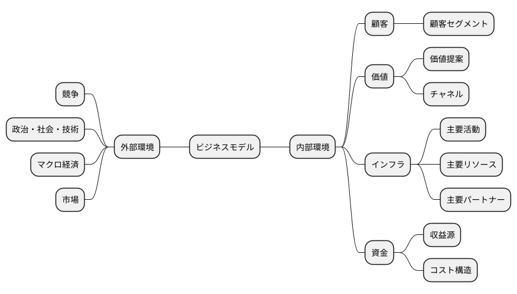

### SWOT分析

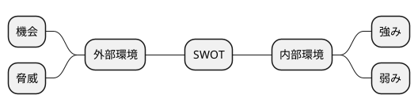

### 業務分析

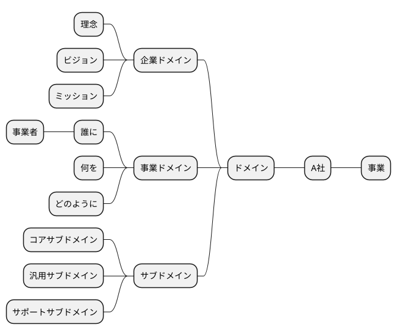

## 企業戦略

### ドメイン

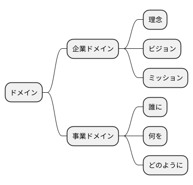

### 成長戦略

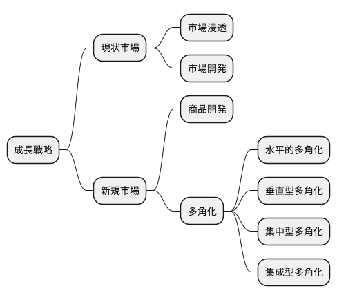

## 事業戦略

### 基本戦略

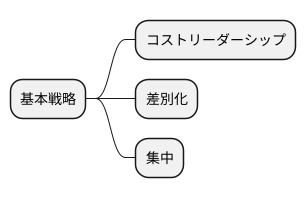

### 価値連鎖

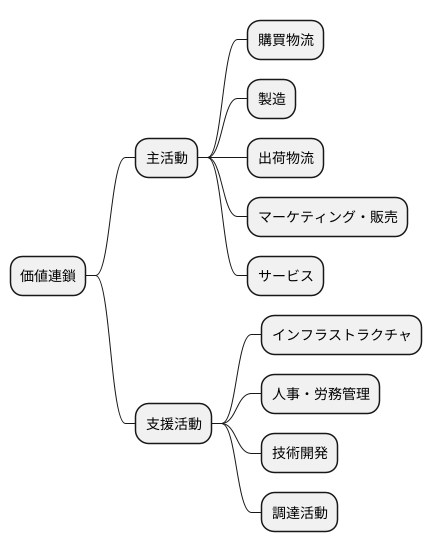

### 競争地位別の戦略

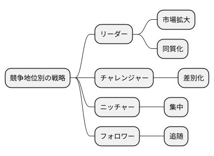

## 機能戦略

### 販売

### 生産

### 購買

### 総務

### 財務

### 資源

# 業務分析

## ドメイン

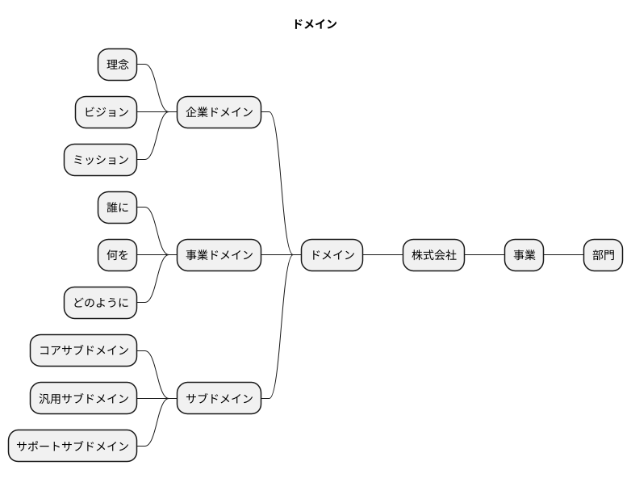

# マーケティング

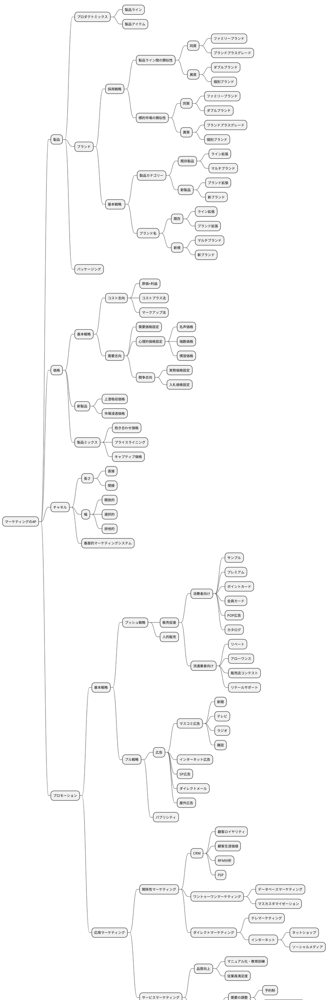