# 実践プログラマー 基本スキル

すごい広島 IT初心者の会

---

## 構成

- 自己紹介
- ロジカルシンキング
- クリティカルシンキング
- まとめ

---

## 自己紹介

カキギカツユキ

ネット通販の会社で業務システムの開発運用してます
あと、売掛金・買掛金管理業務してます
ぼっち・ざ・情シスです

---

## ロジカルシンキング

> 達人プログラマーが取り扱う素材は木でも鉄でもありません --- 知識です。
>
>> — 達人プログラマー 熟達に向けたあなたの旅（第2版）


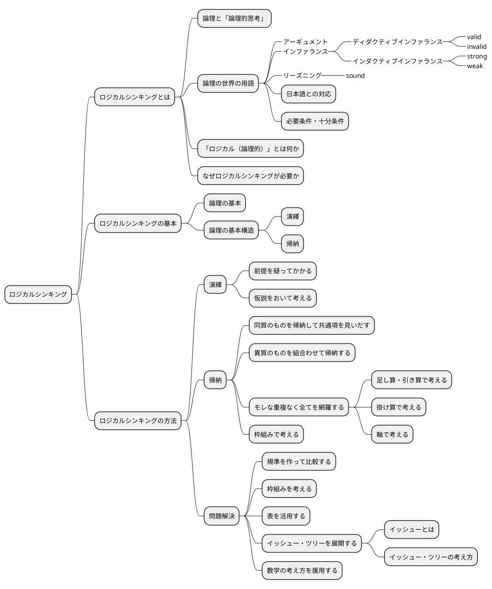

---

### ロジカルシンキングとは

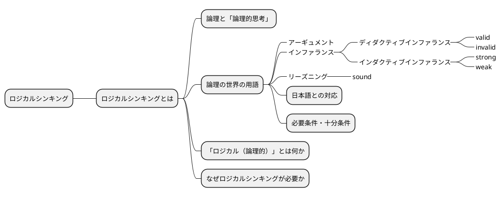

#### 論理と「論理的思考」

> 論理的な思考とは、秩序だった思考です。秩序立てて考えねばなりません。考えを示す際にも、秩序だっていなければなりません。思いつくままに書き並べるのではだめです。「理詰めに考えている」ということを示すためには、帰納と同じで、根拠に量がなければなりません。いろいろな角度からの考察も必要です。いろいろな角度から、結論を支えるのです。「いろいろな角度から」の言葉で誤解して「あれこれ余分なものを混ぜる」のはだめです。
>
> — 論理的に考える方法 小野田博一（著）日本実業出版社

> 高い論理性を身につけるとは、「結論」と「結論を支えるもの」の関係について正確な理解を獲得することなのです。
>
>> 論理思考力を鍛える本 小野田博一

> 高い論理性とは、結論と前提との関係の理解度が高く、理解している通りにそれを実践の場で使えることなのです。
>
>> 論理思考力を鍛える本 小野田博一

---

#### 論理の世界の用語

結論と前提の両方を含んだスティトメント(statement)をアーギュメント(argument)といいます。
「ロジック」（論理）は、結論と前提を繋ぐ無形のものです。この無形の部分はインファランス(inference)ともいいます。インファランスには2種類のものがあります。ディダクティブ・インファランス（deductive inference）とインダクティブ・インファランス（inductive inference）です。

前提から結論を導く思考のことをリーズニング（reasoning）といいます。

ディダクティブ・インファランスの評価は、valid/invalidで与えられます。validは「論理が正しい」の意味で、invalidは「論理が正しくない」の意味です。

インダクティブ・インファランスの評価は、strong/weakで与えられます。インダクティブ・インファランスは「たぶんどうだろうか」の推論なので、前提が正しくとも、得られた結論が100%確実に正しいと断言できません。

論理が正しいだけでなく、前提も（真実か否かの点から）正しい場合、評価はsoundで与えられます。

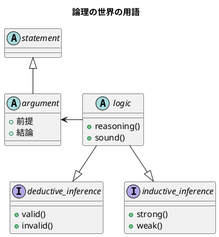

---

##### 日本語との対応

1. カモノハシは哺乳類である。したがって、カモノハシは、哺乳類か鳥類である。
2. 私がこれまでに食べたレモンは、どれもすっぱかった。だからレモンはどれもすっぱいだろう。
3. メガネをかけている高校生の女の子のうち、90%のメガネは黒縁である。紀子は高校生で、メガネをかけている。だから、それはたぶん黒縁だろう。
4. 春にピンクのスカートが流行した年の夏に、白い水着が流行した。ことしの春はピンクのＴシャツが流行しているから、夏には白い水着が流行するだろう。

| 番号                     | タイプ       | 日本語での呼称 |
|--------------------------|------------|--------------|
| 1 : deductive inference  | 演繹        | 演繹          |
| 2 : inductive inference  | 一般化      | 帰納          |
| 3 : inductive inference  | 統計的帰納   | 帰納          |
| 4 : inductive inference  | 類推        | 帰納        |

---

#### 必要条件・十分条件

##### 必要条件

AであるためにはBである必要がある（たとえば、「ペンギンであるためには、鳥である必要がある」）
BであることはAであることの必要条件である（たとえば「鳥であることはペンギンであることの必要条件である」）

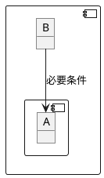

---

##### 十分条件

BであるためにはAであれば十分である（たとえば、「鳥であるためには、ペンギンであれば十分である」）
AであることはBであることの十分条件である（たとえば「ペンギンであることは鳥であることの十分条件である」）

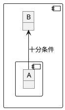

---

### 「ロジカル（論理的）」とは何か

> 「実生活の議論（のうち演繹）では、validであるだけでは十分ではなく、soundでなければならない」ということで、つまり、「前提は真実でなければならない」ということです。
>> 論理思考力を鍛える本 小野田博一

---

### なぜロジカルシンキングが必要か

> なぜ論理思考が必要なのか
> 1. 情緒に流されやすい判断や行動を防ぎ、自分の頭で考えて、「正しい結論を導く」ことができること。
> 1. 文化の同一性に頼らず、どの民族にも通用する、「正しいコミュニケーションができること」こと。
> 1. 「発想を助け、課題の検討・解決に役立つ」こと。
>
>> わかる、使える「論理思考」の本

---

## ロジカルシンキングの基本

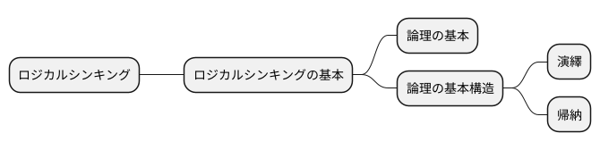

### 論理の基本


> １つのメッセージ（結論）は、必ず2つ以上のサブ・メッセージ（要因）でサポートされてるため、論理は、底辺に行くほど広いピラミッド状に組み上げられる。
>
> わかる、使える「論理思考」の本

1. 論理の基本単位は、単語ではなく主語・述語で組み上げるメッセージである。
1. メッセージを組み上げる基本構造には「演繹」と「帰納」という2つの方法がある。
1. 上位のメッセージと、それをサポートする下位のサブ・メッセージは、結論と要因、あるいは総合と部分の関係にある（メッセージの上下関係）
1. 上位のメッセージを支える下位のメッセージは、それらを総合すると、モレや重複がないこと（水平関係）
1. 全体を支える最下部のメッセージは、事実、またはそれに近い疑いようのないメッセージ（蓋然性の高いメッセージ）であること

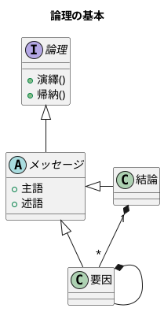

---

### 論理の基本構造

#### 演繹

Deduction(演繹)は、前提となる正しいメッセージ（一般論）がまずあり、それを個別の事象に適用して、正しい主張・答を引き出す方法で「一般論」から「個別論」へという構造になっている

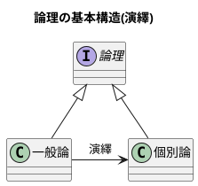

#### 帰納

Induction(帰納)は、たくさんの個別の事象や主張を集めて、より一般的に通用する共通のメッセージを導き出す方法で「個別論」から「一般論」へという構造になっている


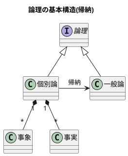

---

### ロジカルシンキングの方法

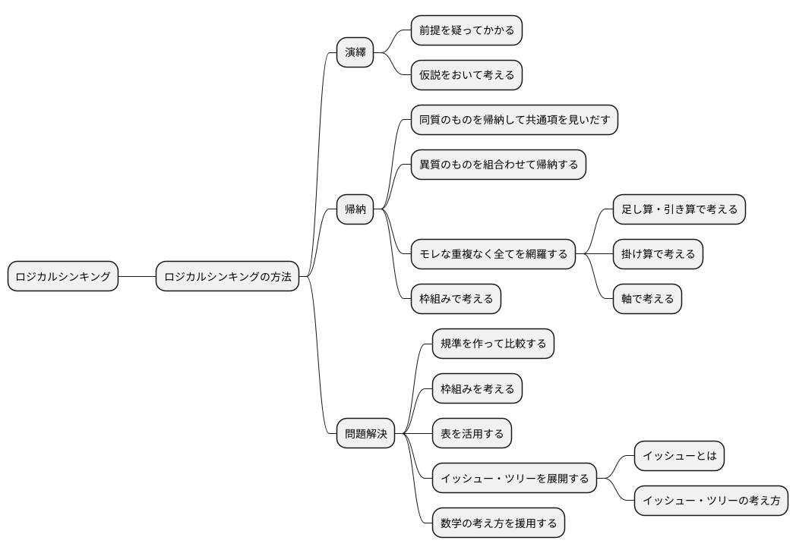

---

#### 演繹

##### 前提を疑ってかかる

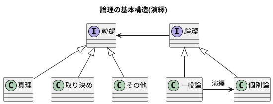

---

##### 仮説をおいて考える

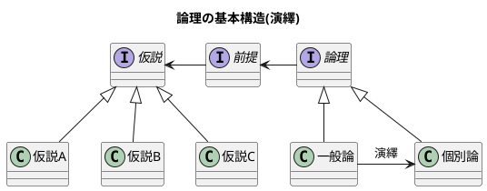

---

#### 帰納

##### 同質のものを帰納して共通項を見いだす

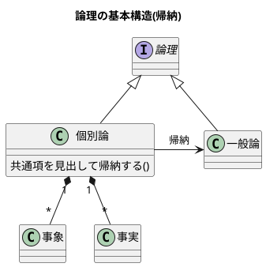

---

##### 異質のものを組合わせて帰納する

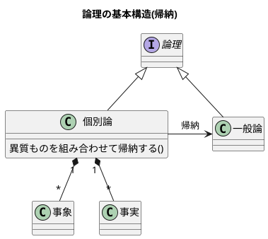
---

##### モレなく重複なく全てを網羅する

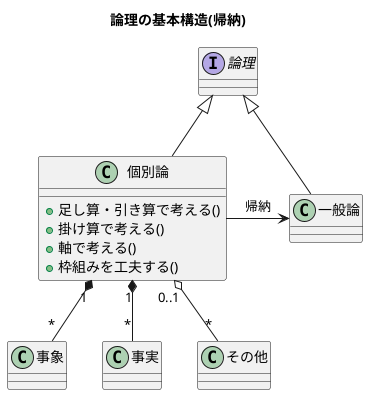

---

###### 足し算・引き算で考える

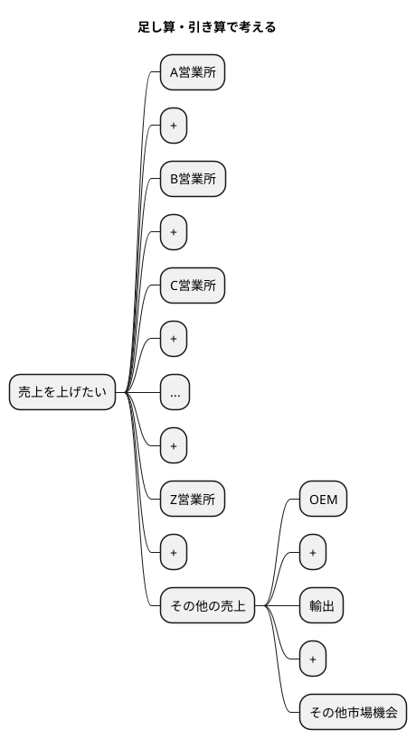

```math
可能な全売上機会 - 現行の各営業所の売上の合計 = その他
```

---

###### 掛け算で考える

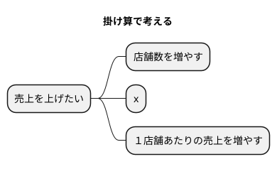

```math
店舗数 \times １店舗あたりの売上 = 全体の売上
```

---

###### 軸で考える

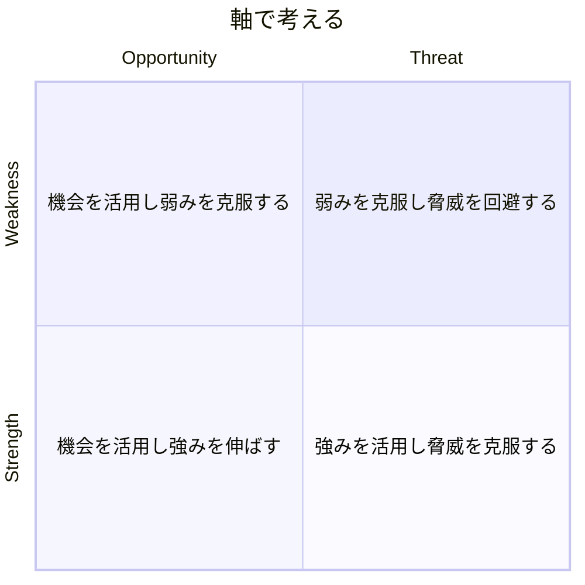

---

##### 枠組みで考える


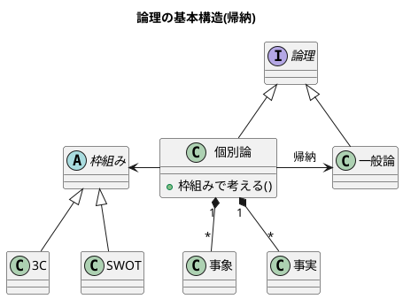

---

#### 問題解決

##### 規準を作って比較する

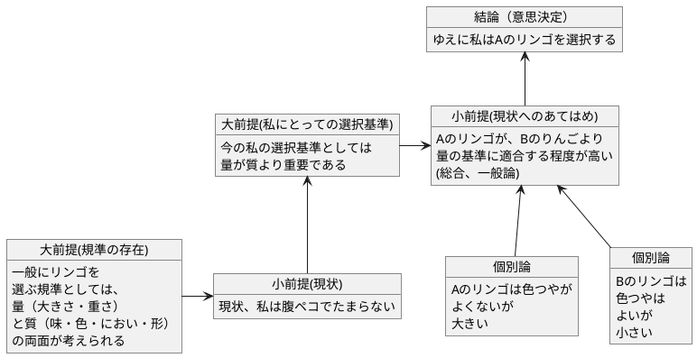

---

##### 枠組みを考える

```plantuml
@startuml
start
:選択の規準要件（大きな枠組み）を考える;
:具体的な判断の規準を考える;
:考え方・調べ方を列挙する;
stop
@enduml
```

---

```plantuml
@startmindmap
title 志望校を決める枠組み

* 志望校を決めたい
** 行けるか
*** 試験に受かるか
**** 偏差値
**** 科目の数
**** 面接の有無
*** 通えるか
**** 通学時間
**** 手段（電車・自転車など）
*** お金は払えるか
**** 経済力
** 大学受験に有利な勉強ができるか
*** 実績
**** どの大学に何人入ったか
*** 先生の指導の内容
**** 先生の評判
*** 設備やカリキュラム
**** 設備の新旧
**** カリキュラムの種類
*** 強い分野、弱い分野はあるか
**** 理系に強いか
**** 文系に強いか
**** 英語に力を入れているか
** 高校生活を楽しめるか
*** 同じ中学の友人がたくさん行くか
**** 友人に聞く
**** 先輩の様子を見る
*** 部活は盛んか
**** 学園祭で見る
**** 先輩に聞く
*** サッカー部はあるか
*** 親しい先輩か知人がいるか
**** 事実を見る
*** 共学かどうか
**** 事実を見る
*** 校風や雰囲気が自分と会うか
**** 学園祭で見る
**** 先輩に聞く
**** 先生に聞く

@endmindmap
```

---

##### 表を活用する

| 規準 | 学校A | 学校B | 学校C |
| ---- | ---- | ---- | ---- |
| 通学時間 | 30分 | 45分 | 1時間 |
| 手段 | 電車 | 自転車 | 徒歩 |
| 経済力 | 可能 | 可能 | 難しい |
| 実績 | 〇 | △ | × |
| 先生の評判 | 良い | 普通 | 悪い |
| 設備の新旧 | 新しい | 古い | 新しい |
| カリキュラムの種類 | 理系 | 文系 | 総合 |
| 強い分野 | 理系 | 文系 | 英語 |
| 高校生活 | 楽しい | 普通 | 退屈 |
| 部活 | 盛ん | 普通 | あまりない |
| サッカー部 | あり | なし | あり |
| 共学 | あり | なし | あり |
| 校風 | 自由 | 厳格 | 普通 |
|総合評価| ◎ | △ | × |

---

##### イッシュー・ツリーを展開する

###### イッシューとは

> 「１つの課題をめぐって、異なる立場から意見が対立する点」のことじゃ。
>
> > わかる。、使える「論理思考」の本　後正武

> イッシューとはイエスかノーか、なすべきかなさざるべきか、の意見が対立する政治上の問題点のことえある。
>
> > 論理的思考と発想の技術

> イッシューということばは「対立」に力点をおくよりも、「解決」に力点をおいて用いられ、その解決のための筋道を考えることが、まさにコンサルタントの日常業務となっている。
>
> > 論理的思考と発想の技術

---

###### イッシュー・ツリーの考え方

> 実は、イッシューは「ロジックの動的展開」であって、構造上の本質はロジックと全く同じものである。
> ただし、ロジックは「あるメッセージ（命題）」を正しく主張するために、最下部の事実からピラミッドの頂点へと積み上げる構造になっているのに対して、イッシューを追求する過程は、逆に争点からはじめて、それを解決するためのより具体的な疑問へと、サブ・イッシューに分解し、ついに事実に突き当たって解決をみるところに違いがある。
>> 論理的思考と発想の技術

```plantuml
@startuml

title ロジック(ボトムアップ)

class "一般論" as A

class "個別論" as B

class "事象" as C

class "事実" as D

B -> A : 帰納

B "1" *-- "*" C 

B "1" *-- "*" D 

class "個別論" as E

E <-- A : 演繹

class "一般論" as F

E -> F : 帰納

@enduml
```

```plantuml
@startuml

title イッシュー(トップダウン)

class "一般論" as A

class "個別論" as B

class "事象" as C

class "事実" as D

A --> B : 演繹

B "1" *-- "*" C

B "1" *-- "*" D

class "一般論" as E

B -> E : 帰納

class "個別論" as F

class "事実" as G

E --> F : 演繹

F "1" *-- "*" G

@enduml
```

---

- イッシュー・ツリーはロジックの動的展開であり、 MECE、抽象レベル、事実のサポート等の諸要件は共通である。
- イッシュー・ツリーは、未解決の課題（争点）を合理的に解明し、正しい結論を導くための枠組みであり、最後に事実を求めて初めて結果に結びつく。
- プロジェクトチームを効果的に運用するためには、イッシュー・ツリーが不可欠である。
- イッシュー・ツリーの展開はいろいろあり、巧拙がある。訓練して身につけるほかはない。
- 頭で考えるより、直接観察したりデータを手に取る事によって、より効果的なイッシューの展開が期待できる。

```plantuml
@startmindmap
title ラーメン店を開くかどうかのイッシュー・ツリー

* ラーメン店を開くべきか否か
** ラーメン店を開いて運営する能力があるか否か(company)
*** 人がいるか
*** お金があるか
*** ラーメンをつくる技術をもっているか
*** 材料や設備は手に入るか
*** ...
*** その他ラーメン店を運営する要件を満たせるか
** 市場は十分に大きいか(customer)
*** 人口はどれだけか
*** 交通量は十分か
*** ラーメンを外食する人が期待できる構成か
** 有力な競争相手がいるか否か(competitor)
*** 競合店が近くにあるか
**** ある場所、距離は十分に遠いか
**** 味・店構え・ロケーションなど自分に比べて優位か否か
*** ラーメン以外の外食店があるか、どんな店か
*** (競合がある場合)集客などかえって相乗効果を期待することはできないか
@endmindmap
```

---

##### 数学の考え方を援用する

```plantuml
@startuml
object "売り上げが低下した" as A 
object "売上を上げれるか" as B 

A -> B
@enduml
```

---

###### 足し算・引き算で考える

```plantuml
@startmindmap
title 足し算・引き算

* 地域等で分ける
** 札幌営業所の売上を上げられるか
** 仙台営業所の売上を上げられるか
** 北関東営業所の売上を上げられるか
** 東京営業所の売上を上げられるか
** ...
** その他、売上を上げらる機会はないか
*** 輸出
*** OEM
*** 他チャネル

@endmindmap
```

---

###### 掛け算で考える

```plantuml
@startmindmap
title 掛け算


+ x
-- 店舗数
--- 増やせるか
---- 交通量・ロケーションの特徴
---- 人口密度・地域需要
---- 基本エコノミクスの構造など
++ １店舗あたりの売上
+++ 客数を増やせるか
++++ キャンペーン・特売
++++ 広告・ちらし
++++ 店構え・その他
+++ x
+++ 客単価を増やせるか
++++ 品揃え
++++ レイアウト
++++ セット販売
++++ その他

@endmindmap
```

---

###### 要素・枠組みで考える

```plantuml
@startmindmap
title 要素・枠組み

* 売上が低下した理由の検討
** 全国共通の要因はあるか 
*** 全国共通の製品・価格・マーケティング施策等の工夫
** 個店別の要因が大きいか
*** 業績低下の大きい店への個別指導等
** 季節性の課題が大きいか
*** 冬に売れる商品の開発（冬に低下なら）
** その他

@endmindmap
```
---

## クリティカルシンキング

> 重要な点の最後は、あなたが見聞きするものごとについての批判的な考え方です。
> Tip 10 見聞きしたものごとを批判的な目で分析すること
>
>> 達人プログラマー

```plantuml
@startmindmap

* クリティカルシンキング
** クリティカルシンキングとは
*** 批判的に読み、批判的に聞く
*** クリティカルシンキングとロジカルシンキングの違い
** クリティカルシンキングの基本
*** クリティカルシンキングのポイント
*** クリティカルシンキングの手順
*** クリティカルシンキングのコツ
** クリティカルシンキングの実践
*** 「もっともらしさ」
*** アーギュメントの欠陥
*** 最も強い反論
*** 智に働けば角が立つ情に棹させば流される
*** 説得の基本
****_ 論理
****_ 感情へのアピール
****_ 信頼性
*** 説得するため5つのステップ
*** 批判と非難は違う

@endmindmap
```
---

### クリティカルシンキングとは

```plantuml
@startmindmap

* クリティカルシンキング
** クリティカルシンキングとは
*** 批判的に読み、批判的に聞く
*** クリティカルシンキングとロジカルシンキングの違い

@endmindmap
```

---


#### 批判的に読み、批判的に聞く

> 実生活の場において、読むとき、聞くときに行っている（行うべき）「批判的に読み、批判的に聞く」ための思考を、クリティカル・シンキングと言います。
>> 論理思考力を鍛える本 小野田博一

> 「実生活の場で、論理が正しいのか、前提は正しいのか、の2点を考える」とは言い換えると、「アーギュメントを鵜呑みにせず、アーギュメントの正しさを自力で考える」ことです。
>> 論理思考力を鍛える本 小野田博一

---

#### クリティカルシンキングとロジカルシンキングの違い

> クリティカル・シンキングとロジカル・シンキングの違い
>
> 論理的に考えることと批判的に考えることは、基本的に同じで、ただ若干の違いは「クリティカル・シンキングの話題は日常生活のみで、ロジカル・シンキングのほうはそのような限定はない」くらいのものと言ってよいでしょう。
>
> — 論理的に考える方法 小野田博一（著）日本実業出版社

---

### クリティカルシンキングの基本

```plantuml
@startmindmap

* クリティカルシンキング
** クリティカルシンキングの基本
*** クリティカルシンキングのポイント
*** クリティカルシンキングの手順
*** クリティカルシンキングのコツ

@endmindmap
```
---


#### クリティカルシンキングのポイント

> なぜクリティカル・シンキングが必要なのかと言えば、それは、読み聞きした内容で「相手のいいように操られないため」「間違った判断を下さないため」です。
>> 論理思考力を鍛える本 小野田博一

> クリティカル・シンキングのポイントは「むやみに信じないこと」です。つまり「信じるにたる根拠がないかぎり信じるな」です。
>> 論理思考力を鍛える本 小野田博一

> 「自分自身の判断力を使って判断する」とは、「前提と結論のつながりの正しさや支えかたの強度」を自分自身で判断することで、具体的には、結論が正しく導き出されているか、しっかり支えられているか、および情報そのものの信頼性を考えることです。
>> 論理思考力を鍛える本 小野田博一

---

#### クリティカルシンキングの手順

```plantuml
@startuml
start
:結論を見つけよ;
:支えている（つもりの）ものを見つけよ;
:支えているつもりのものの信頼性を判断せよ;
:支えているつもりのものが十分支えているかー支えている程度の十分さを調べよ;
if (隠れているアサンプションがある？) then (yes)
  :アサンプションは正しい？;
endif
stop
@enduml
```

---

> このような「当然正しい」と考えられている事柄をー明言されていようといまいとー英語ではアサンプション(assumption)と言います。
>
> — 論理的に考える方法 小野田博一（著）日本実業出版社


> 前提から結論を導く思考のことをリーズニング（reasoning）といいます。
>
> — 論理的に考える方法 小野田博一（著）日本実業出版社

```plantuml
@startuml

title 論理の世界の用語

abstract "statement" as A {
}

abstract "argument" as B {
  + 前提
  + 結論
}

abstract "logic" as C {
  + reasoning()
  + sound()
}

interface "deductive_inference" as D {
  + valid()
  + invalid()
}

interface "inductive_inference" as E {
  + strong()
  + weak()
}

abstract "assumption" as F

F -o B
A <|-- B
B <- C
C --|> D
C --|> E

@enduml
```

---

#### クリティカルシンキングのコツ

1. 隠れているアサンプションが何かを考えよ
1. リーズニングのフォーム（形式）を考えよ

> 日常的には、多くの場合、発言が論理的か否かはアサンプションが正しいか否かにかかっています。
>
> — 論理的に考える方法 小野田博一（著）日本実業出版社

---

### クリティカルシンキングの実践

```plantuml
@startmindmap

* クリティカルシンキング
** クリティカルシンキングの実践
*** 「もっともらしさ」
*** アーギュメントの欠陥
*** 最も強い反論
*** 智に働けば角が立つ情に棹させば流される
*** 説得の基本
****_ 論理
****_ 感情へのアピール
****_ 信頼性
*** 説得するため5つのステップ
*** 批判と非難は違う

@endmindmap
```
---


#### 「もっともらしさ」

> 実生活では、断言できないことがとてもたくさんあります。私たちが話したり書いたりする内容は、ほとんど断言できないことばかりです。そのため、「もっともらしさ」は実生活では大きな役割を果たす事になります。
> そして、クリティカル・シンキンキングは、「もっともらしさ」をあなた自身が検証する事なのです。
>
> — 論理的に考える方法 小野田博一（著）日本実業出版社

##### 議論では、もっともらしさを高めるよう努力せよ

> 人を納得させるのは「真実」ではなく「真実らしさ」（もっともらしさ）です。
>
> — 論理的に考える方法 小野田博一（著）日本実業出版社

---

#### アーギュメントの欠陥

- 早まった一般化
- 原因・結果の間違い
- 間違った類比
- 権威の間違った使用
- あいまいな表現
- 立証責任の転嫁
- 循環論法
- 聞き手・読み手の感情の利用
- 個人攻撃
- 矛盾
- 一般の意見の使用
- 統計の悪用（歪めた使用）

---

#### もっとも強い反論

> もっとも強い反論は、もとの議論のアサンプションをアタックする議論です。
>
> — 論理的に考える方法 小野田博一（著）日本実業出版社

---

#### 批判と非難は違う

> 人を非難したり、煽ったりするのは、後々、自分に返ってくるのでやめましょう。面と向かって言わないようなことを、オンラインで表現してはいけません。
>
> — 達人プログラマー 熟達に向けたあなたの旅（第2版）

---

#### 智に働けば角が立つ情に棹させば流される

---

#### 説得の基本

> 説得に必要な要素は三つあります。それは
> 1 論理
> 2 感情へのアピール
> 3 信頼性
> の三つです。
> 説得をする際に重要となるのは、「説得は一方的に行うものではない。つまり、説得ではコミュニケーションに双方向性がなけらならない」という点です。
>
> 説得とは、人に影響を与えるという目的を持ったコミュニケーションのプロセス」と言うことができます。
>
> 論理的に説得する方法

---

#### 説得するための５つのステップ

- ステップ１ 目標を設定する
- ステップ２ 聞き手を分析する
- ステップ３ あなたの信頼性を高める
- ステップ４ 説得のメッセージをつくる
- ステップ５ メッセージを聞き手に合わせる

---

#### 説得力のある主張をするための究極のコツ

- 「私」を登場させるな。「あなた」が主役。
-  「説得力のコンテスト」と考えよ。
-  審査員であろうとするな。
-  司会者であろうとするな。
-  批判せよ。非難するな。
-  肝心なことを述べよ。余分なことを述べるな。
-  力むな。
-  十分に説明せよ。
-  感想を述べるな。


---

## まとめ

```plantuml
@startuml

object "結論" as A {
	論理的思考の実践である
  ロジカル・クリティカルシンキングは
	実践プログラマの基本スキルである
}
object "小前提" as B {
	論理的思考は習得可能なスキルであり
	論理的思考は知識を扱うプログラマにとって
	キャリアの始まりから終わりまで
	あらゆる局面で役に立つ。
}
object "大前提" as C {
	論理的思考を身に着けることで
	「正しい結論を導くことができる」こと。
	「正しいコミュニケーションができること」こと。
	「発想を助け、課題の検討・解決に役立つ」こと。
  ができるようになる。
}
A <-- B
C -> B

object "個別論" as B_1 {
   達人プログラマーが取り扱う
	 素材は木でも鉄でもありません
   --- 知識です。
}
object "個別論" as B_2 {
   重要な点の最後は、
	 あなたが見聞きするものごとについての
	 批判的な考え方です。
}
object "個別論" as B_3 {
	１つのメッセージ（結論）は、
	必ず2つ以上のサブ・メッセージ（要因）
	でサポートされてるため、
	論理は、底辺に行くほど
	広いピラミッド状に組み上げられる。
}
object "個別論" as B_4 {
	Deduction(演繹)は、前提となる
	正しいメッセージ（一般論）
	がまずあり、それを個別の事象に適用して、
	正しい主張・答を引き出す方法で
	「一般論」から「個別論」へという
	構造になっている
}
object "個別論" as B_5 {
	Induction(帰納)は、たくさんの
	個別の事象や主張を集めて、
	より一般的に通用する共通の
	メッセージを導き出す方法で
	「個別論」から「一般論」へ
	という構造になっている
}

B <-- B_1
B <-- B_2
B <-- B_3
B <-- B_4
B <-- B_5

@enduml
```

---

## 参考文献

- [わかる、使える「論理思考」の本 日本一わかりやすい授業、開講！](https://www.amazon.co.jp/%E3%82%8F%E3%81%8B%E3%82%8B%E3%80%81%E4%BD%BF%E3%81%88%E3%82%8B%E3%80%8C%E8%AB%96%E7%90%86%E6%80%9D%E8%80%83%E3%80%8D%E3%81%AE%E6%9C%AC-%E6%97%A5%E6%9C%AC%E4%B8%80%E3%82%8F%E3%81%8B%E3%82%8A%E3%82%84%E3%81%99%E3%81%84%E6%8E%88%E6%A5%AD%E3%80%81%E9%96%8B%E8%AC%9B%EF%BC%81-%E5%BE%8C-%E6%AD%A3%E6%AD%A6-ebook/dp/B08R37L3YW/ref=sr_1_19?__mk_ja_JP=%E3%82%AB%E3%82%BF%E3%82%AB%E3%83%8A&crid=3156JV5HPZEFX&dib=eyJ2IjoiMSJ9.ocNw5tu0DCBoGPWIQJTlmv1Xb70wAzx3bHNNancrp1W0jWFsbP7ASED88N7rQs6jYWd0aSQrwUxjLZDCQD9EyHdrptHE9GdXOBiI7GTP0oBnhW21BDCsmvKdwfMagGAzgO3FKz0kDMznkB3lTUja29LR2nTXUEsz04nUZcfRoHU.VMAXgoRwztIqOFXDyTh2-C4ts1PRGzV4h-jw8Mu1-tc&dib_tag=se&keywords=%E8%AB%96%E7%90%86%E7%9A%84%E3%81%AB%E8%80%83%E3%81%88%E3%82%8B&qid=1710392290&s=books&sprefix=%E8%AB%96%E7%90%86%E7%9A%84%E3%81%AB%E8%80%83%E3%81%88%E3%82%8B%E6%96%B9%E6%B3%95%2Cstripbooks%2C173&sr=1-19)

- [経営参謀が明かす論理思考と発想の技術](https://www.amazon.co.jp/%E7%B5%8C%E5%96%B6%E5%8F%82%E8%AC%80%E3%81%8C%E6%98%8E%E3%81%8B%E3%81%99%E8%AB%96%E7%90%86%E6%80%9D%E8%80%83%E3%81%A8%E7%99%BA%E6%83%B3%E3%81%AE%E6%8A%80%E8%A1%93-%E7%9F%A5%E5%8A%9B%E3%82%A2%E3%83%83%E3%83%97%E8%AC%9B%E5%BA%A7-%E5%BE%8C-%E6%AD%A3%E6%AD%A6/dp/4833416646/?_encoding=UTF8&pd_rd_w=RrqOp&content-id=amzn1.sym.283d32d1-edfb-4c41-92c4-67698624ee7b&pf_rd_p=283d32d1-edfb-4c41-92c4-67698624ee7b&pf_rd_r=356-2306096-5319855&pd_rd_wg=td1mD&pd_rd_r=61a3b052-5275-42b2-9e99-d157eb967f76&ref_=aufs_ap_sc_dsk)

- [論理的に考える方法: 判断力がアップし本質への筋道が読める](https://www.amazon.co.jp/%E8%AB%96%E7%90%86%E7%9A%84%E3%81%AB%E8%80%83%E3%81%88%E3%82%8B%E6%96%B9%E6%B3%95%E2%80%95%E5%88%A4%E6%96%AD%E5%8A%9B%E3%81%8C%E3%82%A2%E3%83%83%E3%83%97%E3%81%97%E6%9C%AC%E8%B3%AA%E3%81%B8%E3%81%AE%E7%AD%8B%E9%81%93%E3%81%8C%E8%AA%AD%E3%82%81%E3%82%8B-%E5%B0%8F%E9%87%8E%E7%94%B0-%E5%8D%9A%E4%B8%80/dp/4534028075?ref_=ast_author_dp&dib=eyJ2IjoiMSJ9.OrfP_uEuPCoK_CAe7_NK3DHeDiVvisHa9dBuFp-r-FKwaQPzV93gwxXAY6pHf_GAAXsSWCL-VrbbdEr-1ppiEH3Rk1eKOEreTM1EWnaeGPOqzfh6LXYVTmEy-dnZ_bJSiNzhA71VAmresFIVApJNY3xFteBtghW4P0a7Wyv8QYnw1z2FGc6pIqAyrMc8I8e82iBKIXjBoCgfdRe0tDygN5qg2-PQFFOy83u5Qmbm7I4.vyVjugiYeOjCVpBZ5DOPPFZxQ7VbycmctN1HLIy5TyQ&dib_tag=AUTHOR)
  
- [論理思考力を鍛える本: 問題演習](https://www.amazon.co.jp/%E8%AB%96%E7%90%86%E6%80%9D%E8%80%83%E5%8A%9B%E3%82%92%E9%8D%9B%E3%81%88%E3%82%8B%E6%9C%AC%E2%80%95%E5%95%8F%E9%A1%8C%E6%BC%94%E7%BF%92-%E5%B0%8F%E9%87%8E%E7%94%B0-%E5%8D%9A%E4%B8%80/dp/4534034504?ref_=ast_author_dp&dib=eyJ2IjoiMSJ9.OrfP_uEuPCoK_CAe7_NK3DHeDiVvisHa9dBuFp-r-FKwaQPzV93gwxXAY6pHf_GAAXsSWCL-VrbbdEr-1ppiEH3Rk1eKOEreTM1EWnaeGPOqzfh6LXYVTmEy-dnZ_bJSiNzhA71VAmresFIVApJNY3xFteBtghW4P0a7Wyv8QYnw1z2FGc6pIqAyrMc8I8e82iBKIXjBoCgfdRe0tDygN5qg2-PQFFOy83u5Qmbm7I4.vyVjugiYeOjCVpBZ5DOPPFZxQ7VbycmctN1HLIy5TyQ&dib_tag=AUTHOR)

- [論理的に説得する方法: 納得させてYESを引き出す](https://www.amazon.co.jp/%E8%AB%96%E7%90%86%E7%9A%84%E3%81%AB%E8%AA%AC%E5%BE%97%E3%81%99%E3%82%8B%E6%96%B9%E6%B3%95%E2%80%95%E7%B4%8D%E5%BE%97%E3%81%95%E3%81%9B%E3%81%A6YES%E3%82%92%E5%BC%95%E3%81%8D%E5%87%BA%E3%81%99-%E5%B0%8F%E9%87%8E%E7%94%B0-%E5%8D%9A%E4%B8%80/dp/4534029934?ref_=ast_author_dp&dib=eyJ2IjoiMSJ9.OrfP_uEuPCoK_CAe7_NK3DHeDiVvisHa9dBuFp-r-FKwaQPzV93gwxXAY6pHf_GAAXsSWCL-VrbbdEr-1ppiEH3Rk1eKOEreTM1EWnaeGPOqzfh6LXYVTmEy-dnZ_bJSiNzhA71VAmresFIVApJNY3xFteBtghW4P0a7Wyv8QYnw1z2FGc6pIqAyrMc8I8e82iBKIXjBoCgfdRe0tDygN5qg2-PQFFOy83u5Qmbm7I4.vyVjugiYeOjCVpBZ5DOPPFZxQ7VbycmctN1HLIy5TyQ&dib_tag=AUTHOR)

- [達人プログラマー(第2版): 熟達に向けたあなたの旅](https://www.amazon.co.jp/%E9%81%94%E4%BA%BA%E3%83%97%E3%83%AD%E3%82%B0%E3%83%A9%E3%83%9E%E3%83%BC-%E7%AC%AC2%E7%89%88-%E7%86%9F%E9%81%94%E3%81%AB%E5%90%91%E3%81%91%E3%81%9F%E3%81%82%E3%81%AA%E3%81%9F%E3%81%AE%E6%97%85-David-Thomas/dp/4274226298/ref=pd_sbs_1?pd_rd_w=dGuvs&pf_rd_p=e0138d67-9e5b-487b-a2c3-be9ff3010069&pf_rd_r=FQTQBJZRDASV3DCJPQJB&pd_rd_r=400067c3-dc6c-4e86-966e-79474f3ab44f&pd_rd_wg=oB0uI&pd_rd_i=4274226298&psc=1)


