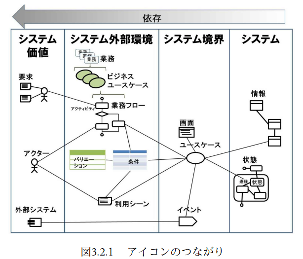
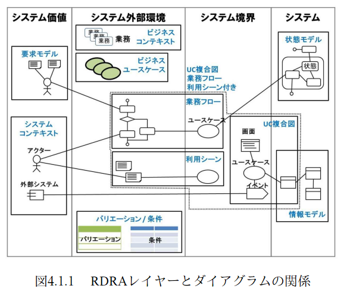

:toc: left
:toclevels: 5
:sectnums:
:stem:
:source-highlighter: coderay

= MeetingRoomReservationSystem

image::images/life_cycle.drawio.svg[]

== 要件

=== 概要

要件定義にはリレーションシップ駆動要件分析(RDRA)を使用する。

RDRAとは短時間で要件を把握することを目的とした軽量の手法。 RDRAでは、決められたアイコンを使い、アイコンとアイコン、アイコンと図を関連づけ、アイコンで表現されたモデル要素と関連のつながりから要件を説明する。

____

____

https://www.amazon.co.jp/RDRA2-0-%E3%83%8F%E3%83%B3%E3%83%89%E3%83%96%E3%83%83%E3%82%AF-%E8%BB%BD%E3%81%8F%E6%9F%94%E8%BB%9F%E3%81%A7%E7%B2%BE%E5%BA%A6%E3%81%AE%E9%AB%98%E3%81%84%E8%A6%81%E4%BB%B6%E5%AE%9A%E7%BE%A9%E3%81%AE%E3%83%A2%E3%83%87%E3%83%AA%E3%83%B3%E3%82%B0%E6%89%8B%E6%B3%95-%E7%A5%9E%E5%B4%8E%E5%96%84%E5%8F%B8-ebook/dp/B07STQZFBX[RDRA2.0 ハンドブックより引用]

=== システム価値

==== システムコンテキスト

[plantuml]
----
@startuml

title システムコンテキスト図

left to right direction

actor 利用者 as ac_01
actor 管理者 as ac_02

usecase 会議室予約システム as uc_01
note top of uc_01
  利用者がWebサイト上で会議室の予約をして、一覧で確認できるようにする。
  登録した利用者だけが利用できるようにする。
  管理者は利用者の予約を取り消すことができるようにする。
end note

ac_01 -- (uc_01)
ac_02 -- (uc_01)

@enduml
----

==== 要求モデル

[plantuml]
----
@startuml

title 要求モデル図

left to right direction

actor 利用者 as ac_01
note "利用可能な会議室があるかを Web で検索したい" as k_r1
note "利用可能な会議室を Web で予約したい" as k_r2
note as k_dr1 #Turquoise
  Web で会議室を検索でき、
  そのまま予約できること
end note
ac_01 -- k_r1
ac_01 -- k_r2
k_r1 -- k_dr1
k_r2 -- k_dr1

actor 管理者 as ac_02
note "利用者の予約を代理でキャンセルしたい" as k_r3
note "利用者を管理したい" as k_r4
note "会議室を管理したい" as k_r5
ac_02 -- k_r3
ac_02 -- k_r4
ac_02 -- k_r5

@enduml

----

=== システム外部環境

==== ビジネスコンテキスト

[plantuml]
----
@startuml

title ビジネスコンテキスト図

left to right direction

actor 利用者 as ac_01

node 設備 {
  rectangle 窓口 {
    actor 管理者 as ac_02
  }
  usecase 予約管理 as uc_01
  usecase 利用者管理 as uc_02
  artifact 会議室 as ar_01
}

ac_01 -- (uc_01)
ac_01 -- (uc_02)
(uc_01) -- (ar_01)
(uc_01) - ac_02

@enduml
----

==== ビジネスユースケース

===== 利用者管理

[plantuml]
----
@startuml

title ビジネスユースケース図 - 利用者管理

left to right direction

actor 利用者 as ac_01

agent 窓口 as ag_01

usecase 利用者の登録 as uc_01
usecase 利用者の認証 as uc_02

ac_01 -- (uc_01)
ac_01 -- (uc_02)

(uc_01) -- ag_01
(uc_02) -- ag_01

@enduml
----

===== 予約管理

[plantuml]
----
@startuml

title ビジネスユースケース図 - 予約管理

left to right direction

actor 利用者 as ac_01
actor 管理者 as ac_02

agent 窓口 as ag_01

usecase 会議室の検索 as uc_01
usecase 会議室の予約 as uc_02
usecase 会議室の登録 as uc_03

artifact 会議室 as af_01

ac_01 -- (uc_01)
ac_01 -- (uc_02)
ac_02 -- (uc_02)
ac_02 -- (uc_03)

(uc_01) -- af_01
(uc_01) -- ag_01
(uc_02) -- af_01
(uc_02) -- ag_01
(uc_03) -- ag_01

@enduml
----

==== 業務フロー

===== 予約管理

====== 会議室の予約

[plantuml]
----
@startuml

title 業務フロー図 - 会議室の予約:BUC

|利用者|
partition 会議室の予約 {
  :予約可能な会議室を検索する;
  :予約可能な会議室を選択する;
   if (キャンセル) then (必要)
    :取り消したい会議室の予約を選択する;
    :会議室の予約を取り消す;
   else (不要)
   endif
}

|管理者|
partition 会議室の予約 {
  :予約可能な会議室を検索する;
  :予約可能な会議室を選択する;
   if (代理キャンセル) then (必要)
    :取り消したい会議室の予約を選択する;
    :会議室の予約を取り消す;
   stop
   else (不要)
   endif
}
stop

@enduml
----

==== 利用シーン

===== 利用者管理

====== 利用者の登録

[plantuml]
----
@startuml

title 利用シーン図 - 利用者の登録:BUC

left to right direction

actor 利用者
actor 窓口

frame 利用者の登録
note right of 利用者の登録
 申し込みのあった利用者を窓口が手動でシステムに登録する
end note

usecase 利用申込みをする
usecase 利用者登録をする

:利用者: -- 利用者の登録
:窓口: -- 利用者の登録
利用者の登録 -- (利用申込みをする)
利用者の登録 -- (利用者登録をする)

@enduml
----

====== 利用者の認証

[plantuml]
----
@startuml

title 利用シーン図 - 利用者の認証:BUC

left to right direction

actor 利用者

frame 利用者の認証
note right of 利用者の認証
  申し込み済みの利用者を認証して会議室の予約・取り消しを実行できるようにする
end note

usecase 利用者を認証する

:利用者: -- 利用者の認証
利用者の認証 -- (利用者を認証する)

@enduml
----

===== 予約管理

====== 会議室の検索

[plantuml]
----
@startuml

title 利用シーン図 - 会議室の検索:BUC

left to right direction

actor 利用者

frame 会議室の検索
note right of 会議室の検索
  利用者認証が完了している
  予約済みおよび予約可能な会議室を検索する
end note

usecase 予約可能な会議室を検索する

:利用者: -- 会議室の検索
会議室の検索 -- (予約可能な会議室を検索する)

@enduml
----

====== 会議室の登録

[plantuml]
----
@startuml

title 利用シーン図 - 会議室の登録:BUC

left to right direction

actor 管理者

frame 会議室の登録
note right of 会議室の登録
   予約可能な会議室を登録する。
   利用者は予約可能な会議室に対して予約をすることができる。
   システムに手動で登録する。
end note

usecase 会議室を登録する

:管理者: -- 会議室の登録
会議室の登録 -- (予約可能な会議室を登録する)

@enduml
----
==== バリエーション・条件

|===
|利用者区分

|利用者
|管理者

|===

=== システム境界

==== ユースケース複合図

===== 利用者管理

====== 利用者の認証

[plantuml]
----
@startuml
actor "利用者" as user
frame "利用者の認証" as f01
usecase "利用者を認証する" as UC1
boundary "ログイン画面" as b01
entity "利用者" as e01
user - f01
f01 - UC1
b01 -- UC1
UC1 - e01
@enduml
----

===== 予約管理

====== 会議室の検索

[plantuml]
----
@startuml
actor "利用者" as user
frame "会議室の検索" as f01
usecase "予約可能な会議室を検索する" as UC1
boundary "会議室一覧画面" as b01
entity "会議室" as e01

user - f01

f01 - UC1
b01 -- UC1
UC1 - e01

@enduml
----

====== 会議室の予約

[plantuml]
----
@startuml
actor "利用者" as user
actor "管理者" as admin
frame "会議室の予約" as f01
usecase "予約可能な会議室を検索する" as UC1
usecase "会議室の予約一覧を取得する" as UC2
usecase "会議室を予約する" as UC3
usecase "会議室の予約を取り消す" as UC4
boundary "会議室一覧画面" as b01
boundary "会議室予約画面" as b02
control "予約条件" as c01
entity "会議室" as e01
entity "予約" as e02

user - f01
admin - f01

f01 - UC1
b01 -- UC1
UC1 -- e01

f01 - UC2
b02 -- UC2
UC2 -- e02

f01 - UC3
b02 -- UC3
UC3 -- e02
UC3 -- c01

f01 - UC4
b02 -- UC4
UC4 - e02

@enduml
----

=== システム

==== 情報モデル

[plantuml]
----
@startuml

title 情報モデル図

left to right direction

entity 利用者
entity 予約
entity 会議室

予約 -- 利用者
予約 -- 会議室

@enduml
----

==== 状態モデル

== 構築

[cols="1,1,1"]
|===
|ソフトウェア |バージョン |備考
|Java
|17
|
|Node.js
|16.3.0
|
|===

=== アプリケーションコンポーネント

==== プロダクション・開発環境

[plantuml]
----
package "APP" {
  [SpringBoot]
}

database "DB" {
  frame "H2" {
    [mrs_test]
  }

  frame "PostgreSQL" {
    [mrs_development]
  }
}

[SpringBoot] -- [mrs_test]
[SpringBoot] -- [mrs_development]
----

=== コンポーネントセットアップ

==== 開発関連

===== 開発ツール

[source,bash]
----
npm init -y
npm install --save-dev @babel/core @babel/cli @babel/preset-env @babel/register
npm install --save-dev npm-run-all watch foreman cpx rimraf marked@1.2.2
npm install --save-dev webpack webpack-cli html-webpack-plugin webpack-dev-server
touch Procfile.dev
npm install --save-dev jest
----

===== Cypress

[source,bash]
----
npm install cypress
npmx cypress open
npm install --save-dev cypress-cucumber-preprocessor
npm install --save-dev cucumber-html-reporter
----

==== ドキュメント関連

===== Asciidoctor

[source,bash]
----
npm install --save-dev asciidoctor asciidoctor-kroki
----

== 配置

=== システムアーキテクチャ

[plantuml]
----
@startuml
actor 開発者
actor 利用者
cloud "Heroku" as Heroku {
    package "Production Environment" as prd {
      [APP] as app_prd
      [DB] as db_prd
    }
}

cloud "GitHub" as github {
  [Git] as repository
}

開発者 --> app_prd
開発者 --> repository
app_prd <-- 利用者
repository --> prd
app_prd -> db_prd
@enduml
----

== 開発

=== 仕様

==== ユースケース

[plantuml]
----
@startuml
left to right direction
actor "利用者" as user
actor "管理者" as admin

rectangle 利用者 {
  usecase "利用者の認証" as UC1
}

rectangle 予約 {
  usecase "会議室の検索" as UC2
  usecase "会議室の予約" as UC3
}
利用者 <--> 予約
user --> 利用者
user --> 予約
予約 <-- admin
@enduml
----

image:images/jig/service-method-call-hierarchy.svg[]

===== 利用者管理
[plantuml]
----
@startuml
left to right direction
actor "利用者" as user
rectangle 利用者 {
  usecase "利用者の認証" as UC1
}
user --> UC1
@enduml
----

[source,yml]
----
include::../cypress/integration/Auth/Login.feature[]
----

===== 予約管理

[plantuml]
----
@startuml
left to right direction
actor "利用者" as user
actor "管理者" as admin
rectangle 予約 {
  usecase "会議室の検索" as UC2
  usecase "会議室の予約" as UC3
}
user --> UC2
user --> UC3
UC2 <-- admin
UC3 <-- admin
@enduml
----

[source,yml]
----
include::../cypress/integration/Room/Room.feature[]

include::../cypress/integration/Reservation/Reserve.feature[]

include::../cypress/integration/Reservation/Cancel.feature[]
----

=== 設計

==== アプリケーションアーキテクチャ

image::images/jig/architecture.svg[]

==== ドメインモデル

image::images/jig/package-relation-depth5.svg[]

image::images/jig/business-rule-relation.svg[]

==== データモデル

image::images/erd/jig-erd-overview.svg[]
image::images/erd/jig-erd-summary.svg[]
image::images/erd/jig-erd-detail.svg[]

===== 予約

image::images/schemaspy/reservation/diagrams/summary/relationships.real.large.png[]

===== 利用者

image::images/schemaspy/usr/diagrams/summary/relationships.real.large.png[]

== 運用

=== 開発

[source,bash]
----
npm start
----

=== テスト

[source,bash]
----
npm test
----

=== ビルド

[source,bash]
----
npm build
----

=== デプロイ

[source,bash]
----
npm run deploy
----

== 参照

- https://qiita.com/ogomr/items/97058a87337eaa2ba21a[PlantUML Example for RDRA 2.0 ハンドブック]
- https://qiita.com/nkenbou/items/86d5718b63f610dfd67f#%E3%81%AF%E3%81%98%E3%82%81%E3%81%AB[PlantUML で始めるリレーションシップ駆動要件分析 (RDRA)]
- https://qiita.com/_shimada/items/c9775f203ae91e32aacb[RDRA2.0の業務フロー図をPlantUMLで描く]
- https://vercel.com/[Vercel]
- https://webpack.js.org/[webpack]
- https://qiita.com/SnowCait/items/487d70b342ffbe2f33d8[GitHub Actions でステータスバッジを表示する]
- https://www.cypress.io/[cypress]
- https://www.npmjs.com/package/cypress-cucumber-preprocessor[Asciidoctor Kroki Extension]
- https://github.com/Mogztter/asciidoctor-kroki[cypress-cucumber-preprocessor]
- https://docs.asciidoctor.org/[Asciidoctor Documentation Site]
- https://blogenist.jp/2019/04/20/8075/[docker-composeで「SchemaSpy」でデータベースのドキュメントを自動生成するやり方]
- https://qiita.com/YasuhiroKimesawa/items/407fcf85aa15eae60508[SchemaSpyでER図を自動生成]