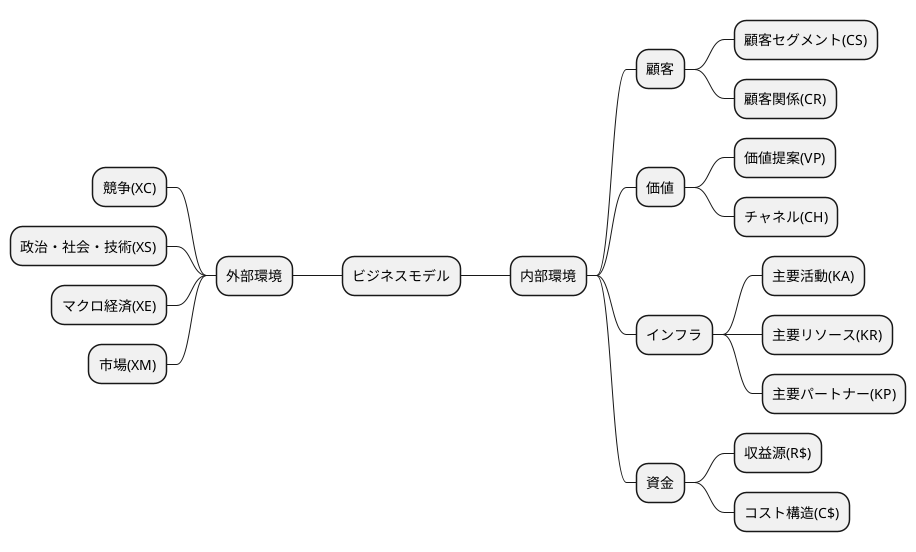
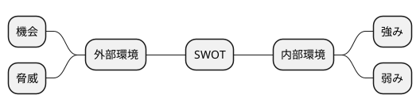

# Ａ社の事例

## 与件文

## 分析

### 組織図

```plantuml
@startmindmap
@endmindmap
```

### ビジネスモデル



### SWOT分析





## 問題

### 第1問（配点20 点）

#### 問題文

#### ロジック

##### 現状分析

```plantuml
@startmindmap

@endmindmap
```

#### 解答


### 第2問（配点20 点）

#### 問題文


#### ロジック

##### 現状分析

```plantuml
@startmindmap

@endmindmap
```

##### 課題設定

##### 解決策

```plantuml
@startmindmap

@endmindmap
```

#### 解答


### 第3問（配点20 点）

#### 問題文


#### ロジック

##### 現状分析

```plantuml
@startmindmap

@endmindmap
```

##### 課題設定


##### 解決策

```plantuml
@startmindmap

@endmindmap
```

#### 解答

### 第4問（配点40 点）

#### （設問１）

##### 問題文

##### ロジック

###### 現状分析

```plantuml
@startmindmap

@endmindmap
```

###### 課題設定

###### 解決策

```plantuml
@startmindmap

@endmindmap
```

##### 解答


#### （設問２）

##### 問題文

##### ロジック

###### 現状分析

```plantuml
@startmindmap

@endmindmap
```

###### 課題設定

###### 解決策

```plantuml
@startmindmap

@endmindmap
```

##### 解答
