:toc: left
:toclevels: 5
:sectnums:
:stem:
:source-highlighter: coderay

= 令和1年度 中小企業の診断および助言に関する実務の事例 1

== 概要

=== ドメイン

A社は、資本金8,000万円、売上高約11億円の農業用機械や産業機械装置を製造する中小メーカーである。縁戚関係にある8名の役員を要する同社の本社は、A社長の祖父が創業した当初から地方の農村部にある。二代目の長男が現代表取締役のA社長で、副社長には数歳年下の弟が、そして専務にはほぼ同年代のいとこが就いており、この3人で経営を担っている。

全国に7つの営業所を構えるA社は、若い経営トップとともに総勢約80名の社員が事業の拡大に取り組んでいる。そのほとんどは正規社員である。2000年代後半に父から事業を譲り受けたA社長は、1990年代半ば、大学卒業後の海外留学中に父が病気となったために急きょ呼び戻されると、そのままA社に就職することになった。

A社長入社当時の主力事業は、防除機、草刈り機などの農業用機械の一つである葉たばこ乾燥機の製造販売であった。その上、関連する産業振興団体から多額の補助金が葉たばこ生産者に支給されていたこともあって、彼らを主要顧客としていたA社の売上は右肩上がりで、最盛期には現在の数倍を超える売上を上げるまでになった。しかし、1980年代半ばに公企業の民営化が進んだ頃から向かい風が吹き始め、健康志向が強まり喫煙者に対して厳しい目が向けられるようになって、徐々にたばこ市場の縮小傾向が進んだ。さらに、受動喫煙問題が社会問題化すると、市場の縮小はますます顕著になった。しかも時を同じくして、葉たばこ生産者の後継者不足や高齢化が急速に進み、葉たばこの耕作面積も減少するようになった。こうした中で、A社の主力事業である葉たばこ乾燥機の売上も落ち込んで、A社長が営業の前線で活用する頃には経営の根幹が揺らぎは始めていたとえいえる。とはいえ、売上も現在の倍以上あった上、一新人社員に過ぎなかったA社長に際立った切迫感があったわけではなく、存続危機に陥るなどとは考えていなかった。

しかし、2000年を超えるころになって、小さな火種が瞬く間に大きくなり、2000年代半ばには、大きな問題となった。すでに5年以上のキャリアを積み経営層の一角となってトップ就任を目前にしていたA社長にとって、存続問題は現実のものとなっていた。そこで、自らが先頭に立って自社製品のメンテナンスを事業化することに取り組んだ。しかし、それはビジネスとして成り立たず、売上減少と費用増大という二重苦を生み出すことになってしまった。このままでは収益を上げることはもとより、100名以上の社員を路頭に迷わすことにもなりかねない状況であった。そこで、自社の技術を見直し、農産物や加工食品などの乾燥装置など葉たばこ乾燥機に代わる新製品の開発に着手した。もっとも、その中で成功の部類に入るのは、干椎茸製造用乾燥機ぐらいであったが、この装置の売上が、最盛期の半分以下にまで落ち込んだ葉たばこ乾燥機の売上減少に取って代わる規模になるわけではなかった。その上、新しい事業に取り組むことを、古き良き時代を知っている古参社員たちがそう簡単に受け入れるはずもなかった。そして、二代目社長が会長に勇退し、新体制が発足した。

危機感の中でスタートした新体制が最初に取り組んだのは、長年にわたって問題視されてきた高コスト体質の見直しであった。減価償却も済み、補修用性能部品の保有期間を過ぎている機械の部品であっても客から依頼されれば個別に対応していたために、膨大な数の部品が在庫となって収益を圧迫していたのである。また、営業所の業務が基本的に手書きの帳簿で処理され、全社的な計数管理が行われないなど、前近代的な経理体制であることが明らかとなった。そこで、A社のこれまでの事業や技術力を客観的に見直し、時代にあった企業として再生していくことを目的に、経営コンサルタントに助言を求めながら、経営改革を本格化指せたのである。

当然のように、業績悪化の真っただ中にあっても見直されることなく、100名以上にまで膨らんでしまっていた従業員の削減にも手を付けることになった。定年を目前にした高齢者を対象とした人員削減ではあったが、地元で長年にわたってっ苦楽を共にしてきた従業員に退職勧告をすることは、若手経営者にとっても、A社にとっても、初めての経験でありつらい試練であった。その後の波及効果を考えると、苦渋の決断ではあったが、これを乗り越えたことで従業員の年齢が10歳程度も引き下がり、コストカットした部分を成果に応じて支払う賞与に回すことが可能になった。

こうして社内整備を図る一方で、自社のコアテクノロジーを「農作物の乾燥技術」と明確に位置づけ、それを社員に共有させることによって、葉たばこ乾燥製造機に代わる新規事業開発の体制強化を打ち出した。その結果、3年の時を経て、葉たばこ以外のさまざまな農作物を乾燥させる機器の製造と、それを的確に機能させるソフトウェアの開発に成功した。さらに、動力源である灯油の燃費効率を大幅に改善することにも成功し、新規事業の基盤が徐々に固まってきた。

しかしながら、新規事業の拡大は機器の開発・製造だけで成就するわけでなく、新規事業を必要とする市場の開拓はもちろん、販売チャネルの構築も不可欠である。当初、経営コンサルタントの知恵を借りながらA社が独自で切り開くことのできた市場は、従来からターゲットとしてきたいわば既存市場だけであり、キノコや果物などの農作物の乾燥以外に、何を何のために乾燥させるのか、ターゲット市場を絞ることはできなかった。

藁をもつかむ思いでA社が選択したのは、線在市場の見えない顧客に用途を問うことであった。自社の乾燥技術や製品を市場に知らせるために自社ホームページ（HP)を立ち上げた。そして、そこにアクセスしてくれた潜在顧客に乾燥したいと思っている「モノ」を送ってもらって、それを乾燥させて返送する「試験乾燥」というサービスを開始した。排水の陣で立ち上げたHPへの反応は、1990年代後半のインターネット黎明期では考えられなかったほど多く、依頼件数は初年度だけで100件以上にも上がった。生産農家だけでなく、それを取りまとめる団体のほか、乾物が特産品である地域など、それまでA社ではアプローチすることのできなかったさまざまな市場との結びつきもできたのである。もちろん、営業部隊のプレゼンテーションが功を奏したことは否めない事実である。

こうして再生に向けて経営改革に取り組むA社の組織は、本社内に拠点を置く製造部、開発部、総務部と全国７地域を束ねる営業部が機能別に組織されており、営業を主に統括するのが副社長、開発と製造を主に統括するのが専務、そして大所高所からすべての部門にA社長が目配りをする体制となっている。

しかしながら、これまでリストラなどの経営改革に取り組んできたものの、A社の組織は、創業当時の機能別組織のままである。そこで、A社長が経営コンサルタントに助言を求めたところ、現段階での組織再編には賛成できない旨を伝えられた。それを受け、A社長は熟考の末、今回、組織再編を見送ることとした。

=== 組織図

=== SWOT分析

=== ビジネスモデル

image::./images/study_1_r01_bmc.drawio.svg[ビジネスモデル]

== 要件

=== システム価値

==== システムコンテキスト

==== 要求モデル

=== システム外部環境

==== ビジネスコンテキスト

==== ビジネスユースケース

==== 業務フロー

==== 利用シーン

==== バリエーション・条件

=== システム境界

==== ユースケース複合図

=== システム

==== 情報モデル

==== 状態モデル
