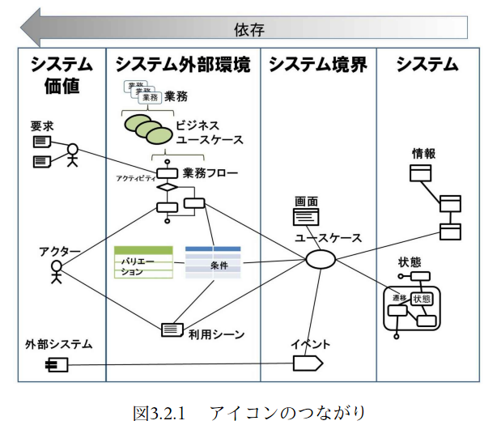

:toc: left
:toclevels: 5
:sectnums:
:stem:
:source-highlighter: coderay

= 令和1年度 中小企業の診断および助言に関する実務の事例 4

== 背景

=== ドメイン

D社は、約40年前に個人事業として創業され、現在は資本金3000万円、従業員数106名の企業である。連結対象となる子会社はない。

同社の主な事業は戸建住宅事業であり、注文住宅の企画、設計、販売を手がけている。顧客志向を徹底しており、他者の一般的な条件よりも、多頻度、長期間にわたって引き渡し後のアフターケアを提供している。さらに、販売した物件において引き渡し後に問題が生じた際、迅速に駆け付けたいという経営者の思いから、商圏を本社のある県とその周辺の3県に限定している。このような経営方針を持つ同社は、顧客を大切にする、地域に根ざした企業として評判が高く、これまでに約2000棟の販売実績がある。一方、丁寧な顧客対応のための費用負担が重いことも事実であり、顧客対応の適正水準について模索を続けている。

地元に恩義を感じる経営者は、「住」だけではなく「食」の面からも地域を支えたいと考え、約6年前から飲食事業を営んでいる。地元の食材を扱うことを基本として、懐石料理店2店舗と、魚介を中心に提供する和食店1店舗を運営している。さらに、今後1年の間に、2店舗目の和食店を新規開店させる計画をしている。このほか、ステーキ店1店舗と、ファミリー向けのレストラン1店舗を運営している。これら2店舗については、いずれも当期の営業利益がマイナスである。特に、ステーキ店については、前期から2期連続で営業利益がマイナスとなったことから、業態転換や即時閉店も含めて対応策を検討している。

戸建住宅事業および飲食事業については、それぞれ担当取締役がおり、取締役の業績は各事業セグメントの当期ROI（投下資本営業利益率）によって評価されている。なお、ROIの算定に用いる各事業セグメントの投下資本として、各セグメントに帰属する期末資産の金額を用いている。

以上の戸建住宅事業および飲食事業のほか、将来の飲食店出店のために購入した土地のうち現時点では具体的な出店計画のない土地を駐車場として賃貸している。また、同社が販売した戸建住宅の購入者を対象にしたリフォーム事業も手掛けている。リフォーム事業については、高齢化の進行とともに、バリアフリー化を主とするリフォームの依頼が増えている。同社は、これを事業の拡大を図る機会ととらえ、これまで構築してきた顧客との良好な関係を背景に、リフォーム事業の拡充を検討している。

D社および同業他社の当期の財務諸表は以下の通りである。

=== 組織図

=== SWOT分析

=== ビジネスモデル

== 要件

要件定義にはリレーションシップ駆動要件分析(RDRA)を使用する。

RDRAとは短時間で要件を把握することを目的とした軽量の手法。 RDRAでは、決められたアイコンを使い、アイコンとアイコン、アイコンと図を関連づけ、アイコンで表現されたモデル要素と関連のつながりから要件を説明する。

____

image::images/rdra2.png[]
____

https://www.amazon.co.jp/RDRA2-0-%E3%83%8F%E3%83%B3%E3%83%89%E3%83%96%E3%83%83%E3%82%AF-%E8%BB%BD%E3%81%8F%E6%9F%94%E8%BB%9F%E3%81%A7%E7%B2%BE%E5%BA%A6%E3%81%AE%E9%AB%98%E3%81%84%E8%A6%81%E4%BB%B6%E5%AE%9A%E7%BE%A9%E3%81%AE%E3%83%A2%E3%83%87%E3%83%AA%E3%83%B3%E3%82%B0%E6%89%8B%E6%B3%95-%E7%A5%9E%E5%B4%8E%E5%96%84%E5%8F%B8-ebook/dp/B07STQZFBX[RDRA2.0 ハンドブックより引用]

=== システム価値

==== システムコンテキスト

==== 要求モデル

=== システム外部環境

==== ビジネスコンテキスト

==== ビジネスユースケース

==== 業務フロー

==== 利用シーン

==== バリエーション・条件

=== システム境界

==== ユースケース複合図

=== システム

==== 情報モデル

==== 状態モデル
